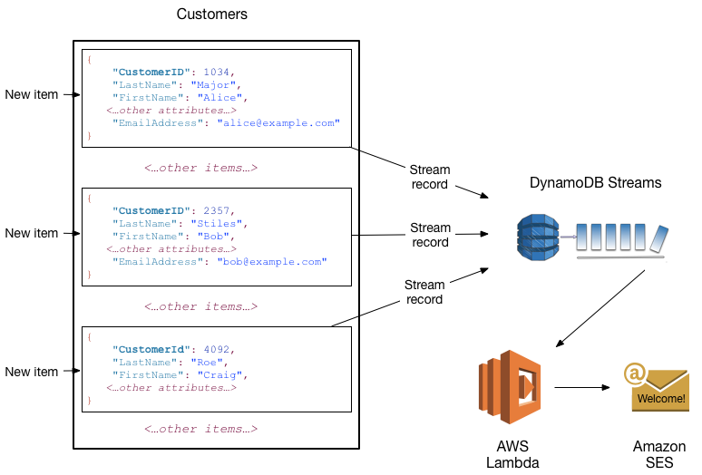
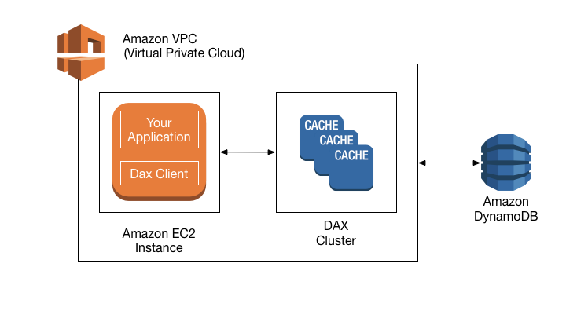

# AWS DynamoDB
\
&nbsp;


AWS DynamoDB Logo [^12]
### Authors
\
&nbsp;

<table>
  <tr>
   <td>Name
   </td>
   <td>Institution
   </td>
  </tr>
  <tr>
   <td>Andre Nollmann
   </td>
   <td>Technische Hochschule Brandenburg
   </td>
  </tr>
  <tr>
   <td>Dominik Braun
   </td>
   <td>Berliner Hochschule für Technik
   </td>
  </tr>
</table>

\
&nbsp;


## Table of contents (Authors)

### 1. Introduction (A, D)

### 2. Architecture (A)

>> 2.1 Overview

>> 2.2 Use Cases

>> 2.3 Data Models

>> 2.4 Data Types

### 3. Tables and capacity provisioning (D)

>>3.1 Table creation and sharding

>>3.2 Read and write capacity

>> 3.3 Capacity Provisioning

### 4. Read items (D)

>> 4.1 Single item read

>> 4.2 Multi item read

>> 4.3 Eventual and strong consistency

### 5. Write items (D)

>> 5.1 Single item write

>> 5.2 Multi item write

>> 5.3 Advanced data types and update actions

### 6. Transactions (A)

### 7. Local and global indexes (A)

### 8. Streams (A)

### 9. In-memory acceleration (D)

### 10. Conclusion (D)

### 11. Bibliography

\
&nbsp;


## 1. Introduction

In today's world data and information is the new currency.

Every second an increasing amount of information in the form of data is produced all over the world. To store this kind of information, which is represented as different data types, a variety of databases are developed to handle diverse use cases. Today a database does not only need to store data but other factors, for example speed or advanced data transformations, are other key factors to consider when choosing a suitable database system.

The most favorite database systems today are relational databases based on “Structured Query Language” (better known as “SQL”). Given the increasing number of requirements and variations in data types, another form of database systems emerged recently. These are called NoSQL or key-value databases and offer new possibilities to save, retrieve and transform data.

One of these newer databases is the key-value database DynamoDB, which was developed by Amazon Web Services in 2012. It is just one of the many prospects to choose from. How and if DynamoDB is able to stand out compared to its competitors will be discussed in detail in the following report. 

Amazon DynamoDB is a fully managed database service. The customer does not have to deal with tedious tasks, like managing servers or its underlying hardware. Amazon Web Services provides security, stability and scalability. All configurations of the system are set up and ready for usage. Data replication and backups are included and software patches are managed as a service. Optional offerings like encryption for operations with sensitive data or flexible scalability for any level of requested traffic are also possible addons the customer can use. Furthermore in-time recovery, seamless scalability and throughput capacity, several management consoles are interesting add-ons. Standards like high availability and durability of data without downtime or performance degradation are included.

This report gives the reader an insight into the possibilities of managing data and databases with AWS DynamoDB. The focus lies on the technology of DynamoDB. \
In the following chapter the architecture of the system will be described in detail, which is followed by the depiction of use cases. Subsequently several models and data types are introduced.  \
In Chapter 3 the creation and usage of tables and provisioning is illustrated.  \
This is followed by a chapter on how data is read. 

Chapter 5 consequently depicts how data is written. 

The next three chapters elucidate how to deal with transactions, local and global indices, and streams.  \
In Chapter 9 the in-memory acceleration is evaluated. 

Finally the conclusion  illustrates the authors’ evaluations of DynamoDB rounding off the in-depth view into the technical backgrounds of this fully managed service. 


\
&nbsp;

## 2. Architecture


### 2.1 Overview

“The architecture of a storage system that needs to operate in a production setting is complex. In addition to the actual data persistence component, the system needs to have scalable and robust solutions for load balancing, membership and failure detection, failure recovery, replica synchronization, overload handling, state transfer, concurrency and job scheduling, request marshaling, request routing, system monitoring and alarming, and configuration management.”[^1]

As a short summary of some techniques used in DynamoDB and their benefits is listed in the following table[^1]:

Table 1: Summary of techniques used in Dynamo and their advantages


<table>
  <tr>
   <td><strong>Problem</strong>
   </td>
   <td><strong>Technique</strong>
   </td>
   <td><strong>Advantage</strong>
   </td>
  </tr>
  <tr>
   <td>Partitioning
   </td>
   <td>Consistent Hashing
   </td>
   <td>Incremental Scalability
   </td>
  </tr>
  <tr>
   <td>High Availability for writes
   </td>
   <td>Vector clocks with reconciliation during reads
   </td>
   <td>Version size is decoupled from update rates.
   </td>
  </tr>
  <tr>
   <td>Handling temporary failures
   </td>
   <td>Sloppy Quorum and hinted handoff
   </td>
   <td>Provides high availability and durability guarantee when some of the replicas are not available.
   </td>
  </tr>
  <tr>
   <td>Recovering from permanent failures
   </td>
   <td>Anti-entropy using Merkle trees
   </td>
   <td>Synchronizes divergent replicas in the background.
   </td>
  </tr>
  <tr>
   <td>Membership and failure detection
   </td>
   <td>Gossip-based membership protocol and failure detection.
   </td>
   <td>Preserves symmetry and avoids having a centralized registry for storing membership and node liveness information.
   </td>
  </tr>
</table>


Regarding the complexity of this database and its used techniques, this paper focuses on some basic topics for this experienced example of a NoSQL database. Amazon DynamoDB is a hosted server operating system with a key-value as well as a document store database model. As a fully managed NoSQL database service by Amazon DynamoDB delivers high performance and scalability combined with individual adjustments on actual requirements and imperceptible changes. There´s no administrational workload like hardware and software provisioning including setup, configuration and updates as well as cluster scaling, replication, monitoring or dealing with hardware failures.

Smilar to the missing administrational overhead, Amazon DynamoDB also offers traffic, throughput and scalability without limits. Write and read capacity for storage and retrieval of massive amounts of data is virtually limitless in the cloud. 

Furthermore, flexible operation and usage is always possible, even in the event of unexpectedly high workloads the service will seamlessly scale in the background. With a predefined performance expectation, throughput and latency are kept on a stable level and are guranteed by AWS Service Level Agreements

With appropriately defined upper and lower limits, Amazon DynamoDB can scale automatically depending on real traffic. This saves real costs through performance adjustment and yet massive access by a large number of users is possible at all times. 

In addition, other AWS services can be easily integrated. There are services for data analyses, logging, security settings and target group-oriented monitoring and many more. Amazon Web Services offers over 200 services for different use cases.

\
&nbsp;


### 2.2 Use Cases

For a better understanding we will explore different use casesto understand the possibilities Amazon DynamoDB has to offer its customers.

**serverless applications**

For persistent storage of relevant data at any scale, Amazon DynamoDB has become one of the central databases for web and mobile backends in eCommerce, sales, education, and the media verticals.

**high volume special events**

Special events and seasonal events usually have a relatively short duration and volatile workload, such as national election campaigns. Increasing and decreasing the capacity currently required allows variable freedom of action and efficient resource management whenever and however it is needed.

**social media applications**

Especially in social media, usage patterns and access numbers are unpredictable and can go viral at any time. Be it mobile online games like Pokemon Go or photo and video sharing platforms like Instagram or TikTok. In order to meet a new hype in a service-oriented way as expected, Amazon DynamoDB offers corresponding elasticity and flexibility.

**regulatory and compliance requirements**

Applications in the areas of healthcare or finance require special regulations and a corresponding set of rules. AWS has a special focus and detailed descriptions in the AWS Services in the Compliance Program area.

**real-time analytics**

For real-time usage data analysis, sentiment detection, advertising and marketing service delivery, and trend analysis, Amazon DynamoDB provides seamless scaling without downtime. This allows streaming event data to be ingested and analyzed in real time. Total capacity can be easily increased as needed and also reduced once the event is over.

For sure this is just seen as a kind of an overview and not as a final compendium. A large number of situations working and needing a database could be solved by using Amazon DynamoDB in the right setup.

\
&nbsp;

### 2.3 Data Models

Although Amazon DynamoDB is a key-value-store as well as a document store, this paper focuses on the key-value data model as a NoSQL data store. According to “simpler and less constrained data models than traditional relational databases”[^2] key-value stores “are designed with the goal to deliver significant performance benefits with low latency and high throughput”[^2].

Generally, the core of relational databases are tables. These tables were called relations. Each relation is a sample of rows. Within these rows exists one or more columns. Usually a formal scheme is not required in NoSQL database tables “except for a mandatory primary key that uniquely identifies each row”[^2]. An example is given in the following table.

Table 2: High-Level NoSQL Database Table Representation


<table>
  <tr>
   <td><strong>Table</strong>
   </td>
   <td>
   </td>
   <td>
   </td>
  </tr>
  <tr>
   <td><strong>Row</strong>
   </td>
   <td>Primary Key
   </td>
   <td>Column 1
   </td>
  </tr>
</table>


Separated column storage operations for each column result in obviously faster operations due to “aggregate operations for one column of the entire table … than the traditional row storage model”[^2].

According to the high-level concept of Amazon DynamoDB a row is related to an item, which itself can have several numbers of attributes without restrictions. Each attribute includes a key beside its own value. The attributes name and value are usually referred to the key as a name-value pair. The number of items stored in an Amazon DynamoDB table is not limited but indexed by primary key as shown in the following table.

Table 3: High-Level Representation of Amazon DynamoDB Table


<table>
  <tr>
   <td><strong>Table</strong>
   </td>
   <td>
   </td>
   <td>
   </td>
   <td>
   </td>
   <td>
   </td>
   <td>
   </td>
  </tr>
  <tr>
   <td><strong>Item 1</strong>
   </td>
   <td>Primary Key
   </td>
   <td>Attribute 1
   </td>
   <td>Attribute 2
   </td>
   <td>Attribute 3
   </td>
   <td>Attribute…n
   </td>
  </tr>
  <tr>
   <td><strong>Item 2</strong>
   </td>
   <td>Primary Key
   </td>
   <td>Attribute 1
   </td>
   <td>
   </td>
   <td>Attribute 3
   </td>
   <td>
   </td>
  </tr>
  <tr>
   <td><strong>Item n</strong>
   </td>
   <td>Primary Key
   </td>
   <td>
   </td>
   <td>Attribute 2
   </td>
   <td>Attribute 3
   </td>
   <td>
   </td>
  </tr>
</table>


There are two options defined for using primary keys in Amazon DynamoDB. The first one is called partition key which is a simple primary key with one attribute. “The minimum length of a partition key value is 1 byte. The maximum length is 2048 bytes. There is no practical limit on the number of distinct partition key values, for tables or for secondary indexes.”[^3] In this outlined setting, every item in this table has to have different partition key values.

Table 4: Amazon DynamoDB Simple Primary Key (Partition Key)


<table>
  <tr>
   <td><strong>Table</strong>
   </td>
   <td>
   </td>
   <td>
   </td>
   <td>
   </td>
   <td>
   </td>
   <td>
   </td>
  </tr>
  <tr>
   <td><strong>Item</strong>
   </td>
   <td>Partition Key
   </td>
   <td>Attribute 1
   </td>
   <td>Attribute 2
   </td>
   <td>Attribute 3
   </td>
   <td>Attribute…n
   </td>
  </tr>
</table>


In the following table PersonID is used as the partition key as an example.

Table 5: Example Person Amazon DynamoDB Table


<table>
  <tr>
   <td><strong>Person Table</strong>
   </td>
   <td>
   </td>
   <td>
   </td>
   <td>
   </td>
   <td>
   </td>
   <td>
   </td>
  </tr>
  <tr>
   <td><strong>Item</strong>
   </td>
   <td>PersonId
<p>
(Partition Key)
   </td>
   <td>FirstName
   </td>
   <td>LastName
   </td>
   <td>Zipcode
   </td>
   <td>Gender
   </td>
  </tr>
  <tr>
   <td><strong>Item 1</strong>
   </td>
   <td>1001
   </td>
   <td>Fname-1
   </td>
   <td>Lname-1
   </td>
   <td>00000
   </td>
   <td>
   </td>
  </tr>
  <tr>
   <td><strong>Item 2</strong>
   </td>
   <td>1002
   </td>
   <td>Fname-2
   </td>
   <td>Lname-2
   </td>
   <td>
   </td>
   <td>M
   </td>
  </tr>
  <tr>
   <td><strong>Item 3</strong>
   </td>
   <td>2002
   </td>
   <td>Fname-3
   </td>
   <td>Lname-3
   </td>
   <td>10000
   </td>
   <td>F
   </td>
  </tr>
</table>


The second option is a composite primary key which comprises two attributes. This key is indexed as a partition key and a sort key. As a result of this construction it is significantly quicker to get the right items with these two hierarchical element values. “The minimum length of a sort key value is 1 byte. The maximum length is 1024 bytes. In general, there is no practical limit on the number of distinct sort key values per partition key value. The exception is for tables with secondary indexes. With a local secondary index, there is a limit on item collection sizes: For every distinct partition key value, the total sizes of all table and index items cannot exceed 10 GB. This might constrain the number of sort keys per partition key value.”[^3]

In this presented setting it is possible for multiple items to have the same partition key value. But therefore these items have to have different sort key values. 

Table 6: Amazon DynamoDB Composite Primary Key (Partition & Sort Key)


<table>
  <tr>
   <td><strong>Table</strong>
   </td>
   <td>
   </td>
   <td>
   </td>
   <td>
   </td>
   <td>
   </td>
   <td>
   </td>
   <td>
   </td>
  </tr>
  <tr>
   <td><strong>Item</strong>
   </td>
   <td>Partition Key
   </td>
   <td>Sort Key
   </td>
   <td>Attribute 1
   </td>
   <td>Attribute 2
   </td>
   <td>Attribute 3
   </td>
   <td>Attribute…n
   </td>
  </tr>
</table>


Another representation of the table above is given in JSON format with additional nested attributes below[^3]:


```
{ 
"Partition Key": "Value", 
"Sort Key": "Value", 
"Attribute 1": "Value", 
"Attribute 2": "Value", 
"Attribute 3": [ 
 { 
"Attribute 4": "Value", 
"Attribute 5": "Value", 
 }, 
 { 
"Attribute 4": "Value", 
"Attribute 5": "Value", 
 } 
 ] 
}
```


This multi-part key leads to many new options in getting a result or datas from queries and other instructions. Another example is a High Score-Listing of several games and players, shown in the following table.

Table 7: Example GameScores Amazon DynamoDB Table


<table>
  <tr>
   <td><strong>GameScores Table</strong>
   </td>
   <td>
   </td>
   <td>
   </td>
   <td>
   </td>
   <td>
   </td>
   <td>
   </td>
   <td>
   </td>
  </tr>
  <tr>
   <td>
   </td>
   <td>PersonID
<p>
(Partition Key)
   </td>
   <td>GameId
<p>
(Sort Key)
   </td>
   <td>TopScore
   </td>
   <td>TopScoreDate
   </td>
   <td>Wins
   </td>
   <td>Losses
   </td>
  </tr>
  <tr>
   <td><strong>item1</strong>
   </td>
   <td>1001
   </td>
   <td>Game01
   </td>
   <td>67453
   </td>
   <td>2013-12-09:17:24:31
   </td>
   <td>73
   </td>
   <td>21
   </td>
  </tr>
  <tr>
   <td><strong>item2</strong>
   </td>
   <td>1001
   </td>
   <td>Game02
   </td>
   <td>98567
   </td>
   <td>2013-12-11:14:14:37
   </td>
   <td>98
   </td>
   <td>27
   </td>
  </tr>
  <tr>
   <td><strong>item3</strong>
   </td>
   <td>1002
   </td>
   <td>Game01
   </td>
   <td>43876
   </td>
   <td>2013-12-15:19:24:39
   </td>
   <td>12
   </td>
   <td>23
   </td>
  </tr>
  <tr>
   <td><strong>item4</strong>
   </td>
   <td>2002
   </td>
   <td>Game02
   </td>
   <td>65689
   </td>
   <td>2013-10-01:17:14:41
   </td>
   <td>23
   </td>
   <td>54
   </td>
  </tr>
</table>


The elements of a composite primary key as a multi-part key were also known as its hash attribute and its range attribute. An explanation of the terms and its functions is given in an Amazon Whitepaper from January 2020:
“The partition key of an item is also known as its hash attribute and sort key as its range attribute. The term hash attribute arises from the use of an internal hash function that takes the value of the partition key as input and the output of that hash function determines the partition or physical storage node where the item will be stored. The term range attribute derives from the way DynamoDB stores items with the same partition key together, in sorted order by the sort key value.”[^2]

\
&nbsp;

### 2.4 Data Types

Amazon DynamoDB allows a broad spectrum of data types also with unstructured datasets.

Table 8: Amazon DynamoDB Data Types


<table>
  <tr>
   <td><strong>Type</strong>
   </td>
   <td><strong>Description</strong>
   </td>
   <td><strong>Example (JSON Format)</strong>
   </td>
  </tr>
  <tr>
   <td><strong>Scalar</strong>
   </td>
   <td>
   </td>
   <td>
   </td>
  </tr>
  <tr>
   <td><strong>String</strong>
   </td>
   <td>Unicode with UTF8 binary encoding
   </td>
   <td>{"S": "Game01"}
   </td>
  </tr>
  <tr>
   <td><strong>Number</strong>
   </td>
   <td>Positive or negative exact- value decimals and integers
   </td>
   <td>{"N": "67453"}
   </td>
  </tr>
  <tr>
   <td><strong>Binary</strong>
   </td>
   <td>Encoded sequence of bytes
   </td>
   <td>{"B":"dGhpcyB0ZXh0IGlzIGJhc2U2NC1l"}
   </td>
  </tr>
  <tr>
   <td><strong>Boolean</strong>
   </td>
   <td>True or false
   </td>
   <td>{"BOOL": true}
   </td>
  </tr>
  <tr>
   <td><strong>Null</strong>
   </td>
   <td>Unknown or undefined state
   </td>
   <td>{"NULL": true}
   </td>
  </tr>
  <tr>
   <td><strong>Document</strong>
   </td>
   <td>
   </td>
   <td>
   </td>
  </tr>
  <tr>
   <td><strong>List</strong>
   </td>
   <td>Ordered collection of values
   </td>
   <td>{"L": ["Game01", 67453]}
   </td>
  </tr>
  <tr>
   <td><strong>Map</strong>
   </td>
   <td>Unordered collection of name-value pairs
   </td>
   <td>{"M": {"GameId": {"S": "Game01"}, "TopScore": {"N": "67453"}}}
   </td>
  </tr>
  <tr>
   <td><strong>Multi-valued</strong>
   </td>
   <td>
   </td>
   <td>
   </td>
  </tr>
  <tr>
   <td><strong>String Set</strong>
   </td>
   <td>Unique set of strings
   </td>
   <td>{"SS": ["Black","Green] }
   </td>
  </tr>
  <tr>
   <td><strong>Number Set</strong>
   </td>
   <td>Unique set of numbers
   </td>
   <td>{"NS": ["42.2","-19.87"] }
   </td>
  </tr>
  <tr>
   <td><strong>Binary Set</strong>
   </td>
   <td>Unique set of binary values
   </td>
   <td>{"BS": ["U3Vubnk=","UmFpbnk=] }
   </td>
  </tr>
</table>


The attributes of an Amazon DynamoDB item appear in one of the following three specifications:


* scalar type: a name-value pair with one definite value
* document type: attributes nested within a complex data structure
* multi-valued set type: a unique set of values

Each item can have any number of attributes.

Primary keys are always scalar types with only one the following data types allowed:


1. String:

“The length of a String is constrained by the maximum item size of 400 KB. Strings are Unicode with UTF-8 binary encoding. Because UTF-8 is a variable width encoding, DynamoDB determines the length of a String using its UTF-8 bytes.”[^3]


2. Number

“A Number can have up to 38 digits of precision, and can be positive, negative, or zero.

• Positive range: 1E-130 to 9.9999999999999999999999999999999999999E+125

• Negative range: -9.9999999999999999999999999999999999999E+125 to -1E-130

DynamoDB uses JSON strings to represent Number data in requests and replies. If number precision is important, you should pass numbers to DynamoDB using strings that you convert

from a number type.”[^3]


3. Binary:

“The length of a Binary is constrained by the maximum item size of 400 KB. Applications that work with Binary attributes must encode the data in base64 format before sending it to DynamoDB. Upon receipt of the data, DynamoDB decodes it into an unsigned byte array and uses that as the length of the attribute.”[^3]

These restrictions are only determined for key attributes, not for other, non-key ones. 

\
&nbsp;

## 3. Tables and capacity provisioning
A key aspect for AWS DynamoDB is the creation and usage of tables and its provisioning of read and write capacity for operations on the data.

The following chapter will demonstrate table creation using Amazon's Software Development Kit (SDK). This is followed by a detailed explanation of the terms “read-” and “write-capacity” of the database and the different provisioning modes, which determine the capacity of the tables.
\
&nbsp;

### 3.1 Table creation and sharding

As highlighted in the architecture section a table will be managed and sharded into smaller individual parts in the background by the AWS DynamoDB business logic.

The key parameters for this operation are the **hash-key **and the** range-key,** that can only be set at the creation phase of a table. The reason for this kind of restriction is that the data is stored and distributed to nodes based on these values. For a later change the data would need to be redistributed between nodes on the fly, which is not trivial. A change of this structure is handled by the creation of an entirely new table, followed by copying the data into said table. A table can be created in code which we illustrate by the following code example[^4].


```
const params = {
  AttributeDefinitions: [
     {
    AttributeName: "HashKeyAttribute", 
    AttributeType: "S"
    }, 
     {
    AttributeName: "RangeKeyAttribute", 
    AttributeType: "S"
   }
  ], 
  KeySchema: [
     {
    AttributeName: "HashKeyAttribute", 
    KeyType: "HASH"
   }, 
     {
    AttributeName: "RangeKeyAttribute", 
    KeyType: "RANGE"
   }
  ], 
  ProvisionedThroughput: {
   ReadCapacityUnits: 5, 
   WriteCapacityUnits: 5
  }, 
  TableName: "TableName"
 };

const result = await dynamodb.createTable(params).promise()
```


As you can see in this example[^4] only the Key Schema needs to be defined. The attributes of the data will be created by putting data to the table. Therefore the attributes will change on the fly by the process of adding data. This is a totally different concept compared to SQL databases, where the schema needs to be defined before putting data in the table. You can always alter the table and its schema with SQL databases but this needs to happen manually and is not automated as it is with MySQL databases.  \
In the example above you might also notice the term “ProvisionedThroughput”. Here five read and five write units are used. This refers to the read and write capacity for operations on the data, which will be illustrated in the following section.

\
&nbsp;

### **3.2 Read and write capacity**

For any operation on the table either read or write capacity is needed. As the name itself indicates, “read” stands for reading data and “write” for writing, transforming, or executing transactions on items in the table.

**Read**

For every read operation, read capacity is used. This is measured in read capacity units.

One read capacity unit is the strongly consistent read of an item with a size up to four KB per second. So for every read at least one read capacity unit is required. \
For a bigger item more read capacity is required. It increments in four KB intervals. Eventually consistent reads give a 50% discount. Read and write consistency will be explained in depth in Chapter 4. \
The following example will illuminate how this process works:

Imagine you want to read one item with a size of 8 KB. Given a read capacity unit of 4 KB/s this operation would need two read capacity units, as 8 divided by 4 results in 2.  If you choose eventual consistency as read attribute including the discount for this type of operation the cost would be one read unit.

**Write**

For every write operation, write capacity is used which is measured in write capacity units.

One write capacity unit is one write action per second with a size up to 1 KB.

If the item is bigger DynamoDB will consume additional write capacity units.

A transactional write will consume 2 capacity units per 1 KB. So, for example, if you want to write a 128 KB sized object with a transaction the total capacity needed for this operation sums up to 256 capacity units.

\
&nbsp;

### 3.3 Capacity Provisioning

On creation read and write capacity need to be provisioned. In contrast to the key schema these values can be changed later on the fly. The capacity can be decreased or increased. Once every twenty four hours the capacity mode can be changed. The mode is either provisioned throughput or on-demand. In the following the differences of these two modes will be illuminated.

**Provisioned Throughput**

This mode is the classic way to provision capacity[^1]. It has been available since the introduction of AWS DynamoDB in the year 2012. It is meant for predictable read and write usage of the underlying table. It is most favorable in a closed system, where the number of reads and writes to the table from functions or servers can be controlled.
A nice example is a Lambda Function with its attribute “concurrent execution” set to a specific limit. This ensures that when the Function runs and contacts the database the used capacity will not exceed the provisioned capacity. The main advantage of this type of provisioning is the costs for continuous workloads. Since the exact amount of required capacity can be set AWS does not need to provide excess capacity in the background which will lower the price. However, if the provisioned capacity is exceeded, throttling behavior will arise. Throttled calls are queued until the capacity is available again. This can slow down operations significantly, which in many use-cases is not acceptable.
In use-cases, where the capacity can not be defined, for example a web app, this provisioning mode can lead to undesirable behavior. For instance: calls that do not return and get lost at the moment the capacity is exceeded, rendering the web app useless. Overprovisioning of capacity is another problem, that will waste capacity and therefore money and resources. Imagine up to 500 requests per second during the day but zero during the night. If capacity is now provisioned in provisioned throughput mode to the maximum possible capacity there is a lot of capacity wasted. 
To overcome this problem, Amazon Web Services introduced in 2018 a new provisioning mode which is called On-Demand provisioning. As the name implies this modus will solve the provisioning of capacity for a service that is used extensively during specific times. 
The provisioned throughput though is in most cases the cheaper solution.

**On-Demand**
When using on-demand[^5] mode there is no need to provision capacity. The capacity is adjusted to the number of requests and so is the price. The table will scale automatically to the required capacity up to a default set quota[^6] of 40 000 read or write units. This limit can be increased and is in place to avoid unwanted costs for customers new to this kind of serverless services. With on-demand mode enabled the application can react to unpredictable workloads. This is especially useful for web applications, as the peak usage times are hard to predict. The example often cited at this discussion is a startup web application going viral overnight. The wep app's capacity needs to scale with the demand to not interrupt the service. Another use-case are infrequent workloads, like a monthly report, which do not need a table with provisioned capacity for the rest of the month. As mentioned before this can result in higher costs than the previous mode when used continuously, as this on demand capacity needs to be provided by AWS at any given moment.

\
&nbsp;

## 4. Read Items

A main operation for every database system is the retrieval of its stored content. AWS DynamoDB offers several functions to read items using various methods. In this chapter these methods are highlighted and illustrated with coding examples.

\
&nbsp;

### 4.1 Single Item Read

The simplest read operation is the retrieval of a single item. As highlighted in the architecture section, DynamoDB is required to first identify the right table and then the shard that specifies the location of the data in that specific table. To achieve this a hash-key in combination with an optional range-key (sort-key) is used. These must be provided as a parameter to the method call.

The name of the method wrapped in the DynamoDB Object of the SDK is **getItem**.

Additional possible parameters for this method call are: **AttributesToGet, ConsistentRead, ReturnConsumedCapacity**[^4]. These three attributes will be shortly explained in the following paragraphs.


* **AttributesToGet**

    This option will filter the attributes that are required on the server side before sending the response. This is quite useful because rows with different attributes can get quite big and for the task at hand it might not be necessary to retrieve all of them. This way partial results can be returned and only the desired data is transferred back to the client over the network.

* **ConsistentRead**

    As highlighted in the architecture chapter, data is distributed in different shards but data is read only from a single shard. This can lead to inconsistencies between an update and the retrieval of data from a single shard. To tackle this the consistentRead Parameter was introduced which forces a consistent result reading from more than one shard.

* **ReturnConsumedCapacity**

    Every operation based on the size of the object in Kilobytes and the number of items returned (in the following example it is a single item) will consume DynamoDB Capacity.


    To find out how much capacity an operation consumed, the consumption can directly be returned in the read result by passing this parameter.


To illustrate the previously introduced method a coding example[^4] in the DynamoDB Node SDK and the simplified DynamoDB Document Client SDK, which has a slightly different syntax, is provided. Both parts of the SDK offer the same functionality but the Document Client tries to abstract some of the complexity. The following code will try to retrieve an item from the table specifying the hash key “Ärzte” in the table “Songs”.


```
// Init the DynamoDB object
const dynamodb = new AWS.DynamoDB();

// Provide Parameters to read
const params = {
  Key: {
   "Artist": {
     S: "Ärzte"
    }
    }, 
  TableName: "Songs"
 };
// Await the result in an async way
const result = await dynamodb.getItem(params).promise()
```


Code for the DynamoDB Document Client looks quite similar besides the parameters that are passed to the method. In the Document Client it is not needed to specify the data-type of the used key. It is abstracted from the variable type by the client.


```
// Init a new DynamoDB Document Client object
const documentClient = new AWS.DynamoDB.DocumentClient();

// Provide Parameters to read
const params = {
  TableName : Songs,
  Key: {
    Artist: "Ärzte"
  }
};

// Await the result in an async way
 const result = await documentClient.get(params).promise()
// Example result
```


In both code blocks data is returned in an async way. For more information on async programming in typescript you can refer to the [documentation of typescript](https://www.typescriptlang.org/docs/handbook/release-notes/typescript-1-7.html)[^7].

The next example shows a possible response  from the DynamoDB SDK.


```
{
    "Item": {
        "Username": {
            "S": "Peter"
        },
        "Age": {
            "N": "81"
        }
    }
}
```


The response indicates the variable type that is returned. In this example you can see that a **string **and a **number **are** **returned.

\
&nbsp;


### 4.2 Multi item read

In contrast to other databases where a search query can be defined which will get multiple items returned. In DynamoDB multiple items can only be retrieved if we provide an array of hash keys for the same table. Making it a chained single item read in another method.


```
// Init the DynamoDB object
const dynamodb = new AWS.DynamoDB();

// Provide Parameters to read
const params = {
  RequestItems: {
   "Table": {
     Keys: [
        {
       "Key": {
         S: "No One You Know"
        } 
       }, 
        {
       "Key": {
         S: "Acme Band"
        }
      }
     ], 
     AttributesToGet: "AlbumTitle"
    }
  }
 };

// Await the result in an async way
const result = await dynamodb.batchGetItem(params).promise()
```


In the code example above you can see the array of keys which will be retrieved.

The advantage of this operation instead of multiple single items read is the reduced traffic. All of the operations will be executed on the DynamoDB Server and given back as a single object instead of requesting the items in several calls.

**DynamoDB Document Client**


```
const dynamodb = new AWS.DynamoDB();

const params = {
  RequestItems: {
    'Table-1': {
      Keys: [
        {
           HashKey: 'haskey',
        }
      ]
    },
    'Table-2': {
      Keys: [
        { foo: 'bar' },
      ]
    }
  }
};

const documentClient = new AWS.DynamoDB.DocumentClient();

const result = await documentClient.batchGet(params).promise()

```


The syntax of the Document Client simplifies this operation and makes it possible to get multiple items from different tables at once. Another simplification is that you do not need to provide the type of the key. The data type will just be derived from the given data type.

\
&nbsp;

### 4.3 Eventual and Strong Consistency

The previous chapter already introduced the terms **eventual** and **strong-consistency** while taking a look at the read and write capacity. In the context of reading items this term becomes even more important in regards to the freshness of data[^8].

DynamoDB data is distributed and sharded to different nodes. If data is altered these changes will be populated to the different nodes in the system. This takes around 200 milliseconds.

If you write data and read it again you could end up with stale data from a node which has not yet been updated. When reading data in eventual consistent mode the first result from any node is returned which might already be stale. To cope with use cases where the consistency of data is important the possibility for strongly consistent reads have been introduced.

Imagine fast consecutive writes to a counter value in a table increasing from 0 to 3. An eventual consistent read could return different values from 0 to 3 while a consistent read always returns the right and final end result of 3 reading from more than 1 node. Because of the multiple operations needed for a consistent read the amount of consumed read capacity is higher as well as the network latency. Another disadvantage is that in the case of one node failing the read operation will fail because the end result can not be evaluated. Thus overall a consistent read is less failure tolerant.

\
&nbsp;

## 5. Write Items

This chapter will introduce different methods to write data to the database. First the single item write is introduced. Then this concept will be expanded to introduce the writing of multiple items. Both operations will be illustrated with example code.

\
&nbsp;

### 5.1 Single Item Write

To write an item to the database the table name and the attributes to write need to be provided. The used **hash-key** of the table has to be included in the payload, a possible range key is optional. If the **hash-key** is not found in the payload the operation is rejected. Thus before writing data to the table knowledge of its key schema is required.

The DynamoDB SDK code example below depicts the data type that is to be written to the database. To successfully write an item to the database all it’s parameters need to be set. The value of the variable is required, as well as it’s type. It can not be inferred as it can be in several other programming languages. The type needs to be specified as a map: as the key of the attribute and the value to write as the value of this key. All attributes are cast into strings. To write a number, for example, the type would be “N” and the value “1”. The example[^4] below depicts a string, boolean and a number value that are written to the database.

Code Example for the DynamoDB SDK Client.


```
const dynamodb = new AWS.DynamoDB();

var params = {
  Item: {
   "Artist": {
     S: "Billy Elish"
    }, 
   "IsAlive": {
     BOOL: "true"
    }, 
   "Age": {
     N: "20"
    }
  }, 
  ReturnConsumedCapacity: "TOTAL", 
  TableName: "Artist"
 };

const result = await dynamodb.putItem(params).promise()
```


This complexity is greatly simplified when using the AWS DynamoDB Document Client.

This can be seen in the second example[^4] below that shows the same operation with the Document Client. Data can be provided as it is as variable and the data type will be inferred and translated to the DynamoDB data type. Thus, instead of writing boolean data with the key “BOOL” and the value itself as String (“true”)  the value **true **can simply be passed** **as it is and the client handles the conversion.


```
const documentClient = new AWS.DynamoDB.DocumentClient();

const params = {
  TableName : 'Table',
  Item: {
     HashKey: 'haskey',
     NumAttribute: 1,
     BoolAttribute: true,
     ListAttribute: [1, 'two', false],
     MapAttribute: { foo: 'bar'},
     NullAttribute: null
  }
};

const result = await documentClient.put(params).promise()
```


For most use-cases this automatic conversion of datatypes works quite well and will enhance the developer experience while using DynamoDB to write data.

\
&nbsp;
### 5.2 Multi Item Write

Using the same pattern as in the previous chapter, this section will illustrate how to write multiple items in a single operation instead of writing a single item to the database multiple times. The  prerequisite for a successful write is the same as for single item operation meaning the hash-key of the table needs to be provided in the payload. But now multiple items combined in one array will be written to different tables and all operations will be executed at once on the server. The example[^4] below shows three different write operations to the same table in one array.

DynamoDB SDK


```
const dynamodb = new AWS.DynamoDB();

const params = {
  RequestItems: {
   "Music": [
       {
      PutRequest: {
       Item: {
        "AlbumTitle": {
          S: "Somewhat Famous"
         }, 
        "Artist": {
          S: "No One You Know"
         }, 
        "SongTitle": {
          S: "Call Me Today"
         }
       }
      }
     }, 
       {
      PutRequest: {
       Item: {
        "AlbumTitle": {
          S: "Songs About Life"
         }, 
        "Artist": {
          S: "Acme Band"
         }, 
        "SongTitle": {
          S: "Happy Day"
         }
       }
      }
     }, 
       {
      PutRequest: {
       Item: {
        "AlbumTitle": {
          S: "Blue Sky Blues"
         }, 
        "Artist": {
          S: "No One You Know"
         }, 
        "SongTitle": {
          S: "Scared of My Shadow"
         }
       }
      }
     }
    ]
  }
 };

const result = await dynamodb.batchWriteItem(params).promise()
```


A simplified version of a multi-item write can be seen in the second example[^4] based on the DynamoDB Document Client. An interesting fact to notice is that a write operation can not only contain the creation or update of an item but also the deletion of another in a single operation. In the code below the item with the hash-key Name and the value “Peter” is deleted.


```
const documentClient = new AWS.DynamoDB.DocumentClient();

const params = {
  RequestItems: {
    'Table-1': [
      {
        DeleteRequest: {
          Key: { Name: Peter }
        }
      },
      {
        PutRequest: {
          Item: {
            Name: Hannes,
            Alter: 12,
            isFunny: true,
            walletContents: [1, 2, false],
            Location: { x: '1111' }
          }
        }
      }
    ]
  }
};

const result = await documentClient.batchWrite(params).promise()
```

\
&nbsp;


## 6. Transactions

Because of the lack of a domain-specific language, such as SQL for RDBMS, NoSQL databases use different opportunities for data lifecycles. To perform standard CRUD operations (create, read, update, delete), Amazon DynamoDB offers easy to use application programming interfaces (APIs). Transactions within or across tables are supported by coordinated, all-or-nothing changes to multiple items. Of course ACID-standards (atomicity, consistency, isolation, durability) regarding Transactions supports users to maintain data correctness in the applications. 

Furthermore the database allows incremental and conditional operations what is mentioned like this:

“Amazon DynamoDB provides atomic item and attribute operations for adding, updating, or deleting data. Further, item-level transactions can specify a condition that must be satisfied before that transaction is fulfilled. For example, you can choose to update an item only if it already has a certain value.

Conditional operations allow you to implement optimistic concurrency control systems on Amazon DynamoDB. For conditional updates, Amazon DynamoDB allows atomic increment and decrement operations on existing scalar values without interfering with other write requests.”[^2]

The Amazon DynamoDB Developer Guide gives more technical informations and examples to the restrictions and constraints of transactions setted up in DynamoDB:

“Classic APIs


* TransactWriteItems – A batch operation that allows Put, Update, and Delete operations to multiple items both within and across tables with a guaranteed all-or-nothing result.
* TransactGetItems – A batch operation that allows Get operations to retrieve multiple items from one or more tables. 

[...]

DynamoDB transactional API operations have the following constraints:


* A transaction cannot contain more than 25 unique items. 
* A transaction cannot contain more than 4 MB of data.
* No two actions in a transaction can work against the same item in the same table. For example, you cannot both ConditionCheck and Update the same item in one transaction.
* A transaction cannot operate on tables in more than one AWS account or Region.
* Transactional operations provide atomicity, consistency, isolation, and durability (ACID) guarantees only within the AWS Region where the write is made originally. Transactions are not supported across Regions in global tables. For example, suppose that you have a global table with replicas in the US East (Ohio) and US West (Oregon) Regions and you perform a TransactWriteItems operation in the US East (N. Virginia) Region. In this case, you might observe partially completed transactions in the US West (Oregon) Region as changes are replicated. Changes are replicated to other Regions only after they have been committed in the source Region.”[^3]
\
&nbsp;

## 7. Local and global indexes

Data in Amazon DynamoDB is generally indexed for getting faster results of queries using a primary key. In order to widen the functionality of indexing data, databases use secondary indexes such as global indexes and local indexes. Secondary indexes can also be used as an alternate query path.

If a table is defined with a primary key and a sort key, Amazon DynamoDB supports the setup of both secondary indexes mentioned above:


* “Global secondary index—An index with a partition and optional sort key that can be different from those on the table.
* Local secondary index—An index that has the same partition key as the table, but a different sort key.”[^2]
Each table can be set up with one or more of each secondary indexes, global and local. It's also possible for documents to define secondary indexes either global or local on any top-level JSON element.

“Names for tables and secondary indexes must be at least 3 characters long, but no greater than 255 characters long. The following are the allowed characters:

• A-Z

• a-z

• 0-9

• _ (underscore)

• - (hyphen)

• . (dot)”[^3]
\
&nbsp;


## 8. Streams

Table activities can be gathered using an optional feature called Amazon DynamoDB Streams. It is not real-time analytic but changes of data like standard CRUD (create, read, update, delete) operations can be recorded in near real time and chronologically ordered. Each activity is tracked and logged with other metadata like timestamp, information of the table like name etc. 


* ”A new item is added to the table: The stream captures an image of the entire item, including all of its attributes.
* An item is updated: The stream captures the "before" and "after" image of any attributes that were modified in the item.
* An item is deleted from the table: The stream captures an image of the entire item before it was deleted.”[^3]
Together with other solutions there’s even more automation possible like this:

“Amazon DynamoDB Streams can be used with AWS Lambda to create trigger-code that executes automatically whenever an event of interest (add, update, delete) appears in a stream. This pattern enables powerful solutions, such as data replication within and across AWS Regions, materialized views of data in DynamoDB tables, data analysis using Amazon Kinesis, notifications via Amazon Simple Notification Service (Amazon SNS) or Amazon Simple Email Service (Amazon SES) and much more.”[^2]

An important note is the fact of stream records lifetime, which exceeds after 24 hours. Afterwards they'll be removed automatically from the stream. 

The following example from the developers guide gives a clinch of the possibilities:

“consider a Customers table that contains customer information for a company. Suppose that you want to send a "welcome" email to each new customer. You could enable a stream on that table, and then associate the stream with a Lambda function. The Lambda function would run whenever a new stream record appears, but only process new items added to the Customers table. For any item that has an EmailAddress attribute, the Lambda function would invoke Amazon Simple Email Service (Amazon SES) to send an email to that address.”[^3]




Referring to the conditional clauses mentioned above, no email will be sent to the last customer (Craig Roe) because of the missing entry of his Email Address. 

For simultaneous reading of a shard in DynamoDB there’s a limit set for two processes at the same time. Ignoring this limit can lead to request throttling.

\
&nbsp;
## 9. In-memory acceleration

AWS DynamoDB itself already offers quite fast read and write operations that only take a couple of milliseconds. In the year 2017 AWS introduced a new addon for in-memory acceleration, which is called DAX[^9], that is specifically designed for use-cases that require even faster read and write operations. The image[^9] below shows that DAX can be used in front of any DynamoDB table and act as an in-memory cache cluster that will automatically scale in a serverless fashion. As a result, the performance is accelerated by a factor of ten offering faster read and write operations. Making it possible to read and write data not in milliseconds but microseconds. 
 




In the code example[^10] below shows how a DynamoDB Table is created. It contains some test data for this specific example. It is quite obvious that the read and write capacity is rather low. This will lead to requests being throttled if fast recurring read operations are executed without any acceleration using DAX.


```
const dynamodb = new AWS.DynamoDB()

const params = {
    TableName : "TryDaxTable",
    KeySchema: [       
        { AttributeName: "pk", KeyType: "HASH"},  //Partition key
    ],
    AttributeDefinitions: [       
        { AttributeName: "pk", AttributeType: "N" }
    ],
    ProvisionedThroughput: {       
        ReadCapacityUnits: 1, 
        WriteCapacityUnits: 1
    }
};

const result = await dynamodb.createTable(params).promise()
```

If the data is now queried with the normal document client the capacity will be exhausted quickly. So instead of using the normal document client, the dax client is used. The dax client will read and write to the caching layer.

```
// Initiate dax client
const AmazonDaxClient = require('amazon-dax-client');
const AWS = require("aws-sdk");

const dynamoDBTableEndpoint = "Please provide endpoint value"

const ddbClient = new AWS.DynamoDB.DocumentClient()
const client = new AmazonDaxClient({endpoints: dynamoDBTableEndpoint })

const tableName = "TryDaxTable";
const params = {
    TableName: tableName,
    KeyConditionExpression: "pk = :pkval",
    ExpressionAttributeValues: {
        ":pkval":pk,
    }
};

const result = await client.query(params).promise()

```


Reading with the dax client will now get the data from the DynamoDB client once saving it to the cache layer. All consecutive read operations will then be handled by the cache layer greatly accelerating reading speed and preventing request throttling in the underprovisioned DynamoDB table. 

\
&nbsp;
## 10. Conclusion

In a world where data is getting increasingly important, the diverse databases known today are required to store multifold data types in countless different formats. AWS DynamoDB has found a good spot in the niche of NoSQL databases to play out its advantages. It stores the data in a reliable, secure and very cost-effective manner.

Its very complex business logic for sharding, saving data, automatic failover, and data backup is abstracted in a very easy to use Software-Development-Kit. It offers a high percentage of availability (99.999%) as documented in the Aws service Level Agreements[^11]  while still being very cost-effective. Although it does not fit all use cases and will not be able to replace SQL based databases, it has a lot of advantages.  \
The in depth view into the system offered in this report illustrated the multitude of operations and features offered to developers and customers. By examining the processes of creating tables and efficiently provisioning the required capacity in different modes as well as the advantages and disadvantages for using them in different use cases, the benefits of using DynamoDB reveal themselves evidently. Furthermore it was demonstrated how data is read and written with the DynamoDB SDK and the effortless usage of the DynamoDB Document Client displayed in code examples. This is further shown by explaining some more complex uses-cases, like transactions and update streams. Finally the massive performance boost, using in-memory acceleration, is illustrated.  \
All in all it can be said that although AWS DynamoDB is only one of the many systems on the market it is clearly able to stand out. Given it is applied to the right use-case, for example in a serverless stack and combined with other AWS Services like Lambda and SQS, it is effortless and fun to use. \
This report aims to provide a clear overview of the architecture and the features of DynamoDB. The code examples are designed to facilitate the usage of the system and expedite the “getting started phase” of developers. Furthermore highlighting of advantages and disadvantages aims to assist with the question: “Is this the right database for my use case?”. Thus the key information required to set up a project with DynamoDB and to maintain it is hereby provided.

\
&nbsp;
## 11. Bibliography

Tables 1 - 8:   Amazon Web Services - Comparing the Use of Amazon DynamoDB and Apache HBase for NoSQL

[^1]:
    [Dynamo: Amazon’s Highly Available Key-value Store](https://www.allthingsdistributed.com/files/amazon-dynamo-sosp2007.pdf)

[^2]:
      [Amazon Web Services - Comparing the Use of Amazon DynamoDB and Apache HBase for NoSQL](https://d1.awsstatic.com/whitepapers/AWS_Comparing_the_Use_of_DynamoDB_and_HBase_for_NoSQL.pdf)

[^3]:
     [Amazon DynamoDB Developer Guide API Version 2012-08-10](https://docs.aws.amazon.com/de_de/amazondynamodb/latest/developerguide/dynamodb-dg.pdf)

[^4]:
     [Amazon DynamoDB SDK for NodeJS](https://docs.aws.amazon.com/AWSJavaScriptSDK/latest/AWS/DynamoDB.html)

[^5]:
     [Amazon DynamoDB On-Demand](https://aws.amazon.com/de/blogs/aws/amazon-dynamodb-on-demand-no-capacity-planning-and-pay-per-request-pricing/)

[^6]:
    [AWS DynamoDB Throughput Default Quotas](https://docs.aws.amazon.com/amazondynamodb/latest/developerguide/ServiceQuotas.html#default-limits-throughput)

[^7]:
     [TypeScript 1.7 Documenation](https://www.typescriptlang.org/docs/handbook/release-notes/typescript-1-7.html)

[^8]:
     [AWS DynamoDB Developer Guide Read and Write Capacity](https://docs.aws.amazon.com/amazondynamodb/latest/developerguide/HowItWorks.ReadWriteCapacityMode.html#HowItWorks.ProvisionedThroughput.Manual)

[^9]:
     [AWS DynamoDB Dax](https://aws.amazon.com/de/dynamodb/dax/)

[^10]:
     [AWS DynamoDB SDK Dax](https://docs.aws.amazon.com/amazondynamodb/latest/developerguide/DAX.client.run-application-nodejs.01-create-table.html)

[^11]:
     [AWS DynamoDB Service Level Agreement](https://aws.amazon.com/de/dynamodb/sla/)

[^12]:
     [Logo Creative Commons](https://openclipart.org/detail/317121/aws-db-dynamo-icon)