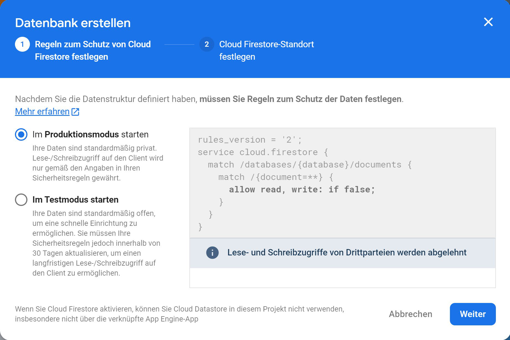
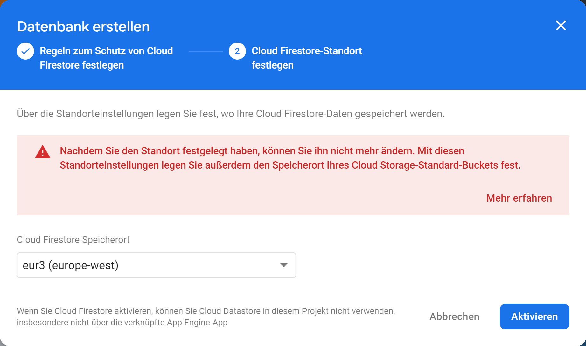
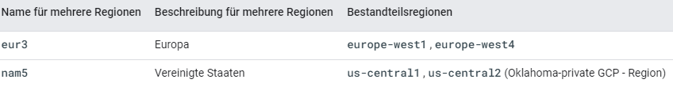
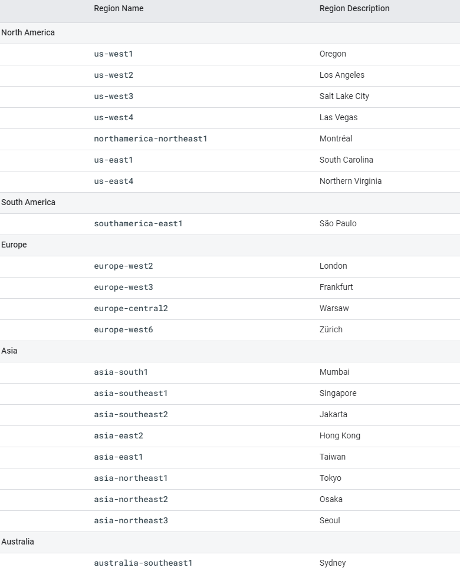
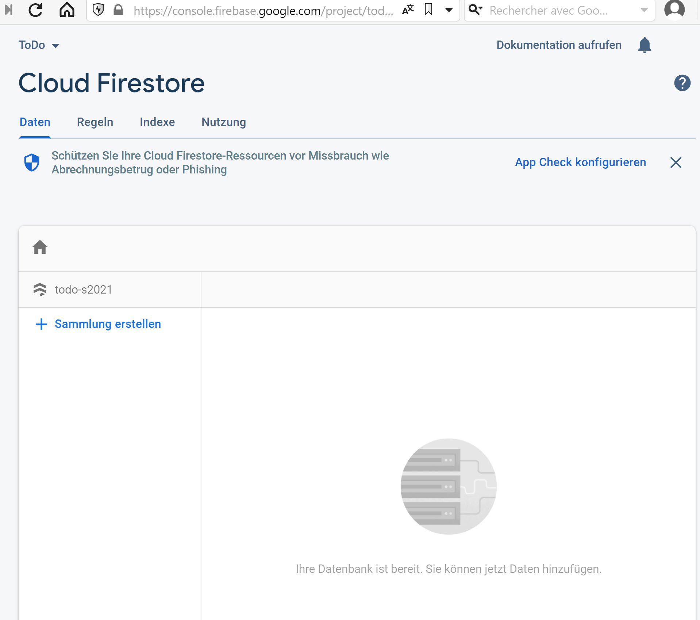

# 3. Zugriff und Sicherheit Regeln

Eine Cloud Firestore Datenbank kann in der Firebase Konsole erstellt werden. Dort muss man einfach auf „Create Database“ klicken.

Abbildung 2: Datenbank erstellen in der Developer Console

 

Bei Cloud Firestore spielt die Sicherheit eine große Rolle, deshalb wird man gleich am Anfang damit konfrontiert. Wenn man auf Create Database klickt, muss man zuerst die Sicherheitsregeln für die Datenbank auswählen.

Abbildung 3: Auswahl des Sicherheitsmodus bei der Erstellung einer Datenbank

 

Es gibt in der Regel zwei Modi zur Auswahl:   
•	Produktionsmodus: Die Datenbank ist privat und kann nur von zugelassenen Anwendungen erreicht werden. 
•	Testmodus: die Datenbank ist offen und kann von allen erreicht werden, die einen Link haben   
Der Testmodus ist aber nur für 30 Tage verfügbar. Damit die Datenbank länger erreichbar ist, muss man die Sicherheitsregeln aktualisieren, sonst wird der Zugang deaktiviert.
Nach den Sicherheitsregeln kommt die Auswahl des Standortes der Datenbank.

Abbildung 4: Auswahl des Standortes für die Datenbank  

Es ist möglich sich für eine Region zu entscheiden oder für einen geographischen Standort. Wenn man sich für eine Region entscheidet, wie Europa zum Beispiel, werden die Daten in mehreren Datenzentrenk dieser Region repliziert. Cloud Firestore unterstützt momentan zwei Regionen (Siehe Abbildung 5): „Europa“ und die „USA“

Abbildung 5: Multiregionale Cloud Firestore Standorte  

Wenn man sich für einen geographischen Standort /regionalen Standort entscheidet, stehen die folgenden Optionen zur Verfügung (Abbildung 6):

Abbildung 6: Cloud Firestore Standorte  

Bei regionalen Standorten werden die Daten nicht in einem anderen Datenzentrum repliziert. Bei einem Ausfall des Standortes, wären alle Daten nicht mehr verfügbar.
Nach der Auswahl des Standortes, wird die Datenbank erstellt und steht direkt zu Verfügung (siehe Abbildung 7).

Abbildung 7: Eine leere Cloud Firestore Datenbank   

Wenn eine Datenbank so erstellt ist, ist sie nur für 30 Tage erreichbar. Um sie weiter nutzen zu können, müssen die Sicherheitsregeln aktualisiert werden. Entwickler haben hier zwei Optionen abhängig von den Clientbibliotheken, die verwendet werden.
•	Für Mobil- und Webclientbibliotheken sollen die Firebase-Authentifizierung und die Cloud Firestore Sicherheitsregeln für die serverlose Authentifizierung, Autorisierung und Datenvalidierung verwendet werden.
•	Für Sever-Clientbibliotheken soll die Identitäts- und Zugriffsverwaltung (IAM) verwendet werden, um den Zugriff auf die Datenbank zu verwalten.

  

