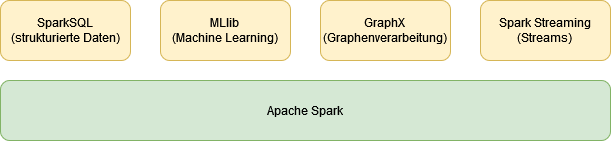
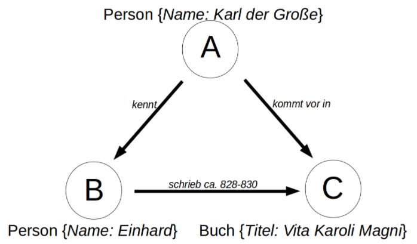
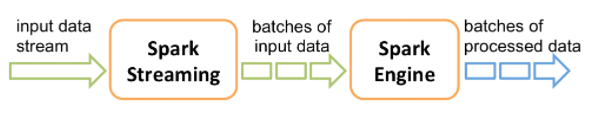

#### [Zum Anfang](README.md "zur Startseite") | [Inhaltsverzeichnis](00_Inhaltsverzeichnis.md "zum Inhaltsverzeichnis")

# 1 Spark

Dieser Abschnitt gibt einen kurzen Überblick über die Ursprünge von [Apache Spark](https://spark.apache.org "zur Webseite") sowie der unterstützten Programmiersprachen. Den Abschluss bildet eine nähere Betrachtung des Ökosystems von Spark mit seinen wichtigsten Erweiterungen.

* [Was ist Spark](01_Spark_Umfeld.md#was-ist-spark "zum Abschnitt")
* [Bisherige Entwicklungsgeschichte](01_Spark_Umfeld.md#bisherige-entwicklungsgeschichte "zum Abschnitt")
* [Sprachunterstützung](01_Spark_Umfeld.md#sprachunterstützung "zum Abschnitt")
* [Spark Ökosystem und Erweiterungen](01_Spark_Umfeld.md#spark-ökosystem-und-erweiterungen "zum Abschnitt")

## Was ist Spark

[_zurück_](01_Spark_Umfeld.md#1-Spark "Zurück")

Bei [Apache Spark](https://spark.apache.org "zur Webseite") handelt es sich um ein ***Framework***, welches Daten aus einer Vielzahl an Quellen einlesen, verarbeiten und ausgeben kann. 

Es verdankt seine Bedeutung der Tatsache, dass es imstand ist, auch ***sehr große Datenbestände*** im Petabereich in kurzer Zeit verarbeiten zu können. Hierbei verteilt [Apache Spark](https://spark.apache.org "zur Webseite")  die Verarbeitung auf verschiedene Prozesse und führt die Ergebnisse zu einem späteren Zeitpunkt wieder zusammen. Daneben können nicht nur ***strukturierte Daten***, sondern auch ***unstrukturierte*** oder als ***Stream*** vorliegende Daten verarbeitet werden.

Den Kern des Frameworks bilden grundlegende Funktionen wie die Ablaufsteuerung, die Aufgaben- und
Zeitplanung sowie die Bereitstellung von Input- und Output-Operationen. Die zugrunde liegende Datenstruktur basiert auf ***Resilient Distributed Datasets (RDDs)***, welche im Abschnitt [Datenstrukturen](02_Datenstrukturen.md "zum Kapitel") ausführlich behandelt werden. Sie ermöglichen die Performante und hoch skalierbare, verteilte Bearbeitung sehr großer Datenmengen.

## Bisherige Entwicklungsgeschichte

[_zurück_](01_Spark_Umfeld.md#1-Spark "Zurück")

Nach [eigenen Angaben](https://spark.apache.org/history.html "zur Webseite") startete Apache Spark 2009 als ein Forschungsprojekt an der [UC Berkley](https://www.berkeley.edu "zur Webseite") in Kalifornien und wurde 2010 als Open Source Projekt veröffentlicht. In den folgenden Jahren erschienen 
mehrere wissenschaftliche Publikationen, die sich mit den zugrunde liegenden Ideen beschäftigten. Es bildete sich eine rasch wachsende Community. Seit 2014 ist es als [Top-Level-Projekt](https://blogs.apache.org/foundation/entry/the_apache_software_foundation_announces50 "zur Webseite") Teil der
[Apache Software Foundation](https://www.apache.org "zur Webseite"). Als Nutzer werden u.a. IBM, Intel und Yahoo aufgelistet.

Laut Angaben von [Databricks](https://databricks.com/de/spark/about "zur Webseite") arbeiten (Stand 2021) über 1000 aktive Entwickler aus mehr als 250 Unternehmen und Organisationen an dem Projekt mit, welches sich zur größten Open Source Community im Bereich Big Data entwickelt habe. Am 13. Oktober 2021 wurde die aktuelle 
[Version 3.2.0](https://spark.apache.org/releases/spark-release-3-2-0.html "zur Webseite") veröffentlicht. 

Ebenfalls in 2013 wurde von den ehemaligen Entwicklern die Firma [Databricks](https://databricks.com "zur Webseite") ins Leben gerufen. Databricks sieht sich selbst in der Verantwortung, das offene Entwicklungsmodell von Spark 
aufrechtzuerhalten und Spark selbst weiterzuentwickeln. Gleichzeitig gehören Onlinekurse und Eigenentwicklungen im Umfeld von Spark zu ihrem Geschäftsmodell. Ein Beispiel hierfür ist die Cloud Data Plattform *lakehouse*.

Laut [Wikipedia](https://en.wikipedia.org/wiki/Databricks "zur Wikipediaseite") arbeitet Databricks seit 2017 mit Microsoft zusammen, und ist hier unter dem Namen *Azure Databricks* verfügbar.  2021 Wurde eine Kooperation mit Google eingegangen, um Spark in dessen Cloud verfügbar zu machen. 

## Sprachunterstützung

[_zurück_](01_Spark_Umfeld.md#1-Spark "Zurück")

Auch wenn Apache Spark ursprünglich in Scala programmiert wurde, unterstützt es eine Reihe weiterer Sprachen, darunter die für das Umfeld von Big Data und Machine Learning wichtigen Sprachen Python und R.

Auf der [Übersichtsseite](https://spark.apache.org/docs/latest "zur Dokumentation") zur aktuellen Version 3.2.0 (Stand Dezember 2021) wird auf die unterstützten Sprachen und deren jeweilige Mindestversion näher eingegangen. Hiernach wird 

- [Java](https://openjdk.java.net "zur Webseite")
  8/11 (Versionen vor 8u201 sind deprecated ab Spark 3.2.0, Maven Support, kann DataSets nutzen)
- [Scala](https://www.scala-lang.org "zur Webseite")
  2.12 (Maven Support, kann DataSets nutzen)
- [Python](https://www.python.org "zur Webseite")
  3.6+ (Version 3.6 und davor sind deprecated ab Spark 3.2.0, mit Hilfe von *PySpark*)  
- [R](https://www.r-project.org "zur Webseite")
  3.5+ (mit Hilfe von *SparkR*)

unterstützt. Insbesondere bei der Zusammenarbeit von Spark mit [Apache Arrow](https://arrow.apache.org "zur Webseite")  wird auf mögliche Probleme im Umfeld von Java und Python eingegangen und auf die entsprechende [Dokumentation](https://arrow.apache.org/docs "zur Webseite")  verwiesen.

Mit ***Spark SQL*** besteht die Möglichkeit, auf ***strukturierte Daten*** unter Verwendung von [***SQL***](https://de.wikipedia.org/wiki/SQL "zur Wikipediaseite") (*Structured Query Language*) zuzugreifen.

Die Verwendung von ***Java*** und ***Scala*** als höhere objektorientierte Programmiersprachen ermöglicht die Verwendung der mit SparkSQL zuletzt eingeführten, ***streng typisierten Datasets im Code*** zu nutzen. Ein weiterer Vorteil dieser Sprachen ist die Möglichkeit, Apache Spark mit Hilfe von Maven direkt in Projekte einzubinden. 

### PySpark

[_zurück_](01_Spark_Umfeld.md#sprachunterstützung "Zurück")

Für die Arbeit mit Python existiert mit [PySpark](https://spark.apache.org/docs/latest/api/python/index.html "zur Dokumentation") ein Interface, dass eine ***starke Integration mit Python*** ermöglicht. Auf Grund der existierenden Vielzahl an Erweiterungen für Python, werden Einschränkungen, welche durch die fehlende Nutzbarkeit von stark typisierten Datasets entstehen,  kompensiert. 

### SparkR

[_zurück_](01_Spark_Umfeld.md#sprachunterstützung "Zurück")

Mit [SparkR (R on Spark)](https://spark.apache.org/docs/latest/sparkr.html "zur Dokumentation") existiert ein leichtgewichtiges ***Frontend zur Nutzung von Spark mit R***. Daneben unterstützt das Paket auch das verteilte Lernen in Zusammenarbeit mit SparkML. Nach Meinung des Autors, scheint die Integration von Python jedoch bei weitem tiefergehender und in sich intuitiver zu sein. 

## Spark Ökosystem und Erweiterungen

[_zurück_](01_Spark_Umfeld.md#1-Spark "Zurück")

In und um Spark hat sich ein sehr umfangreiches Ökosystem entwickelt, welches Spark als Framework erweitert oder aber auf den Fähigkeiten von Spark basiert, diese nutzt ober aber nutzen könnte. Hierbei handelt es sich nicht nur um Software im Umfeld der [Apache Foundation](https://www.apache.org "zur Webseite"), sondern im starken Maße auch um kommerzielle Software. Auf der [Homepage von Spark](https://spark.apache.org "zur Webseite") findet sich hierzu eine Übersicht. 

Bekannte Vertreter sind:

* [mongoDB (Open Source)](https://www.mongodb.com "zur Webseite")
* [SQL Server (Microsoft)](https://www.microsoft.com/de-de/sql-server/sql-server-2022 "zur Webseite")
* [tableau (Salesforce.com)](https://www.tableau.com/de-de "zur Webseite")
* [Power BI (Microsoft)](https://powerbi.microsoft.com/de-de "zur Webseite")
* [PyTorch (facebook)](https://pytorch.org "zur Webseite")
* [TensorFlow (Google)](https://www.tensorflow.org "zur Webseite")

Die folgende Abbildung zeigt die wichtigsten Erweiterungen im direkten Umfeld von Spark, welche das Framework selbst erweitert und breiter aufgestellt haben: 

Eine erschöpfende Betrachtung würde hierbei den Rahmen und die Zielsetzung dieser Arbeit bei weitem sprengen. Hier sei auf die jeweils angegebenen Projektseiten verwiesen:

* [SparkSQL (Unterstützung für strukturierte Daten)](https://spark.apache.org/sql "zur Webseite")
* [MLlib (Unterstützung für maschinelles Lernen)](https://spark.apache.org/mllib "zur Webseite")
* [GraphX (Unterstützung für Graphenbasierte Strukturen)](https://spark.apache.org/graphx "zur Webseite")
* [Spark Streaming (Unterstützung für Streaming)](https://spark.apache.org/streaming "zur Webseite")

### SparkSQL

[_zurück_](01_Spark_Umfeld.md#spark-ökosystem-und-erweiterungen "Zurück")

[SparkSQL](https://spark.apache.org/sql "zur Webseite") erweitert und vereinfacht den Umgang mit ***strukturiert vorliegenden Daten*** und stellt eine der wichtigsten Erweiterungen von Spark dar. Wichtige Punkte bei dessen Entwicklung stellen die Einführung von DataFrames und darauf folgend von DataSets dar. Diese können direkt oder aber auf Basis zugrunde liegender RDDs erstellt werden. 

In den nachfolgenden Versionen wurden beide Konstrukte zusammengeführt. Ein ***DataFrame*** wird hier als ein ***DataSet vom Typ Row*** angesehen und kann auch unstrukturierte Daten enthalten. Ein weiteres wichtiges Feature ist die Möglichkeit, SQL zur Abfrage und Selektion strukturiert vorliegender Daten verwenden zu können.

Im Abschnitt [02 Datenstrukturen](02_Datenstrukturen.md#spark "zum Abschnitt") wird hierauf näher eingegangen. Daneben existiert auf der Seite von Spark eine umfassende [Dokumentation von SparkSQL](https://spark.apache.org/docs/latest/sql-programming-guide.html "zur Dokumentation"). 

### MLlib

[_zurück_](01_Spark_Umfeld.md#spark-ökosystem-und-erweiterungen "Zurück")

Die [Maschine Learning Library (MLlib)](https://spark.apache.org/mllib "zur Webseite") von Apache Spark bietet Zugang zu einer umfangreichen Bibliothek für die Bearbeitung und Bereinigen von Daten. Hierzu gehören neben Funktionen zum Aggregieren von Daten auch ***Algorithmen für Klassifizierung, Regression oder Clustering***. 

Gegenüber anderen Bibliotheken aus diesem Bereich, wie beispielsweise [scikit-learn](https://scikit-learn.org "zur Webseite"), können mit ihr auf Basis von Spark auch sehr große Datenkontingente sehr performant, verteilt und skalierbar verarbeitet werden. Daneben existieren Hilfsfunktionen zur Unterstützung von Routineaufgaben wie die Erzeugung 
von Statistiken.

Weiterhin werden die ***Erstellung von Workflows*** für die Verarbeitung (Pipelines), das ***Erstellen und Trainieren von Modellen*** sowie deren ***Serialisierung und Einsatz*** unterstützt. Für einen vertiefenden Einblick bietet sich die offizielle [Dokumentation](https://spark.apache.org/docs/latest/ml-guide.html "zur Dokumentation") an.

### GraphX

[_zurück_](01_Spark_Umfeld.md#spark-ökosystem-und-erweiterungen "Zurück")

Bei [GraphX](https://spark.apache.org/graphx "zur Webseite") handelt es sich um eine Erweiterung, welche die Möglichkeit eröffnet, im Kontext von Spark mit Graphen zu arbeiten. Nach [eigenen Angaben](https://spark.apache.org/docs/latest/graphx-programming-guide.html "zur Dokumentation") erweitert es die grundlegende und auf Basis der 
[RDD](02_Datenstrukturen.md#spark "zum Abschnitt") aufgebaute Struktur um eine ***Graphenabstraktion***. Hierzu wurden mehrere Erweiterungen für die Arbeit mit Graphen hinzugefügt. Zudem enthält es eine Reihe von ***Algorithmen für die Arbeit mit und Analyse von Graphen***, welche stetig wächst.

Mit Blick auf die immer größere Akzeptanz und den Einsatz von Graphendatenbanken ist diese Erweiterung aus Sicht des Autors sehr wichtig. Um Spark im Kontext von Graphendatenbanken grundsätzlich zu verwenden, ist diese Erweiterung jedoch nicht zwingend notwendig. Als Beispiel sei hier die weit verbreitete Datenbank [Neo4j](https://neo4j.com "zur Webseite") genannt, welche einen eigenen [Konnektor für Spark](https://neo4j.com/docs/spark/current "zur Dokumentation") anbietet.   

#### Exkurs Graphendatenbanken

Im Gegensatz zu relationalen Datenbanken, welche ihre Daten in Tabellen aufteilen, die zueinander in Beziehung stehen (*Relationen zueinander haben*), strukturieren Graphendatenbanken ihre Daten gänzlich anders. 

Eine Graphendatenbank besteht aus einzelnen ***Knoten*** (Nodes), welche über ***Kanten*** (Edges) miteinander verbunden sind. Knoten können einen ***Typ*** (Label) haben und über weitere ***Eigenschaften*** (Properties) verfügen. Die vorhandenen Kanten zeigen die Beziehungen der Knoten untereinander an und verleihen dem Graphen dadurch eine Semantik. 

Kanten können eine Richtung haben (*gerichteter Graph*), oder aber richtungslos (*ungerichteter Graph*) sein. Innerhalb eines Graphen kann sich nur in Richtung der Kanten bewegt werden. Ist eine Kante richtungslos, so kann sich in beide Richtungen bewegt werden.

Von [Andreas Kuczera](https://github.com/kuczera "zur GitHub Seite") findet sich eine gute und leicht verständliche Einführung in die theoretischen Grundlagen der Graphen an sich auf [GitHub](https://kuczera.github.io/Graphentechnologien/05_Einfuehrung_und_Theorie.html "zur GitHub Seite"). Dieser Seite wurde auch das folgende Bild entnommen, welches ein einfaches Beispiel für die Darstellung von Wissen auf Basis von Graphen gibt:

Dargestellt werden zwei Knoten vom Typ **_Person_** sowie ein Knoten vom Typ **_Buch_** mit ihren Eigenschaften. Diese sind mit **_gerichteten_** und **_annotierten Kanten_** verbunden. Ein wichtiger, hier zu erkennender Unterschied zu relationalen Datenbanken ist, dass die Personen nicht Datensätze einer Tabelle, sondern zwei selbstständige **_Knoten_** sind (auch wenn für die Serialisierung durchaus eine relationale Datenstruktur Anwendung finden kann).  

Gleichzeitig gibt der Graph auch einen Sachverhalt wieder, der nicht trivial in einer relationalen Datenbank gehalten werden könnte: 

* Karl der Große kennt Einhard
* Einhard schrieb das Buch Vita Karoli Magni
* Karl der Große kommt in dem Buch vor.

### Spark Streaming

[_zurück_](01_Spark_Umfeld.md#spark-ökosystem-und-erweiterungen "Zurück")

Als letzte Erweiterung soll hier ein Blick auf [Spark Streaming](https://spark.apache.org/streaming "zur Webseite") geworfen werden. Spark Streaming ermöglicht die Verarbeitung von Datenströmen aus einer Vielzahl an unterschiedlichen Quellen. Ebenfalls besteht die Möglichkeit, eigene Quellen zu definieren und zu verwenden. Die folgende Abbildung wurde der [Dokumentation von Spark Streaming](https://spark.apache.org/docs/latest/streaming-programming-guide.html "zur Dokumentation") entnommen und zeigt einige der verfügbaren Quellen und Ausgabeformate.

Wie aus der Abbildung zu ersehen, werden empfangene Streams verarbeitet und im Anschluss an deren Verarbeitung die Ergebnisse abgelegt. Die Art der Verarbeitung richtet sich hierbei nach der konkreten Aufgabe. 

Laut [aktueller Dokumentation](https://spark.apache.org/docs/latest/streaming-programming-guide.html "zur Dokumentation") führt Spark Streaming hierfür einen [***Discretized Stream*** (DStream)](https://spark.apache.org/docs/latest/streaming-programming-guide.html#discretized-streams-dstreams "zur Dokumentation") ein, welcher einen ***kontinuierlichen Datenstrom*** (datastream) darstellt. Hierzu findet sich auf [Usenix.org](https://www.usenix.org "zur Webseite") ein wissenschaftliches [Paper](https://www.usenix.org/system/files/conference/hotcloud12/hotcloud12-final28.pdf "zum Paper"). 

Ein Stream kann auf einer unterstützten Quelle oder aber einem anderen DStream basieren. Intern stellt ein **DStream** eine ***Sequenz von RDDs*** dar. Hierbei werden die Sprachen Scala, Java und Python unterstützt.

Die folgende Abbildung, welch ebenfalls der [Dokumentation](https://spark.apache.org/docs/latest/streaming-programming-guide.html "zur Dokumentation") entnommen wurde, visualisiert nochmals den Vorgang:

Ein **_kontinuierlicher Eingabestrom (datastream)_** wird von Spark Streaming in eine **_Sequenz von RDDs_** umgewandelt und im Anschluss von Spark weiterverarbeitet.

Mit Hilfe von Spark Streaming ist es somit möglich, jede Form von Datenströmen zu verarbeiten und hierzu die Fähigkeiten von Spark direkt zu nutzen. Dies erweitert die möglichen Szenarien, in denen Spark eingesetzt werden kann, erheblich. Zu nennen sind hier beispielsweise Textmining unter Verwendung von Twitter um aktuelle Trends in Echtzeit zu erfassen. 
