#### [Zum Anfang](README.md "zur Startseite") | [Inhaltsverzeichnis](00_Inhaltsverzeichnis.md "zum Inhaltsverzeichnis")

# 2 Datenstrukturen

In den folgenden Unterkapiteln wird ein Überblick über die wichtigsten Konzepte und Datentrukturen von Spark gegeben.
Wegen der starken Verbindung von Hadoop und Spark wird zu Anfang zunächst kurz auf Hadoop als ganzes und detailierter
auf dessen auch für Spark wichtigen Filesystem HDFS eingegangen. Den Schwerpunkt bildet jedoch ein Überblick über
die wichtigsten Datenstrukturen von Spark.

Eine vertiefende und vollständige Behandlung beider System kann und soll hierbei nicht geleistet werden. Hierzu sei auf
die offizielle Dokumentation sowie weitere Quellen im Internet hingewiesen. Eine erste Orientierung kann hierbei die
[Linksliste](Anhang_Linkliste.md "zum Kapitel")
am Ende dieses Repositories geben.

Insbesondere werden im Rahmen von Erweiterungen hinzugefügte Datentrukturen, welche im Kapitel
[Spark](01_Spark_Umfeld.md "zum Kapitel")
diskutierten werden, hier nicht berücksichtigt. Dies betrifft in erster Linie die Erweiterungen im Kontext von 
[GraphX](01_Spark_Umfeld.md#graphx "zum Abschnitt")
und
[Spark Streaming](01_Spark_Umfeld.md#spark-streaming "zum Abschnitt")

Ergänzend zu dieser Einleitung, werden in den Kapiteln

* [Wordcount mit Spark RDDs und Python](04_Wordcount_mit_Spark_RDDs_und_Python.md "zum Kapitel")
* [Wordcount mit Spark DataFrames und Python](05_Wordcount_mit_Spark_DataFrames_und_Python.md "zum Kapitel")

zwei konkrete Beispiele zur Nutzung von Spark mit Python vorgestellt. Beide Beispiele liegen auch in Form von Python
Notebooks im Ordner 
[notebook](notebook "zum Ordner") 
vor und können direkt in Google Colab geöffnet und ausgeführt werden.

* [Hadoop](02_Datenstrukturen.md#hadoop "zum Abschnitt")
* [Spark](02_Datenstrukturen.md#spark "zum Abschnitt")

## Hadoop

[_zurück_](02_Datenstrukturen.md#2-Datenstrukturen "Zurück")

* [Yet Another Resource Negotiator (YARN)](02_Datenstrukturen.md#yet-another-resource-negotiator-yarn "zum Abschnitt")
* [Hadoop Distributed File System (HDFS)](02_Datenstrukturen.md#hadoop-distributed-file-system-hdfs "zum Abschnitt")
* [Hadoop Map Reduce](02_Datenstrukturen.md#hadoop-map-reduce "zum Abschnitt")


(Das Apache Hadoop Loge ist ein eingetragenes Logo
der [Apache Software Foundation](https://www.apache.org "zur Webseite")

Laut
[Wikipedia](https://de.wikipedia.org/wiki/Apache_Hadoop "zur Wikipediaseite")
ist
[Apache Hadoop](https://hadoop.apache.org "zur Webseite")
ein in Java geschriebenes Open Source Framework zur verteilten Verarbeitung sehr großer Datenmengen. Es
wurde in 2006 gegründet und gehört seit 2008 zu den Top Level Projekten von Apache. Aktuell (Dezember 2021) 
liegt es in der Version 3.3.1 vor.

Entgegen der weit verbreiteten Meinung ist
[Apache Hadoop](https://hadoop.apache.org "zur Webseite") 
kein Datenbanksystem im engeren Sinne, sondern muss eher als ein Framework für die dateibasierte
[Batchverarbeitung](https://de.wikipedia.org/wiki/Stapelverarbeitung "zur Wikipediaseite") 
sehr großer, verteilter Datenmengen mit Hilfe seines Dateisystems
[HDFS](02_Datenstrukturen.md#hadoop-distributed-file-system-hdfs "zum Abschnitt")
angesehen werden, was es als Echtzeitsystem ungeeignet macht. Hierbei ist es hoch skalierbar und kann auch 
sehr großen Datenmengen performant verarbeiten. Wie auf einer Grafik der Seite   
[datasolut.com](https://datasolut.com/apache-hadoop-einfuehrung "zur Webseite")
dargestellt wird, existieren insgesammt vier Komponenten:

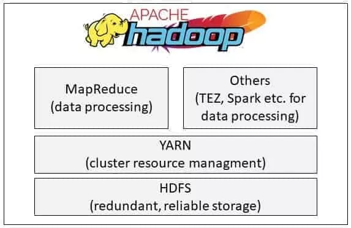

Alle Ressourcen werden von einen zentralen Ressourcen Manager 
[YARN](02_Datenstrukturen.md#yet-another-resource-negotiator-yarn "zum Abschnitt")
verwaltet. Die zu verarbeitenden Daten werden im 
[HDFS Filesystem](02_Datenstrukturen.md#hadoop-distributed-file-system-hdfs "zum Abschnitt") 
abgelegt und anschließend mit 
[Map Reduce](02_Datenstrukturen.md#hadoop-map-reduce "zum Abschnitt") 
verarbeitet und serialisiert.

Daneben existieren unter den Begriff
[Hadoop Common](https://mvnrepository.com/artifact/org.apache.hadoop/hadoop-common "zum Maven Repository")
eine Sammlung von für den Betrieb notwendigen Tools und Routinen als Maven Repository. Hierzu gehören Javafiles
und -skripte für den Start des Systems.

### Yet Another Resource Negotiator (YARN)

[_zurück_](02_Datenstrukturen.md#hadoop "Zurück")

[YARN (Yet Another Resource Negotiator)](https://hadoop.apache.org/docs/stable/hadoop-yarn/hadoop-yarn-site/YARN.html "zur Dokumentation") 
hat die Aufgabe, die zur Bearbeitung benötigten Ressourcen eines Clusters, also CPU Zeit und Speicher, in ausreichenden 
Maße bereitzustellen und einem Job zuzuweisen. Er erfüllt somit eine sehr wichtige und für die Performance des Systems 
relevante Aufgabe. Eine weitere 
[tiefergehende Betrachtung](https://www.computerweekly.com/de/definition/Apache-Hadoop-YARN-Yet-Another-Resource-Negotiator "zur Webseite")
aus dem Jahr 2018 ist auf 
[ComputerWeekly.de](https://www.computerweekly.com/de "zur Webseite") 
zu finden. Dieser Seite wurde auch die folgende Übersicht entnommen, welche die Funktionsweise von YARN skizziert:

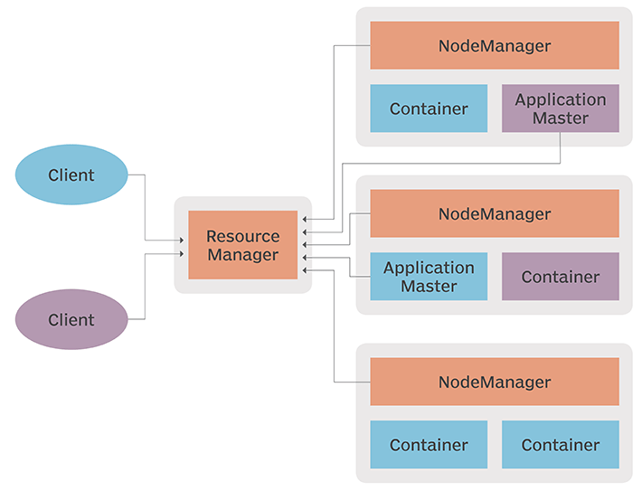

Zentrales Element ist der **_Resourcenmanager_** selbst. Die **_NodeManager_** der beteiligten **_Cluster_** teilen 
ihren Status mit. Für jede Anwendung wird ein **_Application Manager_** erstellt, welcher die benötigten Ressourcen 
beim **_Ressourcen Manager_** anfragt. **_Container_** weisen dann die Ressourcen der Anwendung zu.

### Hadoop Distributed File System (HDFS)

[_zurück_](02_Datenstrukturen.md#hadoop "Zurück")

Hadoop nutzt zur Speicherung seiner Daten das
[Hadoop Distributed Filesystem (HDFS)](https://hadoop.apache.org/docs/r3.3.1 "zur Dokumentation")
. Hierbei handelt es sich um ein hochverfügbares, verteiltes Dateisystem, welches die Verwaltung mehrere Millionen 
Dateien auf mehreren tausend Servern ermöglicht.

Die folgende Abbildung wurde der Seite 
[Quobyte](https://www.quobyte.com/storage-explained/what-is-hdfs "zur Webseite") 
entnommen und gibt eine Übersicht über den Aufbau des Dateisystems wieder:

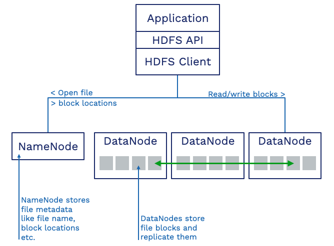

Wie in der Abbildung zu sehen ist, besteht das Dateisystem aus drei primären Bestandteilen. Bei dem ersten 
Bestandteil handelt es sich um einen als **_DataNode_** bezeichneten Service. Dieser ist für die Speicherung der Daten 
in feste Blöcke zuständig und sichert deren Replizierbarkeit. Dieser Service läuft daher in der Regel auf jeden
genutzten Server. Ein einziger **_NameNode_** enthält alle notwendigen Metadaten über existierenden **_DataNodes_** und
kann somit als eine Art "_Gesamtverzeichnis_" angesehen werden. Der Zugriff auf die Daten erfolgt über einen **_HDFS 
Client_**, der Teil der Hadoop Distribution ist.

Trotz der vielen Vorteile wird
[HDFS](https://hadoop.apache.org/docs/r3.3.1 "zur Dokumentation")
zunehmend von Cloudbasierten, intelligenten Dateisystemen wie beispeilsweise 
[AWS S3](https://aws.amazon.com/de/s3 "zur Website")
oder
[Microsoft Blob Storage](https://azure.microsoft.com/de-de/services/storage/blobs "zur Website")
verdrängt.

### Hadoop Map Reduce

[_zurück_](02_Datenstrukturen.md#hadoop "Zurück")

Für die Datenverarbeitung nutzt Hadoop das ursprünglich in seinen Grundzügen von Google stammende
[Map Reduce](https://research.google/pubs/pub62 "zur Webseite").
Bei 
[Hadoop Map Reduce](https://hadoop.apache.org/docs/stable/hadoop-mapreduce-client/hadoop-mapreduce-client-core/MapReduceTutorial.html "zur Dokumentation") 
handelt es sich im Prinzip um zwei nacheinander stattfindende Prozesse:

* einen Map Job
* einen Reduce Job

Zunächst werden mit dem Map Job benötigten Daten aus den Datenbestand gefiltert und extrahiert. Auf der so  
selektierten Datenbasis werden die definierten Operationen ausgeführt und zusammengefasst. Dieser Schritt 
kann als eine Reduktion der ursprünglichen Datenbasis aufgefasst werden, wovon die Bezeichnung Reduce abgeleitet 
werden kann.

Auf der Webseite 
[datasolut.com](https://datasolut.com/apache-hadoop-einfuehrung "zur Webseite")
existieren hierzu zwei Grafiken, welche diesen Vorgang gut verdeutlichen:

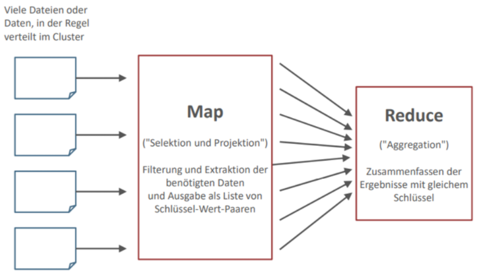

Die anfallenden Aufgaben können hierbei aufgeteilt und parallel auf mehrere, verteilte Rechner ausgeführt und 
anschließend zu einem Gesamtergebnis zusammengeführt werden. Die zweite Grafik auf der genannten Seite 
verdeutlicht dies an einem Wordcount Beispiel.

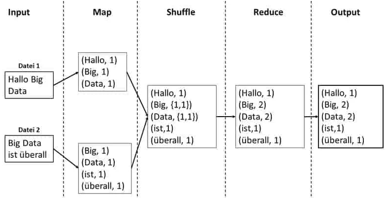

Es ist wichtig, zwei Dinge zu verstehen:

* Das Ergebnis eines Map Reduce bei Hadoop ist immer ein **_reduzierter, berechneter Datenbestand_**. Würde in einer
  Anwendung zwei Map Reduce Vorgänge hintereinander ausgeführt, ohne das Zwischenergebnis zu speichern, so kann kein
  Rückschluß auf das Zwischenergebnis oder den ausgeführten Aktionen gemacht werden.
* Der Map-Begriff im Kontext von Hadoop unterscheidet sich stark von dem in Spark. Im **_Kontext von Hadoop_** dient
  es der Filterung und Selektion von Daten aus dem gesamten Datenbestand. Im **_Kontext von Spark_** definiert es eine
  Aktion, welche auf jedes Element eines RDD, Dataframe oder Datasets ausgeführt werden soll. Das in 
  [Kapitel 4](04_Wordcount_mit_Spark_RDDs_und_Python.md "zum Kapitel") 
  vorgestellte, praktische Beispiel verdeutlicht dies gut.

## Spark

[_zurück_](02_Datenstrukturen.md#2-Datenstrukturen "Zurück")

* [Spark RDDs](02_Datenstrukturen.md#spark-rdds "zum Abschnitt")
* [Spark Dataframes](02_Datenstrukturen.md#spark-dataframes "zum Abschnitt")
* [Spark Datasets](02_Datenstrukturen.md#spark-datasets "zum Abschnitt")
* [Spark DataFrame vs Spark DataSet](02_Datenstrukturen.md#spark-dataframe-vs-spark-dataset "zum Abschnitt")
* [Optimierungen](02_Datenstrukturen.md#optimierungen "zum Abschnitt")
* [Transformationen und Aktionen](02_Datenstrukturen.md#transformationen-und-aktionen "zum Abschnitt")

### Spark RDDs

[_zurück_](02_Datenstrukturen.md#spark "Zurück")

In den folgenden Kapiteln wird eine Übersicht über die wichtigsten Datenstrukturen in Spark gegeben, deren 
Verständnis für die Funktionsweise und Bewertung von Spark als ganzes wichtig sind. Starkes Gewicht wird hierbei auf 
den RDDs als Kernkomponente von Spark gelegt.

Auch wenn aktuell anwenderfreundliche Strukturen wie DataFrames und DataSets mit ihrer eigenen API verfügbar sind, 
ist für ein gutes Verständnis von Spark dies Wissen wichtig. Umso mehr, wenn stark auf Ebene der RDDs in die 
Verarbeitung eingegriffen werden soll oder muss.

RDD steht für **_Resilient Distributed Dataset_** (auf deutsch etwa “robuster verteilter Datensatz”) und stellt das 
zentrale Konzept und Objekt für die Abstraktion von Daten innerhalb von Spark dar. Für einen RDD können 
**_Transformationen_** (Bearbeitungen) für dessen Daten festgelegt werden. Hierbei ist das RDD **_immutable_**. Jede 
Aktion auf ein RDD verändert das zugrunde liegende RDD nicht, sondern gibt stets ein neues RDD zurück. Hierbei nutzt 
Spark in starken Maße die Übergabe von Funktionen. RDDs nutzen **_lazy evaluation_**. Transformationen werden erst 
dann ausgeführt, wenn ein Ergebnis abgefragt, sprich, eine **_Action_** angestoßen wird.

Die folgende, der Seite 
[TowardDataScience.com](https://towardsdatascience.com/your-first-apache-spark-ml-model-d2bb82b599dd "zur Webseite") 
entnommene Grafik illustriert dies sehr schön:

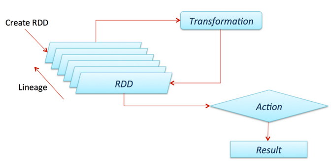

Im Ergebnis bleiben somit die Rohdaten erhalten und Transformationen können vor der finalen Ausführung optimiert und 
effektiv umgesetzt werden. Von Nachteil ist hierbei, dass Daten nicht typisiert sind und ein RDD über keine 
Schemainformationen verfügt.

RDDs verfügen über die Fähigkeit, beschädigte Spark Knoten oder Partitionen zu ersetzen. Als Legacy Code ermöglicht RDD
eine Low-Level Kontrolle über die Ausführung und Verarbeitung unstrukturierter Daten und ist für alle Arten von
Anwendungen geeignet und über seiner API zugänglich.

#### Erzeugen von RDDs

Grundsätzlich existieren zwei Möglichkeiten, um ein RDD zu erzeugen. Zum einen ist dies die Verwendung einer
existierenden Collection, zum anderen das Referenzieren eines extern vorliegenden Datasets wie ein geteiltes 
Dateisystem oder ein beliebiges Hadoop Eingabeformat.  

Bei der Verwendung von Collections werden die Daten bereits im Vorfeld aus den jeweiligen Quellen gelesen und in Form
einer geeigneten Collection gehalten. Mithilfe der Methode 
[**_parallelize_**](https://spark.apache.org/docs/latest/rdd-programming-guide.html#parallelized-collections "zur Dokumentation") 
wird dann aus der Collection ein RDD erstellt. Diese Methode eignet sich insbesondere für Datenbestände, welche mit 
normalen Werkzeugen gut zu handhaben sind:

```python
sc = SparkContext("local", "SampleApp")
integers = list(range(1,6)
integers_rdd = sc.parallelize(integers)
```

Für sehr große Datenbestände kann jedoch beispielsweise die Verwendung der 
[**_textFile_**](https://spark.apache.org/docs/latest/rdd-programming-guide.html#resilient-distributed-datasets-rdds "zur Dokumenation") 
Methode sinnvoller sein. Mit ihrer Hilfe können auch sehr große, entfernte Daten einem RDD zugeführt werden:

```python
sc = SparkContext("local", "SampleApp")
lines_rdd = sc.textFile("text.txt")
```

Diese Methode eignet sich auch für externe Datenspeicher wie Amazon S3, HDFS, Cassandra, Elasticsearch sowie JDBC.

### Spark Dataframes

[_zurück_](02_Datenstrukturen.md#spark "Zurück")

Die Arbeit auf Basis der zuvor behandelten RDDs ist gut geeignet, wenn man nahe an Spark arbeiten und den größtmöglichen
Einfluss haben möchte. Auf der anderen Seite erfordert die Einarbeitung und der Umgang mit diesem Objekt eine gewisse
Einarbeitung.

Mit der Version 1.3 führte Spark DataFrames ein, welche die sogenannten SchemaRDDs ersetzten. Ab der Version 2.0 dient
die
[**_Spark Session_**](https://spark.apache.org/docs/latest/sql-getting-started.html "zur Dokumentation") 
als allgemeiner Einstiegspunkt in eine Spark Anwendung. Sie löst den bis dahin genutzen 
[**_HiveContext_**](https://spark.apache.org/docs/1.6.1/api/java/org/apache/spark/sql/hive/HiveContext.html "zur Dokumentation")
(unstrukturierte Daten) und 
[**_SQLContext_**](https://spark.apache.org/docs/latest/api/java/org/apache/spark/sql/SQLContext.html "zur Dokumentation") 
(strukturierte Daten) ab. DataFrames sollen die Arbeit und den Umgang mit Spark
vereinfachen und bieten eine Abstraktion der Datensicht in Spark, nutzen jedoch intern die API der RDDs. Daher können
sie nicht nur auf Basis eines bereits vorhandenen RDDs, sondern auf Basis aller von Spark unterstützten Datenquelle wie
beispielsweise einer Hive Tabelle erzeugt werden. APIs für DataFrames sind für Scala, Java, Python sowie R verfügbar.

Wie zuvor dargestellt, geht man bei der Arbeit mit Spark Dataframes den Weg über eine Spark Session und deren
[**_build Methode_**](https://spark.apache.org/docs/latest/sql-getting-started.html "zur Dokumentation")
. Anschließend stehen unter anderen eine Reihe von Funktionen wie
[**_Session.read.text_**](https://spark.apache.org/docs/latest/sql-getting-started.html#creating-dataframes "zur Dokumentation") 
zur Verfügung, um Textdateien einzulesen.

```python
from pyspark.sql import SparkSession
import pyspark.sql.functions as func

session = SparkSession.builder.appName("Anwendungsname").getOrCreate()
dataframe = session.read.text("Pfad zu einer Datei")
```

Spark Dataframes können hierbei sowohl das Schema der vorhandenen Daten ableiten oder aber ein Schema für die Daten
zugewiesen bekommen. Letzteres ist besonders bei sehr großen Datenbeständen sinnvoll. Zusätzlich kommen bei DataFrames
[**_Query-Optimizer_**](02_Datenstrukturen.md#tungsten-component "zum Abschnitt")
für relationale SQL Abfragen sowie ein
[**_Catalyst-Optimierer_**](02_Datenstrukturen.md#catalyst-optimizer "zum Abschnitt") 
zum Einsatz, der den effizientesten Plan zur Ausführung der Datenoperationen ermittelt. DataFrames sind daher den 
RDDs bei der Ausführung überlegen.

Als Nachteil ist jedoch ihre Nähe zu RDDs zu sehen, da sie letztlich eine Kollektion von Row Objekten eines RDD sind.
Erst zur Ausführung greift die Typisierug. Siehe hierzu auch einen Artikel von
[Heise](https://www.heise.de/ratgeber/Apache-Spark-2-0-Zweiter-Akt-einer-Erfolgsgeschichte-3292006.html?seite=all "zur Webseite")
.

Dataframes sind somit **_kein Ersatz der RDDs_**, sondern können als eine **_Abstraktionsschicht_** auf die Daten und 
deren Handling mit RDDs angesehen werden. Dies verdeutlicht auch die folgende Abbildung.

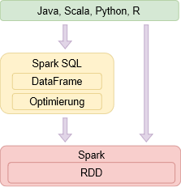

Besonders im Umfeld von Python sind Dataframes als Pandas DataFrames bekannt und in der Tat zeigen sich im Umgang eine
Reihe von Gemeinsamkeiten aber auch Unterschiede. Der wichtigste ist, dass ein **_Spark Dataframe_** eine **_verteilte 
Kollektion von Daten_** ist, welche konzeptuell ein zweidimensionalen Array mit Reihen und benannten Spalten eines 
Datenbestandes entsprechen. Es wurde für die Verarbeitung sehr großer Datenstände optimiert.

### Spark Datasets

[_zurück_](02_Datenstrukturen.md#spark "Zurück")

Mit der Version 1.6 wurden Anfang 2016
[Spark DataSet](https://spark.apache.org/docs/latest/api/scala/org/apache/spark/sql/Dataset.html "zur Dokumentation")
eingeführt. DataSets stellen eine Erweiterung der DataFrames dar und bieten zur Kompilierzeit Typsicherheit. Ebenso wie
DataFrames sind DataSets Bestandteil von SparkSQL und bieten so die Möglichkeit zur Nutzung von SQL zur Abfrage
strukturierter Daten. Hierbei handelt es sich bei DataSets ebenso wie bei DataFrames um immutable und verteilte
Datensammlungen. Für die Übertragung der DataSet Objekte ist eine Serialisierung notwendig. Hierfür nutzt Spark 
einen eigenen leistungsstarken Decoder.

DataSets orten sich eher in Richtung einer stark typisierten objektorientierten Kapselung von Daten ein. Als Konsequent
existiert so nur eine API für Java und Scala. Dies Manko gleicht Python jedoch von Haus aus bereits durch ein
umfangreiches Ökosystem wie Pandas aus.

### Spark DataFrame vs Spark DataSet

[_zurück_](02_Datenstrukturen.md#spark "Zurück")

Chronologisch existierten Spark DataFrames bereits vor der Einführung der DataSets. Als Erweiterung vereinfachen sie
den Zugriff auf RDDs mit Funktionen wie agg (Aggregat), select (Auswahl), sum (Summe) und avg (Mittelwert). Für Ihre 
Erzeugung nutzte man zunächst einen Spark- oder SQLContext. Später jedoch SparkSession.

Mit der Einführung der Spark DataSets entstand eine weitere Abstraktion, welche das DataFrame erweiterte, jedoch auch in
Richtung eines objektorientierten Aufbaus änderte. Es wurde die Entscheidung getroffen, beide als Spark DataSet zu
vereinen. In der aktuellen Version existiert somit ein DataSet Objekt, welches sowohl einen stark typisierten Zugriff (
DataSet) als auch einen nicht typisierten (DataFrame) Zugriff anbietet. Ein **_DataFrame_** Objekt wird hierbei als ein
**_DataSet[row]_** aufgefasst. Auf der Seite
[Knoldus Inc.](https://medium.com/@knoldus/spark-type-safety-in-dataset-vs-dataframe-174137517821 "zur Webseite")
wird hierauf vertiefend eingegangen und der Sachverhalt schön visuelle verdeutlicht:

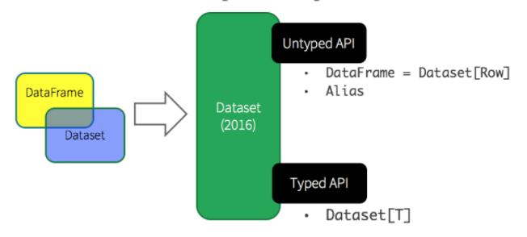


Eine Übersicht über RDD, DataFrames sowie DataSets lässt sich der folgenden Tabelle entnehmen:


|                                 | RDD                          | Spark DataFrames        | Spark DataSets                  |
| --------------------------------- | ------------------------------ | ------------------------- | --------------------------------- |
| Funktionalität                 | Verteilte Sammlung von Daten | Organisation in Spalten | Erweiterung des DataFrame (OOP) |
| Seit Version                    | 1.0                          | 1.3                     | 1.6                             |
| Typesicherheit zur Kompilerzeit | Nein                         | Nein                    | Ja                              |
| APIs verfügbar                 | Nein                         | Ja                      | Ja                              |
| Spark SQL                       | Nein                         | Ja                      | Ja                              |
| Catalyst Optimizer              | Nein                         | Ja                      | Ja                              |
| Tungsten component              | Nein                         | Ja                      | Ja                              |
| Sprachen                        | Java, Scala, Python, R       | Java, Scala, Python, R  | Java, Scala                     |

### Optimierungen

[_zurück_](02_Datenstrukturen.md#spark "Zurück")

Spark ist für die schnelle, verteilte und optimierte Verarbeitung sehr großer Datenbestände entwickelt worden. Um diese
Ziele zu erreichen, muss der verwendete Code hochgradig optimiert sein. Zwei in diesen Zusammenhang immer wieder genannte
Optimierungen sind der Catalyst Optimizer sowie die Tungsten Komponenten. Beide sollen hier kurz besprochen werden.

#### Catalyst Optimizer

Die Aufgabe des Catalyst Optimizers ist die Optimierung der Ausführung von Berechnungen innerhalb von Spark. Bei der
Konzeption des Optimierers wurde darauf geachtet, dass dieser durch eigene Methoden erweitert und angepasst werden kann.

Der Optimierer ist ein Bestandteil von SparkSQL. In einem aufwendigen Prozess werden anstehende Transaktionen zunächst
analysiert und anschließend optimiert. Als Ergebnis steht am Ende generierter Java Bytecode, welcher auf jeder Maschine
ausführbar ist. Zur Generierung des Bytecodes wird ein spezielles Features von Scala,
[Quasiquotes](https://docs.scala-lang.org/overviews/quasiquotes/intro.html "zur Webseite")
genutzt. Dies ermöglicht die einfache Erstellung von Syntaxbäumen, welche dann mit Hilfe des Scala Compilers zu Java
Bytecode kompiliert wird.

Auf der folgenden Abbildung von
[data-flair](https://data-flair.training/blogs/spark-sql-optimization "zur Webseite")
findet sich eine etwas vereinfachte Darstellung des Prozessen:

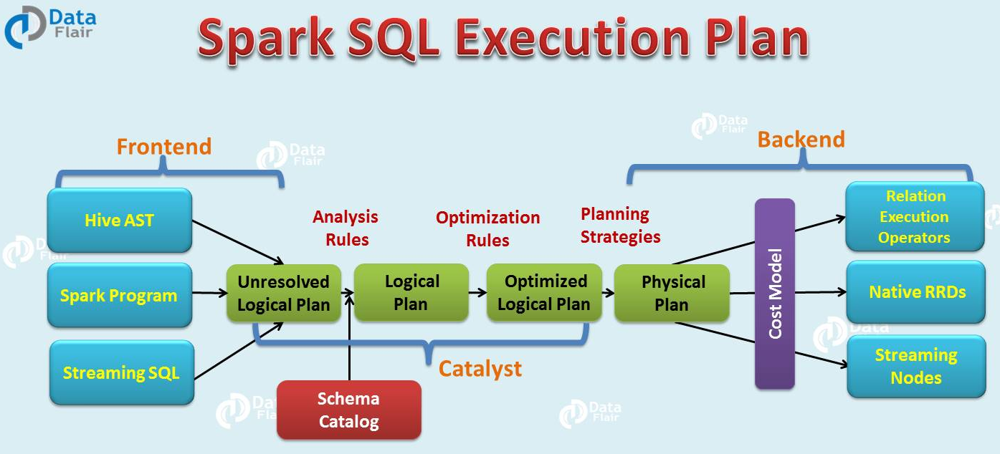

Der Ausführungsplan unterteilt sich in vier Phasen:

In der **_ersten Phase_** werden die **_anstehenden Transformationen_** analysiert. Als Ergebnis steht ein **_logischer 
Ausführungsplan_** am Ende der Verarbeitung. Auf diesen werde in der **_zweiten Phase_** die vorhandene **_Regeln zur 
Optimierung_** ausgeführt. Es entsteht ein **_optimierte logische Ausführungsplan_**.

Aus dem optimierten logischen Plan werden in der **_dritten Phase_** ein oder mehr **_physikalische Pläne_** erstellt, 
welche anhand des **_Kostenmodells_** einer **_Bewertung_** unterzogen werden. Am Ende wird der günstigste Plan verwendet 
und in der **_vierten Phase Bytecode generiert_**, welcher auf jeder Maschine lauffähig ist.

#### Tungsten component

Hinter dem Begriff Tungsteen verbirgt sich ein Sammelprojekt für verschieden Aktivitäten mit dem Ziel, die Performance
von Spark zu verbessern. Grundgedanke ist hierbei, dass weniger Ein- und Ausgabe sowie Netwerke ein Problem darstellen,
sondern in starken Maße Speicher und die Rechenleistung.

In Anlehnung an
[Databricks](https://databricks.com/de/glossary/tungsten "zur Website")
umfasst das Projekt um Moment Aktivitäten in den Bereichen:

- Speichermanagement und binäre Verarbeitung um Overheads beim Objekt Modell und der Garbage Collection zu beseitigen
- Bessere Ausnutzung des Speichers durch Verbesserung der eingesetzten Algorithmen
- Nutzung von Codegenerierung um von modernen Compilern und CPUs zu profitieren
- Verringerung der CPU Aufrufen durch die Vermeidung virtueller Funktionsdispatcher
- Speichern von Zwischenwerten in CPU Registern statt im Speicher. Hierdurch verringert sich die Zahl der notwendigen
  Zyklen
- Ausnutzen moderner CPUs und Compilers um Schleifenausführungen zu optimieren

Dieser Abschnitt kann nur eine kurze Übersicht über das Projekt wiedergeben. Eine interessante und tiefergehende
Einfühung in Tungsten ist auf der Website von Databrick
[hier](https://databricks.com/blog/2016/05/23/apache-spark-as-a-compiler-joining-a-billion-rows-per-second-on-a-laptop.html "zur Webseite")
zu finden.

### Transformationen und Aktionen (RDDs)

[_zurück_](02_Datenstrukturen.md#spark "Zurück")

Auf der Ebene der RDDs kennt Spark zwei grundsätzliche Operationen. Die **_Transformation_** führt eine Aktion auf 
Daten aus und liefert ein neues RDD zurück. Eine **_Aktion_** hingegen ermöglicht den Zugriff auf den vorhandenen Daten,  
kann Berechnungen ausführen und das Ergebnis zurückliefern. Als Parameter werden in starken Maße Funktionen übergeben.

Hierbei werden die Transformationen nicht unverzüglich, sondern erst zu einem späteren Zeitpunkt bei Aufruf einer
Aktion ausgeführt, welche ein Ergebnis zurückliefert. Spark führt somit ein **_lazy computing_** aus.

Dieses Vorgehen ermöglicht Spark, zu einem möglichst späten Zeitpunkt mit der Bearbeitung zu beginnen und eröffnet so
die Möglichkeit, Transformationsschritte zu optimieren. Grundsätzlich werden hierbei in der Grundeinstellung die
Berechnungen bei jedem Aufruf der Action wiederholt, jedoch existiert auch die Option einer Persistierung und
Wiederverwendung der Ergebnisse.

Eine gute Übersicht über die verfügbaren Transformationen und Aktionen findet sich neben der eigentlichen Dokumentation
von Spark
[hier](https://blog.knoldus.com/deep-dive-into-apache-spark-transformations-and-action "zur Webseite").

Ein Punkt für Verwirrung kann der sprachliche Umgang der Begriffe Transformationen (RDD), Aktionen (RDD) und API 
(DataSet, DataFrame) sein. Auch DataSets und DataFrames basieren im Hintergrund auf RDDs und nutzen diese nach wie vor.
Im Kontext dieser Strukturen wird jedoch von der von Ihnen veröffentlichten API gesprochen, welche den Umgang mit Spark 
stark vereinfacht.

#### Übergabe von Funktionen

Spark macht in sehr starken Umfang Gebrauch von der
[Übergabe von Funktionen](https://spark.apache.org/docs/latest/rdd-programming-guide.html#passing-functions-to-spark "zur Dokumentation")
. Dieses Konzept eröffnet zum einen eine sehr umfangreiche Möglichkeit zur Bearbeitung der Daten, ist jedoch
andererseits nicht jeden sehr vertraut und zudem Sprachabhängig.

Im Context von Python gibt es drei Möglichkeiten, eine Funktion zu definieren und zu übergeben:

1. Nutzen einer
   [Lambda Expression](https://docs.python.org/2/tutorial/controlflow.html#lambda-expressions "zur Webseite")

```python
# Die Methode flatMap iteriert durch jedes Element line und gibt das durch
# split(" ") erzeugte array zurück.

words=lines.flatMap(lambda line: line.split(" "))
```

2. Definition und Übergabe einer lokalen Funktion

```python
# Die Methode main_function ist die Hauptmethode. 
#
# Der darin enthaltene lokalen Methode do_split wird ein String übergeben. Die 
# Methode ruft die Split Methode des String auf und gibt das Ergebnis zurück.
#
# Der Methode flatMap wird die Funktion do_split übergeben. Sie iteriert durch 
# jedes Element, übergibt es an do_split und gibt das Ergebnis zurück.

def main_function():
    def do_split(line):
        return line.splitt(" ")

    words=lines.flatMap(do_split)
```

3. Definition und Übergabe einer Top-Level Funktion in einem Modul.

```python
# Der globalen Methode do_split innerhalb eines Moduls wird ein String übergeben. Die 
# Methode ruft die Split Methode des String auf und gibt das Ergebnis zurück.
#
# Der Methode flatMap wird die globale Funktion do_split übergeben. Sie iteriert durch 
# jedes Element, übergibt es an do_split und gibt das Ergebnis zurück.
  
if __name__ == "__main__":
    def main_function():
        def do_split(line):
            return line.splitt(" ")

    words=lines.flatMap(do_split)
```

#### Übersicht über Transformationen (RDD))

Im Folgenden werden einige gebräuchliche Transformationen von RDDs vorgestellt.

##### Filter, Map und FlatMap

Zu den wichtigsten, aber häufig zu Anfang irritierenden Transformationen zählen die Funktionen 
[_Filter_](https://spark.apache.org/docs/3.1.1/api/python/reference/api/pyspark.RDD.filter.html "zur Dokumentation")
,
[_map_](https://spark.apache.org/docs/latest/api/python/reference/api/pyspark.RDD.map.html "zur Dokumentation") 
und
[_flatMap_](https://spark.apache.org/docs/3.1.1/api/python/reference/api/pyspark.RDD.flatMap.html "zur Dokumentation")
. Daher soll im Folgenden kurz hierauf eingegangen werden. Ihnen allen ist gemein, dass
ihnen eine Funktion in Form einer Lambda Expression als Parameter übergeben wird, welche die eigentliche Transformation
oder Selektierung ausführt.

###### filter

Bei der 
[Filtermethode](https://spark.apache.org/docs/3.1.1/api/python/reference/api/pyspark.RDD.filter.html "zur Dokumentation")
wird der Funktion eine Filtermethode übergeben, die auf alle Elemente des RDD angewendet wird. Als
Ergebnis wird ein neues RDD auf Basis der selektierten Elemente zurückgegeben.

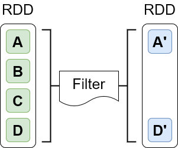

Der folgende Code würde ein neues RDD zurückgeben, in dem alle (String)Items, welche leer sind, herausgefiltert sind:

```python
sc = SparkContext("local", "SampleApp")
lines = sc.textFile("text.txt")
lines2 = lines.filter(lambda linex: linex.strip() != "")
```

###### map

Bei der 
[Map Methode](https://spark.apache.org/docs/latest/api/python/reference/api/pyspark.RDD.map.html "zur Dokumentation")
wird die übergebene Funktion auf alle Elemente des RDD angewendet. Hierbei erfolgt genau eine
Transformation von einem Zustand in einen anderen. Als Ergebnis wird auch hier ein RDD mit den neuen Werten zurück
gegeben.

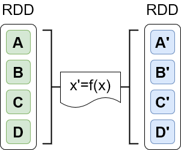

Der folgende Code würde ein neues RDD mit Integer Werten zurückgeben. Für jeden Texteintrag in lines würde in dem neuen
RDD lengths ein Zahlwert für die Länge des entsprechenden Wertes aus lines stehen.

```python
sc = SparkContext("local", "SampleApp")
lines = sc.textFile("text.txt")
lengths = lines.map(lambda line: len(line))
```

Der Typ der zurückgegebenen Elemente muss hierbei nicht dem Typ der ursprünglichen Elemente entsprechen. Wird
beispielsweise für Textelemente die Länge ermittelt, so handelt es sich bei dem zurückgegebenen Elementen um
Zahlenwerte.

###### flatMap

[Flat Map](https://spark.apache.org/docs/3.1.1/api/python/reference/api/pyspark.RDD.flatMap.html "zur Dokumentation")
unterscheidet sich zu Map dadurch, dass die übergebene Funktion mehr als ein Element zurückgeben kann.

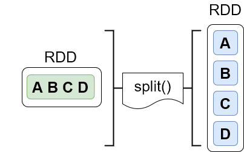

Der folgende Code würde für jeden Texteintrag in lines den enthaltenen Text auf Basis der Leerstellen splitten und
ein neues RDD mit einer Spalte und n Zeilen zurückgeben.

N würde hierbei der Summe der Längen der jeweils durch splitt erstellten Arrays von Wörtern entsprechen. Als Ergebnis
würde man ein neues RDD wörter mit Textelementen erhalten. Jedes seiner Einträge entspräche dabei einem Wort, seine 
Länge der Anzahl der Wörter.

```python
sc = SparkContext("local", "SampleApp")
lines = sc.textFile("text.txt")
wörter = lines.flatMap(lambda line: line.split(" "))
```

#### Übersicht über Aktionen (RDD)

Im Folgenden werden einige gebräuchliche Aktionen von RDDs vorgestellt.

##### collect

Die Verarbeitung der Daten kann je nach Größe der Daten verteilt erfolgen. In solch einen Fall liegen die Ergebnisse
der Transformationen ebenfalls verteilt vor und müssen zunächst zusammen gebracht werden. Dies "Einsammeln" geschieht
mit dem 
[Collect](https://spark.apache.org/docs/3.1.1/api/python/reference/api/pyspark.RDD.collect.html "zur Dokumentation") 
Befehl.

##### count, first und take

Die Aktionen ermöglichen einen Überblick über die vorliegenden Daten. Während 
[Count](https://spark.apache.org/docs/3.1.1/api/python/reference/api/pyspark.RDD.count.html "zur Dokumentation") 
lediglich die Anzahl der vorhandenen Elemente zurück gibt, gibt
[first](https://spark.apache.org/docs/3.1.1/api/python/reference/api/pyspark.RDD.first.html "zur Dokumentation")
das erste Element und
[take](https://spark.apache.org/docs/3.1.1/api/python/reference/api/pyspark.RDD.take.html "zur Dokumentation")
n-Elemente des zugrundeliegenden RDD wieder.

```python
count_words=lines.count()
```

##### reduce 

Die 
[Reduce](https://spark.apache.org/docs/3.1.1/api/python/reference/api/pyspark.RDD.reduce.html "zur Dokumentation") 
Aktion dient der Aggregierung der vorhandenen Daten, indem auf Basis zweier Elemente ein Ergebnis 
berechnet wird.  

```python
words=lines.flatMap(lambda line: line.split(" ")) \
  .map(lambda word: (word, 1)) \
  .reduceByKey(lambda a,b:a+b)
```

In diesem Beispiel wird mit 
[reduceByKey](https://spark.apache.org/docs/3.1.1/api/python/reference/api/pyspark.RDD.reduceByKey.html?highlight=reduce%20key#pyspark.RDD.reduceByKey "zur Dokumentation") 
eine Variation von reduce verwendet, welche jedoch prinzipiell auf der gleiche Art und Weise funktioniert: Der 
Funktion werden zwei Elemente (a, b) übergeben. Darauf basierend wird der Rückgabewert (a+b) berechnet. 

##### foreach

Der Befehl 
[foreach](https://spark.apache.org/docs/3.1.1/api/python/reference/api/pyspark.RDD.foreach.html?highlight=foreach#pyspark.RDD.foreach "zur Dokumentation") 
iteriert durch jedes Item des RDD und ermöglicht so eine Elementweise Verarbeitung der Daten. 

```python
top_out = 30

print("")
print("Ausgabe der ersten {} Zeilen des Textes".format(top_out))
print("")

for line in lines.collect()[0:top_out]:
  print(line)
```

In diesem Beispiel werden die Aktionen collect und foreach verwendet, um durch alle Elemente zu iterieren. Hierbei
erkennt man, das es sich um eine Flow API handelt, welche den Code übersichtlicher macht.
