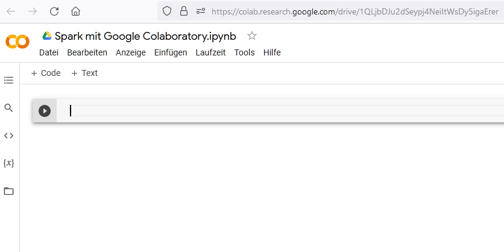
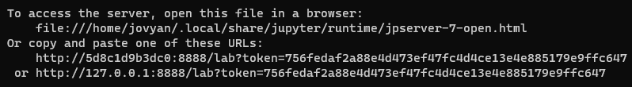
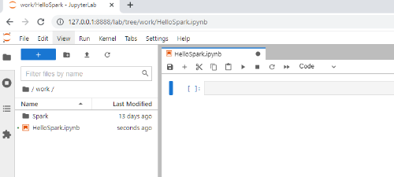

#### [Zum Anfang](README.md "zur Startseite") | [Inhaltsverzeichnis](00_Inhaltsverzeichnis.md "zum Inhaltsverzeichnis")

# 3 Mögliche Umgebungen für Spark

In diesen Kapitel werden Wege aufgezeigt, wie eine produktiv einsetzbare Umgebung für Spark mit wenig Aufwand eingerichtet werden kann. 

Als erstes werden hierbei die Möglichkeiten im Umfeld bekannter Clouddienstleisters untersucht. Dies ist vor allem für Unternehmen oftmals eine sinnvolle Lösung, kann aber auch für den ersten Kontakt eine kostengünstige und einfach Möglichkeit darstellen. 

Anschließend werden Lösungen auf Basis von *Google Colaboratory* und *Docker* vorgestellt. Beide verbindet, dass sie kostenlos und einfach verfügbar sind.

Grundsätzlich kann Spark auch auf einen lokalen Rechner eingerichtet werden. Dies hat jedoch den Nachteil, dass eine Reihe an Installationen und Einstellungen erforderlich sind, welche das zugrunde liegende System letztlich ändern. Für einen ersten Kontakt ist dies nicht optimal und wird daher nicht berücksichtigt. 

* [_Spark in der Cloud_](03_Mögliche_Umgebungen_für_Spark.md#spark-in-der-cloud "zum Abschnitt")
* [_Spark mit Google Colaboratory (Colab)_](03_Mögliche_Umgebungen_für_Spark.md#spark-mit-google-colaboratory-colab "zum Abschnitt")
* [_Spark mit Docker_](03_Mögliche_Umgebungen_für_Spark.md#spark-mit-docker "zum Abschnitt")

## Spark in der Cloud

[_zurück_](03_Mögliche_Umgebungen_für_Spark.md#3-mgliche-umgebungen-fr-spark "Zurück")

Insbesondere für Unternehmen kann der Einsatz von Spark im Umfeld einer Cloud sinnvoll sein. In der Regel können Lösungen zunächst kostengünstig implementiert und mit zunehmenden Nutzen hoch skaliert werden. 

Die einfache Verfügbarkeit macht diese Optionen aber auch für einen ersten Kontakt interessant, da oftmals kostenlose Testzeiträume angeboten werden. Grundsätzlich handelt es sich jedoch in der Regel um kostenpflichtige Lösungen. 

In diesen Abschnitt wird kurz auf die Angebote von ***Microsoft Azure***, ***Amazon AWS*** sowie ***Google Cloud*** 
als größte Anbieter eingegangen. Eine tiefergehende Beschäftigung würde jedoch den Rahmen dieser Arbeit sprengen.

### Microsoft Azure

[_zurück_](03_Mögliche_Umgebungen_für_Spark.md#spark-in-der-cloud "Zurück")

Hinter [*Microsoft Azure*](https://azure.microsoft.com/de-de "zur Webseite") verbirgt sich die Cloudsparte von Microsoft. Innerhalb von Azure wird Spark in den Bereich ***Machine Learning*** unter den Begriff [***Azure Databricks***](https://azure.microsoft.com/de-de/services/databricks "zur Webseite") einsortiert.

Azur ermöglicht eine einfache, angeleitete und sehr schnelle Einrichtung von automatisch skalierten Spark Clustern und somit ein schnelles Ergebnis. Zusätzlich existiert eine sehr umfangreiche 
[Dokumentation](https://docs.microsoft.com/de-de/azure/databricks "zur Webseite") zur Arbeit mit *Azure Databricks* alias Spark.

Daneben bietet Azur die Integration eines [***Zeppelin Notebooks***](https://zeppelin.apache.org "zur Webseite") und ermöglicht ein ähnlich komfortables Arbeiten wie im Umfeld von [*Google Colab*](https://colab.research.google.com/?utm_source=scs-index "zur Webseite") weiter [unten](03_Mögliche_Umgebungen_für_Spark.md#spark-mit-google-colaboratory-colab "zum Abschnitt") auf dieser Seite. 

Neben der Integration von [*GitHub*](https://github.com "zur Webseite"), können im Umfeld von *Azure Databricks* weitere Dienste einfach 
genutzt und integriert werden. Hierzu gehören unter anderen:

- **Azure Synapse Analytics** (Auslastung)
- **Azure Machine Learning** (KI Algorithmen und Unterstützung für eine Vielzahl von KI Frameworks)
- **Azure Data Factory** (Datenintegration)
- **Azure Data Lake Storage** (Datenhaltung)

Die [Kosten](https://azure.microsoft.com/de-de/pricing/details/databricks "zur Webseite") richten sich in erster Linie nach den benötigten ***Platz***, der ***Leistungsfähigkeit*** sowie der ***Rechenzeit***. Somit ist es notwendig, hier sehr genau zu planen, um einen angenäherten Preis zu bestimmen. Daneben existieren einige ***kostenlose*** Funktionalitäten.

Azure eignet sich auf Grund seines aufgeräumten Designs, der deutschen Sprache, der umfangreichen Verfügbarkeit sowie des 30 tägigen, kostenlosen ***Testzeitraums*** aber auch für ein erstes Kennenlernen von Spark im Enterprise Bereich. 

### Amazon AWS

[_zurück_](03_Mögliche_Umgebungen_für_Spark.md#spark-in-der-cloud "Zurück")

Hinter dem Begriff [***Amazon Web Services*** oder kurz *AWS*](https://aws.amazon.com "zur Webseite") steht die Cloudsparte von Amazon. Wie bei *Microsofts Azure* werden auch hier verschiedene Dienstleistungen angeboten, darunter auch ein Hosting von Spark. Anders als bei *Azure* wird hier jedoch nicht mit *Databricks* zusammengearbeitet, 
sondern Spark ***nativ*** unterstützt.

Bei Amazon ist für den Einsatz von Spark [***Amazon EMR***](https://docs.aws.amazon.com/de_de/emr/latest/ManagementGuide/emr-what-is-emr.html "zur Webseite") notwendig. *Amazon EMR* steht hierbei für ***Amazon Elastic MapReduce***. Hierbei handelt es sich um eine ***Plattform***, welche speziell der ***Ausführung von Frameworks*** wie Spark mit sehr großen Datenkontingenten dienen. Technisch gesehen handelt 
es sich um ***verwaltete Cluster***, welche schnell erstellt werden können und zusammenarbeiten.   

Über die Nutzung von Amazon besteht die Möglichkeit, mit Spark umfangreiche ***Verarbeitungspipelines*** aufzubauen und hierfür auf allen Ebenen Unterstützung durch die Amazon Cloud zu erhalten. Für das interaktive Arbeiten sind [***Jupyter***](https://jupyter.org "zur Webseite") oder [***Zeppelin Notebooks***](https://zeppelin.apache.org "zur Webseite") verfügbar.

Amazon fokussiert auf der [Übersichtsseite für Spark](https://aws.amazon.com/de/elasticmapreduce/details/spark "zur Webseite") auf vier Funktionalitäten:

- **S3_Sketch_Available**: Zielt auf eine hohe Performance auf Basis gerichteter azyklischer Graphen und RDDs
- **S3_Sketch_High_Performance**: Ermöglicht die Einbindung von Java, Scala und Python. SparkSQL ist ebenso verfügbar wie eine interaktive Umgebung via Notebooks. Die Schnelle Entwicklung von Anwendungen steht hier im Vordergrund.
- **S3_Sketch_Simple**: Fokussiert auf das schnelle Erstellung von Workflows. Folgerichtig kann hier auf die Bibliotheken für maschinelles Lernen ([MLib](https://spark.apache.org/mllib "zur Webseite")), Stream Verarbeitung ([Spark Streaming](https://spark.apache.org/streaming "zur Webseite")) sowie der Graphverarbeitung ([GraphX](https://spark.apache.org/graphx "zur Webseite")) einfach zugegriffen werden.
- **Integration in Amazons EMR-Funktionssatz**: Bietet eine tiefe Integration in *Amazon EMR*. Arbeitsschritte von Spark können hierbei an die sogenannte *Step-API* von *Amazon EWS* zur Ausführung übermittelt werden. Hierbei erfolgt die gesamte Verwaltung von Spark und der verwendeten Infrastruktur durch Amazon. 

Auch bei *Amazon AWS* handelt es sich um einen kostenpflichtigen Dienst. Je nach ***Leistungsfähigkeit*** und ***Funktionalität*** müssen für die Nutzung [Entgelte](https://aws.amazon.com/de/emr/pricing "zur Webseite") entrichtet werden. Wie zuvor ist es daher auch hier wichtig, zu wissen, was genau in Anspruch genommen werden wird.

Daneben bietet auch Amazon kostenlose ***Testzeiträume*** und begrenzte bzw. dauernd ***kostenlose*** Dienstleistungen an. Eine [Übersicht](https://aws.amazon.com/de/free/?all-free-tier.sort-by=item.additionalFields.SortRank&all-free-tier.sort-order=asc&awsf.Free%20Tier%20Types=tier%23always-free&awsf.Free%20Tier%20Categories=*all&all-free-tier.sort-order=asc&awsf.Free%20Tier%20Types=*all&awsf.Free%20Tier%20Categories=*all&refid=7f46dc7a-cf36-47f2-8b7b-74dceeb857ff#Free_Tier_details "zur Webseite") geht hierauf detaillierter ein. Zudem stehen umfangreiche Ressourcen in deutscher Sprache für die Einarbeitung in *Amazon AWS*, jedoch eher weniger 
[speziell für Spark](https://aws.amazon.com/de/big-data/what-is-spark "zur Webseite"), zur Verfügung. 

Alles in allen ist auch *Amazon AWS* für ein erstes Kennenlernen geeignet. Nach Meinung des Autors zeigt sich jedoch die Oberfläche von *Microsofts Azure* aufgeräumter. Daher wird der Einstieg in *Amazon AWS* als komplizierter angesehen.

### Google Cloud

[_zurück_](03_Mögliche_Umgebungen_für_Spark.md#spark-in-der-cloud "Zurück")

Unter dem Begriff [*Google Cloud*](https://cloud.google.com "zur Webseite") finden sich das Angebot von Google für seinen Cloudbereich. Ebenso wie die zuvor behandelten Anbieter, verfügt auch Google über eine beachtliche Zahl an Diensten auf Cloudbasis. Positiv ist auch hier, dass alle besuchten Seiten auf Deutsch waren sowie das Vorhandensein einer bemerkenswert umfangreichen [Dokumentation](https://cloud.google.com/docs "zur Webseite").

Um auf Basis der *Google Cloud* mit Spark zu arbeiten, bedient man sich des [***Dataproc Dienstes***](https://cloud.google.com/dataproc "zur Webseite"). Hierbei handelt es sich nach Google um einen ***verwalteten*** und ***hoch skalierten Dienst***, welcher jedoch nicht nur für [Spark](02_Datenstrukturen.md#spark "zum Abschnitt") oder [Hadoop](02_Datenstrukturen.md#hadoop "zum Abschnitt") reserviert ist, sondern auch ***weitere Open Source Projekte*** zugänglich macht. 

Google fokussiert somit nicht auf die reine Nutzung nur der eigenen Angebote, sondern bietet eine ganze [*Umgebung*](https://cloud.google.com/dataproc#section-9 "zur Webseite") für den *Data Scientisten* unter Einbindung von ***Spark***, anderen ***Apache Projekten*** sowie ***Open Source Anwendungen*** an.

Wie bei den zuvor behandelten Cloudanbietern auch, handelt es sich bei *Google Cloud* um einen grundsätzlich [kostenpflichtigen Dienst](https://cloud.google.com/dataproc/pricing "zur Webseite"). Auch hier erfolgt die Preisfindung auf Basis der ***Leistungsfähigkeit*** und des verwendeten ***Dienstes***, sodass eine genaue Planung der tatsächlich benötigten Ressourcen sinnvoll ist. 

Google bietet einen [kostenlosen ***Testzeitraum*** und ***Testguthaben***](https://console.cloud.google.com/freetrial "zur Webseite"), welches 90 Tage nutzbar ist, sowie eine Vielzahl an [freien monatlichen Kontingenten](https://cloud.google.com/free "zur Webseite") für verschiedene Dienste an. Interessant ist die klare Versicherung, dass die anzugebene Kreditkarte nur dann belastet wird, wenn ein ***manuelles Upgrade*** auf ein ***kostenpflichtiges Konto*** erfolgt. Diese Versicherung findet man bei den vorherigen Anbietern in dieser Klarheit nicht.

Nach Meinung des Autors handelt es sich bei dem Angebot von Google um ein sehr aufgeräumtes Angebot ähnlich dem von *Microsofts Azure*, wobei dies direkter auf die Spark Nutzung abzielt und je nach Ziel sinnvoller sein kann. 

## Spark mit Google Colaboratory (Colab)

[_zurück_](03_Mögliche_Umgebungen_für_Spark.md#3-mgliche-umgebungen-fr-spark "Zurück")

Eine sehr einfache Möglichkeit, um mit Spark zu arbeiten, bietet [***Google Colaboraty***](https://colab.research.google.com/?utm_source=scs-index "zur Webseite") oder einfach ***Google Colab***. Bei *Google Colab* handelt es sich um eine von Google ***kostenlos*** zur Verfügung gestelltes
***Jupyter Notebook***:





Das Notebook eignet sich zum ***kollaborativen Arbeiten*** und kann wie andere Dokumente innerhalb von ***Google Drive*** gehalten und freigegeben werden. Aus dem Notebook ist grundsätzlich ein ***Zugriff auf das eigene Drive-Laufwerk*** möglich, jedoch ***nicht zwingend notwendig***.

Der Vorteil dieses Vorgehens ist die ***vorhandene Infrastruktur*** für das Notebook und die Möglichkeiten einer doch ***beachtenswerten Rechenleistung*** der darunter liegenden virtuellen Maschine. Als Betriebssystem dient ***Linux***. Sowohl [***Python***](https://www.python.org "zur Webseite") als auch [***Jupyter Notebook***](https://jupyter.org "zur Webseite") sind mit den gängigsten Bibliotheken ***vorinstalliert***.

Als größter Nachteil ist die ***Flüchtigkeit der Daten*** zu nennen. Jedes Ergebnis, aber auch jede gemachte Installation und Download von Daten wird nach einer Zeit der Inaktivität ***gelöscht***. Daher empfiehlt es sich, in seinen Routinen immer auch die Vorbereitung des Notebooks zu hinterlegen.

Alle im folgenden verwendete Beispiele wurden den ***lauffähige Jupyter Notebooks*** in [_Jupyter Notebook mit RDD_](notebook/Wordcount_mit_Spark_RDD.ipynb "zum Notebook") oder [_Jupyter Notebook mit DataFrame_](notebook/Wordcount_mit_Spark_DataFrame.ipynb "zum Notebook") entnommen.

### Vorbereiten des Notebooks

[_zurück_](03_Mögliche_Umgebungen_für_Spark.md#spark-mit-google-colaboratory-colab "Zurück")

Für den Einsatz von Spark sind in jedem Fall drei Voraussetzungen notwendig:

+ [Java](https://openjdk.java.net "zur Webseite") muss installiert sein, damit Spark ausgeführt werden kann.
+ [Spark](https://spark.apache.org "zur Webseite") muss installiert sein
+ die Bibliothek [FindSpark](https://pypi.org/project/findspark "zur Webseite") muss installiert sein
+ die Bibliothek [PySpark](https://spark.apache.org/docs/latest/api/python "zur Webseite") muss installiert sein. Auf den Seiten von [Apache.org](https://www.apache.org "zur Webseite") findet man
  [weitergehende Informationen zu PySpark](https://spark.apache.org/docs/latest/api/python "zur Dokumentation") 

Im Folgenden wird der Nutzer in ***drei Schritten*** durch die Vorbereitung eines Jupyter Notebook geführt. Auch wenn sich der wiedergegebene Code auf die Installation innerhalb von *Google Colaboratory* bezieht, gilt er grundsätzlich auch für andere Umgebungen im Umfeld von Python und Linux.

#### 1 Installation von Java und Spark

[Spark](https://spark.apache.org "zur Webseite") wurde in der Programmiersprache [Java](https://openjdk.java.net "zur Webseite") geschrieben. Für seine Ausführung ist es daher notwendig, eine ***Java Umgebung*** einzurichten. Hierfür muss eine Installationsdatei für Java heruntergeladen und installiert werden. Spark selbst hingegen benötigt als Java Programm ***keine Installation***, sondern lediglich eine ***korrekt installierte Java Laufzeit***.

```Python
# Installation von Java
!apt-get install openjdk-8-jdk-headless -qq > /dev/null

print("Java ist installiert...")

# Download und Entpacken von Spark (Versionsnummer anpassen!)
!wget -q https://archive.apache.org/dist/spark/spark-3.2.0/spark-3.2.0-bin-hadoop3.2.tgz
!tar xf spark-3.2.0-bin-hadoop3.2.tgz

print("Spark ist verfügbar...")
```

Nach der Installation und für den Betrieb ist es sehr wichtig, alle ***Systemvariablen für Spark und Java korrekt zu setzen***. Der folgende Code zeigt beide genannten Schritte.

```Python
# Setzen der Systemvariablen für Java und Spark
import os
os.environ["JAVA_HOME"] = "/usr/lib/jvm/java-8-openjdk-amd64"
os.environ["SPARK_HOME"] = "/content/spark-3.2.0-bin-hadoop3.2"

print("Umgebungsvariablen sind gesetzt...")
```

#### 2 Installation der benötigten Python Bibliotheken

Nach Ausführung der vorherigen Schritte existiert eine Umgebung mit einer funktionierenden Spark Installation. Um einfach mit Spark und Python arbeiten zu können, fehlen noch zwei Bibliotheken.

[***PySpark***](https://spark.apache.org/docs/latest/api/python "zur Dokumentation") ist ein ***Interface für die Nutzung von Spark mit Python***. Es ermöglicht also die Programmierung von Anwendungen mit Spark und Python.

```Python
# Installation von findspark und pyspark

!pip install findspark
print("FindSpark wurde installiert...")

!pip install pyspark
print("PySpark wurde installiert...")
```

Standardmäßig ist die Bibliothek ***nicht in*** [***sys.path***](https://docs.python.org/3/library/sys.html "zur Dokumentation") enthalten und somit in Python ***nicht nutzbar***. Damit
[***PySpark***](https://spark.apache.org/docs/latest/api/python "zur Dokumentation") dennoch als reguläre Bibliothek genutzt werden kann, müssen beide voneinander wissen. Hier kommt [***FindSpark***](https://pypi.org/project/findspark "zur Webseite") ins Spiel.

#### 3 Initialisierung der Programmierumgebung

Um die Zusammenarbeit von *PySpar*k mit Python zu ermöglichen, bieten sich laut des [Git Repositorys](https://github.com/minrk/findspark "zur GitHub Seite") 
von *FindSpark* grundsätzlich ***zwei Wege*** an: Entweder wird *PySpark* so verlinkt, dass Python es finden kann, oder aber ***zur Laufzeit sys.path hinzugefügt***. [*FindSpark*](https://pypi.org/project/findspark "zur Webseite") verwendet die ***zweite*** Option. Hierzu wird der Befehl [*init*](https://github.com/minrk/findspark "zur GitHub Seite") genutzt.

```Python
# Initialisieren von findspark

try: 
  import findspark
  from pyspark import SparkContext, SparkConf

  findspark.init()

  print("FindSpark und PySpark wurden initialisiert")
except ImportError: 
  raise ImportError("Fehler bei der Initialiserung von FindSpark und PySpark")
```

### Vor- und Nachteile

[_zurück_](03_Mögliche_Umgebungen_für_Spark.md#spark-mit-google-colaboratory-colab "Zurück")

Als Vorteile dieser Vorgehensweise sind zu nennen:

* kostenlos
* überall verfügbar
* Möglichkeit zur kollaborativen Zusammenarbeit
* einfache Nutzung, da alle benötigten Tools vorhanden sind
* eignet sich für Lehrzwecke, kleine Projekte, Prototyping und Verteilung von Beispielen
* Leistungsfähiges, virtuelles System

Als Nachteile sind zu nennen:

* keine dauernde Serialisierung der Ergebnisse, Installationen oder Daten
* vor der Arbeit ist das System erst wieder zu erstellen
* Google Ökosystem steht im Ruf, nicht sehr anonym zu sein

## Spark mit Docker

[_zurück_](03_Mögliche_Umgebungen_für_Spark.md#3-mgliche-umgebungen-fr-spark "Zurück")

Die Verwendung von *Google Colaboratory* zeigte bereits eine einfache Möglichkeit, eine Umgebung für die Verwendung Spark mit Python zu erstellen. Verfügbar war diese Lösung jedoch nur innerhalb des *Google Ökosystems*. Spark mit [Docker](https://www.docker.com "zur Webseite") bietet eine weitere, einfache Möglichkeit. 

In diesen Abschnitt wird gezeigt, wie mit Hilfe von Docker eine Umgebung für Spark mitsamt [*Jupyter Notebook*](https://jupyter.org "zur Webseite") angelegt werden kann.

[Docker](https://www.docker.com "zur Webseite") arbeitet mit sogenannten **_Containern_**, welche einen **_Prozess visualisieren_**. Die Basis eines *Containers* bildet ein **_Image_**. Eine gute Einführung zu Docker findet sich [hier](https://docs.docker.com/get-started/overview "zur Dokumentation").

Einer der Vorteile von [Docker](https://www.docker.com "zur Webseite") ist die sehr große Sammlung bereits fertiger Images im [***Docker Hub***](https://hub.docker.com "zur Webseite"). 
Hier finden sich für viele Anwendungsfälle vorgefertigte Lösungen.

Unabhängig von Spark ist für die Ausführung eines **_Docker Containers_** die Installation einer **_Docker Runtime_** notwendig. Diese ist in Form eines **_Docker Desktop_** für die Plattformen ***Mac***, ***Windows*** und ***Linux*** verfügbar. Die Installation von [Docker](https://www.docker.com "zur Webseite") ist nicht Teil dieser Arbeit, jedoch findet sich auf dessen Webseite eine gute [Einführung](https://docs.docker.com/get-started/overview "zur Dokumentation"). 

Als Basis dient hier ein [Docker Image](https://hub.docker.com/r/jupyter/pyspark-notebook "zur Webseite") mit einer ***fertig installierten*** und ***konfigurierten Spark Umgebung*** auf Basis eines ***Linux Systems***. Somit sind keine weiteren Einstellungen oder Installationen notwendig, um Spark innerhalb des Containers auszuführen. Als ***Frontend*** kommt hierbei [***Jupyter Notebooks***](https://jupyter.org/index.html "zur Webseite") zum Einsatz.

### Download und erster Start

[_zurück_](03_Mögliche_Umgebungen_für_Spark.md#spark-mit-docker "Zurück")

Nachdem alle zuvor beschriebenen Vorbereitungen abgeschlossen wurden, kann nun mit einer beliebigen ***Eingabekonsole*** der Container mit Hilfe des unten gezeigten Befehls ***gestartet*** werden:

```
docker run -p 8888:8888 -e JUPYTER_ENABLE_LAB=yes --name pyspark jupyter/pyspark-notebook
```

Bei der ***ersten Ausführung*** wird das ***Image*** direkt vom ***Docker Hub heruntergeladen***, sofern es noch ***nicht lokal vorhanden ist***. Anschließend wird auf Basis des heruntergeladenen Images ein ***Container erstellt***, welcher auf dem ***Port 8888*** horcht. Der Name des erstellten Containers lautet ***pyspark***. 

Nach dem ersten Zugriff kann der Container einfach durch ***Eingabe des Startbefehls*** gestartet werden:

```
docker start -a pyspark
```

Möchte man bei der Arbeit auf eigene Daten oder Verzeichnisse zugreifen, so müssen sie ***vor dem Start*** für den Container ***zugänglich gemacht werden***. Hierfür gibt es eine [Reihe von Möglichkeiten](https://docs.docker.com/storage "zur Dokumentation").

Ein einfacher Weg ist das ***Kopieren der Dateien oder Verzeichnisse in den Container***. Hierzu darf dieser noch ***nicht gestartet*** sein:

```
cp [DOWNLOAD VERZEICHNIS] pyspark:/home/jovyan/work
```

### Zugriff auf das Jupyter Notebook

[_zurück_](03_Mögliche_Umgebungen_für_Spark.md#spark-mit-docker "Zurück")

Während des Startvorgangs erfolgen eine Reihe von Ausgaben auf der Konsole. Wichtig ist hierbei zunächst die am Ende ausgegebene ***URL*** mit einem angehangenen ***Token*** wie in der folgenden Abbildung zu sehen ist:





Nach dem erfolgreichen Start ist das Jupyter Notebook über die ***angegebene URL*** erreichbar. Da bereits alle für Spark benötigten Installationen und Einstellungen vorhanden sind, kann dort direkt gearbeitet werden. Die im oberen Abschnitt [_Google Colaboratory_](03_Mögliche_Umgebungen_für_Spark.md#spark-mit-google-colaboratory-colab "zum Abschnitt") beschrieben Arbeiten für die Installation müssen hier nicht durchgeführt werden:




### Vor- und Nachteile

[_zurück_](03_Mögliche_Umgebungen_für_Spark.md#spark-mit-docker "Zurück")

Als Vorteile dieser Vorgehensweise sind zu nennen:

* kostenlos
* einfache Verfügbarkeit über _Docker Hub_
* keine weiteren Installationen notwendig
* benötigt keine Internetverbindung im Betrieb
* Daten und Ergebnisse können gespeichert und weiterverwendet werden.
* kann für den Aufbau größerer Systeme verwendet werden.

Als Nachteile sind zu nennen:

* als *Out-of-the-Box* Lösung, ist man auf das Wissen und die Fähigkeiten der Anbieter angewiesen
* Anpassungen erfordern auch hier tiefere Kenntnisse
* Notwendigkeit zur Installation einer _Docker Laufzeit_ mit privilegierten Rechten
* Sicherheitsrisiken im Umfeld von _Docker_ können das eigene System gefährden
