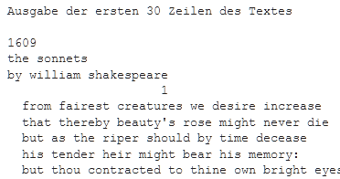
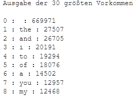

#### [Zum Anfang](README.md "zur Startseite") | [Inhaltsverzeichnis](00_Inhaltsverzeichnis.md "zum Inhaltsverzeichnis")

# 4 Wordcount mit Spark RDDs und Python

Um einen praktischen Einblick in die Anwendung von Spark zu geben, wurde im Rahmen dieser Arbeit die weit 
verbreitete Aufgaben Zählen von Wortvorkommen aufgegriffen und umgesetzt.

Als Basis dient hierbei auf Grund der einfachen Verfügbarkeit 
[_Google Colaboratory_](03_Mögliche_Umgebungen_für_Spark.md#spark-mit-google-colaboratory-colab "zum Abschnitt").
Das hierbei entstandene  
[_Jupyter Notebook_](notebook/Wordcount_mit_Spark_RDD.ipynb "zum Notebook")
ist Teil dieser Arbeit und kann frei verwendet werden. 

Als zu bearbeitende Datei dient eine einzelne Textdatei mit den gesammelten
[literarischen Werken von Shakespeare](https://ocw.mit.edu/ans7870/6/6.006/s08/lecturenotes/files/t8.shakespeare.txt "zum Download")
. Diese Textdatei ist an mehreren Stellen im Internet frei verfügbar. Für dieses Beispiel wird auf das Angebot des
[Massachusetts Institute of Technology (MIT)](https://ocw.mit.edu "zur Webseite")
zurückgegriffen.

Insgesamt enthält die Datei:

* 5.333.743 Zeichen ohne Zeilenende in
* 929.396 Wörter in
* 124.457 Zeilen.

Für die Vorbereitung des Noteboos kann auf den Abschnitt
[_Google Colaboratory_](03_Mögliche_Umgebungen_für_Spark.md#spark-mit-google-colaboratory-colab "zum Abschnitt")
dieser Arbeit zurück gegriffen werden. Im 
[_Jupyter Notebook_](notebook/Wordcount_mit_Spark_RDD.ipynb "zum Notebook") finden sich die hierfür erforderlichen
Arbeitsschritte im Abschnitt **Vorbereitung des Notebooks**.

## Auszählen der Wörter

[_zurück_](04_Wordcount_mit_Spark_RDDs_und_Python.md#4-wordcount-mit-spark-und-python "Zurück")

Um die Aufgabe umzusetzen sind zwei Arbeitsschritte erforderlich. Entsprechend finden sich im 
[_Jupyter Notebook_](notebook/Wordcount_mit_Spark_RDD.ipynb "zum Notebook")
zwei Abschnitte.

### Abschnitt: Einlesen und Vorbereiten der Textdatei

Im diesen Abschnitt werden zunächst zwei Methoden definiert.

* Der ersten Methode **_get_file_from_url_** werden als Parameter eine URL sowie ein Speicherort übergeben. Bei Ihrem
  Aufruf lädt die Methode eine Datei von der angegebenen URL herunter und speichert sie in Google Drive ab.
* Die zweite Methode **_cut_file_** nimmt als Parameter einen numerischen Start- und Endwert sowie die Angabe einer
  Quell- und Zieldatei entgegen. Bei Ihrem Aufruf entfernt die Methode alle Zeilen vor bzw. nach den durch Start- und
  Endwert definierten Zeilenbereich aus der Quelldatei und speichert das Ergebnis in die Zieldatei.

Beide Dateien dienen der Vorbereitung der zu bearbeitenden Datei und stehen in keinen direkten Zusammenhang mit der
Nutzung von Spark. Daher wird hier nicht weiter darauf eingegangen. In dem folgenden Block wird zunächst die erste 
Methode dazu verwendet, die Datei von der Seite des MIT herunter zu laden:

```python
# Datei von der Quelle nach Colab laden

file_url = "https://ocw.mit.edu/ans7870/6/6.006/s08/lecturenotes/files/t8.shakespeare.txt"
place_to_save = "/content/shakespeare.txt"

get_file_from_url(file_url, place_to_save)

print("")
print("Datei wurde vorbereitet...")
```  

Anschließend wird mit Hilfe der zweiten Methode der Anfang und das Ende beschnitten. Dies ist notwendig, da hier 
ergänzender Text eingefügt wurde. Die beschnittene Datei wird als _shakespeare_neu.txt_ gespeichert:

```python
# Unnötige Zeilen am Ende und am Start entfernen

file_source = "/content/shakespeare.txt"
file_target = "/content/shakespeare_neu.txt"

cut_file(244,124438,file_source, file_target)

print("")
print("Die Arbeitsdatei ist vorbereitet...")
```

### Abschnitt: Auszählen der Wörter

In diesem Abschnitt befindet sich der eigentliche Code, der mit Hilfe von Spark die Wortvorkommen auszählt und 
die 30 häufigsten ausgibt.
 
#### 1 Spark Context anlegen

Um mit Spark arbeiten zu können, muss als erstes eine Verbindung zu Spark in Form eines
[SparkContext](https://spark.apache.org/docs/3.1.1/api/python/reference/api/pyspark.SparkContext.html "zur Dokumentation")
aufgebaut werden. Weitere Informationen hierzu findet man auch im Kapitel 
[Datenstrukturen](02_Datenstrukturen.md): 

```python
# Erzeugen eines Spark Kontext

sc = SparkContext("local[*]","WordCounter")
sc.setLogLevel("ERROR")

print("Der Spark Kontext wurde angelegt...")
```

Der Kontext erhält die Bezeichnung _WordCounter_. Er läuft lokal und nutzt alle verfügbaren Kerne. Dieser Block kann 
nur ein Mal ausgeführt werden.

Statt _local[*]_ kann auch die Anzahl der zu nutzenden Kerne direkt angegeben werden. Die alleinige Angabe von local
bewirkt, dass nur ein Kern genutzt wird. Gerade bei sehr großen Dateien und in einer produktiven Umgebung würde 
jedoch die Verarbeitung gerade nicht lokal stattfinden und an dieser Stelle entfernte Rechner eines Verbundes angegeben 
werden.

#### 2 Auszählen

Die Methode
[_textFile_](https://spark.apache.org/docs/3.1.1/api/python/reference/api/pyspark.SparkContext.textFile.html "zur Dokumentation")
im letzten Block ermöglicht das Lesen von in UTF-8 codierten Textdateien und gibt ein RDD in Form einer Liste von 
String zurück. In diesen Fall entsprechen die Strings den Zeilen der Textdatei. 

Die Methode
[_map_](https://spark.apache.org/docs/latest/api/python/reference/api/pyspark.RDD.map.html "zur Dokumentation")
führt auf jedem Element des zugrunde liegenden RDDs - also den Zeilen der Textdatei - die angegebene Funktion aus.

Im Anschluss werden eine Reihe von Ersetzungen (replace), dann eine Konvertierung in Kleinbuchstaben 
(lower) und am Schluss eine Filterung (filter) auf leere Zeilen durchgeführt. 

Als Ergebnis wird ein neues RDD vom Typ String zurückgegeben. Die Verwendung einer FluentApi bewirkt eine 
übersichtliche Strukturierung des Codes.

```python
lines=sc.textFile(file_target)
  .map( lambda x: x.replace(',',' ').replace('.',' ').replace('-',' ').lower())
  .filter(lambda linex: linex.strip() != "")
```

#### 3 Ausgabe der ersten 30 Zeilen zur Kontrolle

Nach dem Einlesen werden die ersten 30 Listeneinträge des zurück gegebenen RDD's ausgegeben. Jeder Eintrag entspricht
hierbei einer Zeile der Datei. Hierzu kann eine einfach _for Schleifen_ verwendet werden. Besondere Aufmerksamkeit 
muss dem Aufruf von
[_collect_](https://spark.apache.org/docs/latest/api/python/reference/api/pyspark.RDD.collect.html "zur Dokumentation")
entgegengebracht werden.

Das von Spark erzeugte RDD ist ein verteiltes Dataset, welches auf den Kernen der CPU oder aber auch auf weit 
entfernte Rechner verteilt sein kann.
[_Collect_](https://spark.apache.org/docs/latest/api/python/reference/api/pyspark.RDD.collect.html "zur Dokumentation")
sammelt nun alle Elemente des RDD ein und macht sie so verfügbar:

```python
top_out = 30

print("")
print("Ausgabe der ersten {} Zeilen des Textes".format(top_out))
print("")

for line in lines.collect()[0:top_out]:
  print(line)
```

Nach der Ausführung erhalten wir die folgende Ausgabe:



#### 4 Ausgabe der ersten 30 Wortvorkommen

In der folgenden Codesequenze wird jedes Listenelement des RDD durch
[_flatMap_](https://spark.apache.org/docs/3.1.1/api/python/reference/api/pyspark.RDD.flatMap.html "zur Dokumentation")
in seine einzelnen Wörter aufgeteilt. Für jedes Wort wird mit 
[_map_](https://spark.apache.org/docs/latest/api/python/reference/api/pyspark.RDD.map.html "zur Dokumentation")
ein Tupel erzeugt und zurückgegeben. Das Ergebnis ist eine sehr lange Liste von Tupel. Die Funktion
[_reduceByKey_](https://spark.apache.org/docs/latest/api/python/reference/api/pyspark.RDD.reduceByKey.html "zur Dokumentation")
merged diese abschließend. Als Ergebnis erhält man eine Liste von Tupel mit eindeutigen Wörtern und deren
Vorkommen.

```python
words=lines.flatMap(lambda line: line.split(" ")) \
  .map(lambda word: (word, 1)) \
  .reduceByKey(lambda a,b:a+b)
```

Mit der Methode
[_sortBy_](https://spark.apache.org/docs/latest/api/python/reference/api/pyspark.RDD.sortBy.html "zur Dokumentation")
wird auf die Anzahl der Wortvorkommen sortiert und das zurückgegebene, sortierte RDD ausgegeben. Zuvor müssen auch 
hier mit
[_collect_](https://spark.apache.org/docs/latest/api/python/reference/api/pyspark.RDD.collect.html "zur Dokumentation")
alle Werte eingesammelt werden.

```python
sorted_counts = words.sortBy(lambda wordCounts: wordCounts[1], ascending=False)

top_length = 30

print("")
print("Ausgabe der {} größten Vorkommen".format(top_length))
print("")

i = 0
for word, count in sorted_counts.collect()[0:top_length]:
  print("{} : {} : {} ".format(i, word, count))
  i += 1
```

Das Ergebnis ist eine Liste aller Wörter mit deren Vorkommen in absteigender Reihenfolge. Hierbei steht an erster Stelle
das Leerzeichen als häufigster Vertreter.


