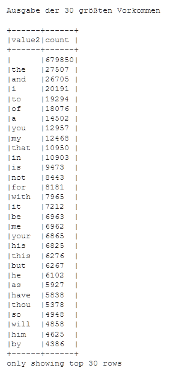

#### [Zum Anfang](README.md "zur Startseite") | [Inhaltsverzeichnis](00_Inhaltsverzeichnis.md "zum Inhaltsverzeichnis")

# 7 Wordcount mit Spark DataFrames und Python

An dieser Stelle wird eine Variante der zuvor im Kapitel
[Wordcount mit Spark und Python](04_Wordcount_mit_Spark_RDDs_und_Python.md "zum Kapitel")
vorgestellten Beispiels vorgestellt.

Auch wenn viele der Methoden auf Grund der gleichen Aufgabenstellung gleichbleiben, finden sich im Gegensatz zur
vorherigen Anwendung entscheidende Änderungen in der Art der Sparknutzung. Statt mit RDDs kommen nunmehr die neueren
Data Frames Objekte zum Einsatz.

Im folgenden soll nun auf die Unterschiede in der Programmierung kurz eingegangen werden. Um unnötige Wiederholungen zu
vermeiden wird auf die Erklärung der bereits zuvor verwendeten Codebestandteile verzichtet. Diese werden bereits
ausführlich im
[vorhergehenden Kapitel](04_Wordcount_mit_Spark_RDDs_und_Python.md "zum Kapitel")
erklärt.

Wie bereits zuvor ist auch der Code dieses Abschnitts als lauffähiges  
[_Jupyter Notebook_](notebook/Wordcount_mit_Spark_DataFrame.ipynb "zum Notebook")
Teil dieser Arbeit und frei verwendbar.

## Session statt Context

Ein wichtiger Unterschied im Gegensatz zur Nutzung eines 
[Spark Context](https://spark.apache.org/docs/3.1.1/api/python/reference/api/pyspark.SparkContext.html "zur Dokumentation") 
ist, das hier nun eine 
[Spark Session](https://spark.apache.org/docs/latest/sql-getting-started.html "zur Dokumentation") 
verwendet werden soll. Zugriff auf
[Spark Session](https://spark.apache.org/docs/latest/sql-getting-started.html "zur Dokumentation") 
erhält man über die Bibliothek 
[pyspark.sql](https://spark.apache.org/docs/2.4.0/api/python/pyspark.sql.html "zur Dokumentation")
, welche aus Gründen der Übersichtlichkeit erst hier eingebunden wird.

Mit der folgenden Codesquenz erhält man eine
[Spark Session](https://spark.apache.org/docs/latest/sql-getting-started.html "zur Dokumentation") 
mit der Bezeichnung Wordcount. Ist diese Session noch nicht vorhanden, so wird sie erstellt, ansonsten die vorhandene 
zurückgegeben.

```python
# Erzeugen einer Spark Session

from pyspark.sql import SparkSession
session = SparkSession.builder.appName("Wordcount").getOrCreate()

print("Die Spark Session wurde angelegt...")
```

## DataFrame Methoden statt Map

Anschließend wird die Textdatei eingelesen. Die Funktion 
[Session.read.text](https://spark.apache.org/docs/latest/sql-getting-started.html#creating-dataframes "zur Dokumentation")
liest eine Textdatei ein und gibt ein direkt
nutzbares typisiertes Spark 
[DataFrame](https://spark.apache.org/docs/latest/sql-programming-guide.html "zur Dokumentation") 
zurück. Über ein Reflexion-Prozess kann das Schema der enthaltenen Daten - in
diesem Fall ein nullable String – erkannt und ausgegeben werden.

Im Weiteren finden zunächst eine Reihe von Ersetzungen (replace), dann eine Konvertierung in Kleinbuchstaben (lower)
und am Schluss eine Filterung (filter) auf leere Zeilen statt. Hierbei wird jedes Mal ein neues
[DataFrame](https://spark.apache.org/docs/latest/sql-programming-guide.html "zur Dokumentation")
zurückgegeben.
Da Spark DataFrames auf
[Spark RDDs](02_Datenstrukturen.md#spark-rdds "zum Abschnitt")
basieren, sind auch sie immutable. Die Methode 
[withColumn](https://spark.apache.org/docs/latest/api/python/reference/api/pyspark.sql.DataFrame.withColumn.html "zur Dokumentation") 
bewirkt, dass die übergebene
Funktion ähnlich der zuvor behandelten
[Map Funktion](02_Datenstrukturen.md#transformationen-und-aktionen "zum Abschnitt")
auf alle Datensätze angewendet wird.

Der letzte Schritt erinnert stark an ein 
[SQL](https://de.wikipedia.org/wiki/SQL "zur Wikipediaseite") 
Konstrukt. Zunächst wird jeder Zeile durch ihre Leerzeichen gesplittet. Die
Funktion 
[explode](https://spark.apache.org/docs/latest/api/python/reference/api/pyspark.sql.functions.explode.html "zur Dokumentation") 
sorgt ähnlich der zuvor behandelten 
[FlatMap Funktion](02_Datenstrukturen.md#transformationen-und-aktionen "zum Abschnitt")
dafür, dass das so entstandene Array mit n Spalten als ein Array mit einer Spalte (value2)
und n Reihen zurückgegeben wird.

Die Funktion 
[groupBy](https://spark.apache.org/docs/latest/api/python/reference/api/pyspark.sql.DataFrame.groupBy.html "zur Dokumentation")
gruppiert die in value2 enthaltenen Werte (Wörter) und 
[Count](https://spark.apache.org/docs/latest/api/python/reference/api/pyspark.sql.DataFrame.count.html "zur Dokumentation")
aggregiert die Anzahl der einzelnen
Vorkommen. Abgeschlossen wir die Anweisung mit einem 
[sort](https://spark.apache.org/docs/latest/api/python/reference/api/pyspark.sql.DataFrame.sort.html)
und der Ausgabe der sortierten Liste. Die Nutzung der Fluent
API macht den Code hierbei gut lesbar. Ebenso fällt die Ähnlichkeit zu 
[Panda DataFrames](https://pandas.pydata.org/docs/reference/api/pandas.DataFrame.html "zur Dokumentation")
auf.

```python
# Auszählen der Wörter

import pyspark.sql.functions as func

df = session.read.text(file_target)

print("")
print("Schema der eingelesenen Datei:")
df.printSchema()
print("")

top_out = 30
top_length = 30

print("")
print("Ausgabe der ersten {} Zeilen des Textes".format(top_out))
print("")

df.show(n=top_out,truncate=False)

#df.printSchema()
#df.describe().show()
#print(df.columns)

df=df.withColumn('value', func.translate('value', ',', ' '))
df=df.withColumn('value', func.translate('value', '.', ' '))
df=df.withColumn('value', func.translate('value', '-', ' '))
df=df.withColumn('value', func.lower('value'))

print("")
print("Ausgabe der {} größten Vorkommen".format(top_length))
print("")

df=df.withColumn('value2',func.explode(func.split(func.col('value'), ' ')))\
  .groupBy('value2')\
  .count()\
  .sort('count', ascending=False)\
  .show(n=top_length,truncate=False)
```  

Das Ergebnis ist eine Liste aller Wörter mit deren Vorkommen in absteigender Reihenfolge. Hierbei steht an erster Stelle
das Leerzeichen als häufigster Vertreter.


