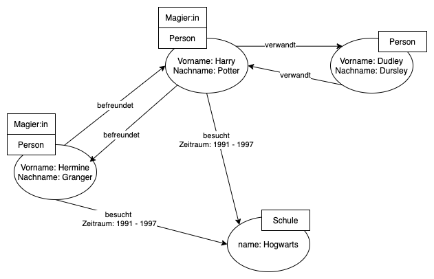

# Graphdatenbanken am Beispiel von Neo4j
Einer der, nach eigener Aussage, aktuell führenden Anbieter von Graphen Technologien ist Neo4j. [[1]](#neo4j) Im folgenden Abschnitt sollen die durch Neo4j angewandten Konzepte von Graphdatenbanken vorgestellt werden. <br> Außerdem werden konkrete Projekte betrachtet, welche Neo4j als Technologie für sich nutzen. 

## Allgemeines 
Das Unternehmen Neo4j (Logo s. Abbildung 4.2) wurde 2007 nach knapp sieben Jahren Prototypentwicklung gegründet. 2010 folgte der erste offizielle Release des GDBMS Neo4j. Seitdem befindet sich das Projekt in steter Weiterentwicklung und umfasst neben dem GDBMS unter anderem kommerzielle Produkte, die dem Cloudhosting und der Visualisierung von Graphdatenbanken dienen. Der Kern von Neo4j, das GDBMS, ist (und bleibt nach eigener Angabe auch zukünftig) Open Source nach der dritten Version der GNU General Public License [[1]](#neo4j) <br>
|  | 
|:--:| 
| *Abbildung 4.1: Logo Neo4j (Quelle: [[1]](#neo4j))* |

Die Anwendung des GDBMS ist in Java geschrieben. Die Softwarearchitektur zeichnet sich durch die Implementierung von _native graph processing_ und die Umsetzung eines _native graph storage_ aus. [[1]](#neo4j) [[2]](#graph-databases)


## Datenbank Modellierung 
Das Datenbankmodell von Neo4j liegt dem sogenannten _Labeled Property Graph_ Model zugrunde. Grundelemente dessen sind _Nodes_ und _Relationships_.
Diese verkörpern im klassisch-mathemathischen Sinne Vertices und Edges des zu modellierenden Graphens. Nodes werden durch Relationships miteinander verbunden und bilden somit ein Graphenkonstrukt. Relationships besitzen immer eine Richtung - in der Graphentheorie würde man von gerichteten Graphen sprechen. Weiterhin brauchen sie zwingend eine Start- und eine Endnode. Relationships können somit nicht etwa ins "Leere" führen. Außerdem besitzen Relationships einen Namen zur semantischen Einordnung. <br>
Nodes können mit einer variablen Anzahl von _Labels_ gekennzeichnet werden. Diese dienen der Klassifizierung und Gruppierung von Nodes. 
Relationships und Nodes können außerdem mithilfe von _Properties_ in Form von Key-Value-Paaren weiter spezifiziert werden. 
Labels und Properties geben der Graphenstruktur einen semantischen Kontext und verleihen ihr somit eine Bedeutung innerhalb des gewünschten Datenraums. <br> Weiterhin können durch Labels und Properties Metadaten abgebildet werden, welche nicht in das Sprektrum von Nodes und Relationships fallen. [[1]](#neo4j) [[2]](#graph-databases)
<br>
Aus relationalen DBMS sind zum Beispiel sogenannte Datenbankschema bekannt, welche gewissermaßen den logischen Bauplan der Datenbank bilden. Durch _Indices_ und _Constraints_ wird die Struktur der unterliegenden Datenbank gebildet. Die Daten müssen daraufhin kohärent zur Struktur angepasst werden, bevor sie in die Datenbank eingefügt werden. Neo4j Datenbanken dagegen werden als _schema optional_ beschrieben, was bedeutet, dass die Inhalte der Datenbank ohne eine vorherige Festlegung eines Schemas modifiziert werden können. Indices und Constraits sind optional. [[1]](#neo4j) 


|  | 
|:--:| 
| *Abbildung 4.2: Beispielhaftes Graphenmodell nach dem Labeled Property Graph* |

Ein beispielhaftes Modell findet sich in Abbildung 4.2, in welchem ein Graph mit vier Nodes (rund) zu sehen sind. Sie werden durch unterschiedliche Relationships (Pfeile) verbunden, wie zum Beispiel die "verwandt"-Beziehung.  Die Nodes und Relationships werden durch Properties wie "Vorname" oder "Zeitraum" weiter spezifiziert. Des Weiteren ist zu sehen, dass die Nodes mit Labels (eckiger Kasten an Nodes) wie "Person" oder "Schule" markiert werden können. 

## Cypher Query Language
Datenbankmanagementsysteme brauchen von jeher eine Schnittstelle nach außen und ein Werkzeug zur Manipulation der zugrundeliegenden Daten. Sogenannte Query-Languages, wie zum Beispiel SQL, werden daher zur Ausführung von klassischen CRUD-Operationen auf den Datenbanken genutzt. <br>
Die verwendete Query Language von Neo4j ist Cypher, welche 2011 im Rahmen eines Versionsupdates vorgestellt wurde. 
Der Quellcode ist seit 2015 unter einer Open Source Lizenz frei verfügbar und wird seitdem auch für andere Graphdatenbanken wie Redis Graph oder Memgraph verwendet. 
Die Designphilosophie von Cypher verspricht einen expressiven und deklarativen Sprachaufbau, welcher für Nutzer:innen jeglicher Kenntnissstände im Bereich der Datenbanktechnologien einen schnellen Einstieg verspricht. [[3]](#cypher) <br>

### Basisoperationen
Cypher verfügt über eine Reihe von Operationen, die zur Manipulation der Datenbank genutzt werden kann. Möchte man zum Beispiel den Graphen aus Abbildung 4.2 erstellen kann man folgendermaßen vorgehen: 
Zur Erstellung von Nodes wird das _CREATE_ Statement genutzt. Nodes werden durch runde Klammern `()` gekennzeichnet. 
In der Klammer steht zuerst ein beliebiger Identifier, darauf folgen Labels, welche jeweils mit einem Doppelpunkt `:` voneinander getrennt sind.
Properties werden nach dem Key-Value Prinzip in geschweiften Klammern `{}` hinzugefügt. 
Die Erstellung von Relationships erfolgt ebenfalls mithilfe des CREATE Statements und nach einem ähnlichem Prinzip. 
Relationships zwischen Nodes werden mithilfe der Pfeil Notation `-[]->` gezogen. 
In der eckigen Klammer `[]` befindet sich daraufhin die Bezeichnung der Relationship nach einem Doppelpunkt `:`. Auch hier können in geschweiften Klammern Properties angegeben werden. 

Führt man dementsprechend folgenden Code aus, werden vier Nodes, mehrere Relationships inklusive Properties und Labels erstellt. Das Ergebnis ist in Abbildung 4.3 ersichtlich. [[2]](#graph-databases)[[4]](#neo4j-docs) 

```cypher
CREATE  (harry:Person:MagierIn {vorname: 'Harry', nachname: 'Potter'}),
        (hermine:Person:MagierIn {vorname: 'Hermine', nachname: 'Granger'}),
        (dudley:Person {vorname: 'Dudley', nachname: 'Dursley'}),
        (hogwarts:Schule {name: 'Hogwarts'}),
        (harry)-[:BEFREUNDET_MIT]->(hermine),
        (hermine)-[:BEFREUNDET_MIT]->(harry),
        (dudley)-[:VERWANDT_MIT]->(harry),
        (harry)-[:VERWANDT_MIT]->(dudley),
        (harry)-[:BESUCHT {zeitraum: '1991 - 1997'}]->(hogwarts),
        (hermine)-[:BESUCHT {zeitraum: '1991 - 1997'}]->(hogwarts);
```

|  | 
|:--:| 
| *Abbildung 4.3: Die erstellten Nodes und Relationships* |

Bestehende Daten lassen sich mit sogenannten _MATCH_ Anweisungen lesen und manipulieren. Gemäß der Designphilosophie von Cypher werden dabei Teile des Graphen beschrieben, um zum Beispiel Details zu betrachten. 
Abfragen können mithilfe von _RETURN_ Statements gestaltet werden. Möchte man im Beispiel von Graphen in Abbildung 4.2 herausfinden, welche Personen die Schule Hogwarts besuchen, könnte man folgenden Code verwenden: 

```cypher
MATCH (a:Person)-[:BESUCHT]->(b:Schule {name: 'Hogwarts'})
RETURN a
```

Nodes und Relationships werden dabei wie zuvor mithilfe der jeweiligen Klammernotationen gekennzeichnet. Das MATCH Statement beschreibt dabei einen Teil des Graphen. Nodes und Relationships können weiter spezifiziert werden durch genauere Informationen über Properties, wie im obigen Fall der Name der Schule. 
Das RETURN Statement deklariert daraufhin, welche Informationen exakt gesucht werden. <br>
Optional können Details der beschriebenen Nodes und Relationships auch in ein _WHERE_ Statement verlagert werden, um die MATCH Klausel übersichtlicher zu gestalten. Obiger Code würde dann folgendermaßen aussehen: 
```cypher
MATCH (a:Person)-[:BESUCHT]->(b:Schule)
WHERE b.name = 'Hogwarts'
RETURN a
```

MATCH Statements können auch zur Manipulation von Daten verwendet werden. Beispielweise kann man in Kombination mit dem _SET_ Befehl Properties von Nodes bearbeitet werden. Für die Beispielanwendung kann mit dem folgenden Code einer Node eine neue Property hinzugefügt werden:

```cypher
MATCH (a:Person)
WHERE a.vorname = 'Harry'
SET a.geburtsdatum = '31.07.1980'
RETURN a
```

Möchte man Entitäten aus der Datenbank löschen kann der _DELETE_ Befehl genutzt werden. Mit dem Zusatz _DETACH_ können außerdem ausstehende Relationen gelöscht werden. Wie zum Beispiel in dem folgendem Code:
```cypher
MATCH (a:Person)
WHERE a.vorname = 'Dudley'
DETACH DELETE a
RETURN a
```

Die komplette Operatoren Liste für Cypher findet sich in der offiziellen Dokumentation von Neo4j. [[2]](#graph-databases)[[4]](#neo4j-docs) 

## Anwendungsfall: Untersuchung der Pandora Papers
Neo4j wurde bereits in diversen Projekten unterschiedlicher Größe verwendet. Dabei haben insbesondere die Untersuchungen der sogenannten Pandora Papers Popularität erlangt. <br>
Das ICIJ (International Consortium of Investigative Journalists) veröffentlichte unter internationaler Zusammenarbeit von über 600 Journalisten im Oktober 2021 eben jene als Pandora Papers bekannten Datensätze, welche ein komplexes Netzwerk an Steuerhinterziehungsdelikten via Offshorefirmen aufdeckten. 
Die zugrundeliegende Datenmenge ist immens groß - untersucht wurden insgesamt 2,94 Terrabyte an Dokumenten von 14 verschiedenen Unternehmen, welche den Betrieb von verschachtelten Offshorefirmen ermöglichten. Diese Praktik verschleiert dahingehend die Identität und Aufspürbarkeit von Individuen, die  die Steuersituation von ökonomisch schwächeren Staaten zugunsten des eigenen Gewinns ausnutzen wollen. 
Die Dokumente entstammen unterschiedlichen Quellen und sind dementsprechend variabel an Formaten. Umso aufwendiger war daher die Aufgabe der Aufbereitung und Auswertung dieser Daten. [[5]](#neo4j-blog)[[6]](#icij)
Neo4j wurde von der ICIJ genutzt, um die zugrundeliegenden Daten zu katalogisieren und Journalisten simpel zur Verfügung zu stellen. Wie in Abbildung 4.4 zu sehen wurden die Daten gemäß des Labelled Property Graphs strukturiert. 
|  | 
|:--:| 
| *Abbildung 4.4: Das Modell der aufbereiteten Pandora Papers in Neo4j (Quelle: [[5]](#neo4j-blog))* |

Diese Bereitstellung trug maßgeblich dazu bei, dass komplexe Verbindungen und Netzwerke aufgedeckt werden konnten, welche aus den groben Daten nicht für das menschliche Augen erkennbar waren. 

<hr>

<a name="neo4j">[1] </a> Neo4j, Inc., Neo4j Grap Data Platform, https://neo4j.com/, Abgerufen am 03.01.2021 <br>
<a name="graph-databases">[2] </a> Ian Robinson, Jim Webber, Emil Eifrem, Graph Databases - New Opportunities for connected data, O'Reilly Media, Inc., 2015 <br>
<a name="cypher">[3] </a> 
Nadime Franci, Alastair Green, Paolo Guagliardo, Leonid Libkin, Tobias Lindaaker, Victor Marsault, Stefan Plantikow, Mats Rydberg Petra Selmer, Andrés Taylor, Cypher: An Evolving Query Language for Property Graphs, SIGMOD '18: Proceedings of the 2018 International Conference on Management of Data, 2018 <br>
<a name="neo4j-docs">[4] </a>Neo4j, Inc., Neo4j documentation ,Abgerufen am 03.01.2021 <br>
<a name="neo4j-blog">[5] </a> Michael Hunger, Digging Into the ICIJ Pandora Papers Dataset with Neo4j, 07.12.2021 <br>
<a name="icij">[6] </a>  Emilia Díaz-Struck, Delphine Reuter, Agustin Armendariz, Jelena Cosic, Jesús Escudero, Miguel Fiandor Gutiérrez, Mago Torres, Karrie Kehoe, Margot Williams, Denise Hassanzade Ajiri, Sean McGoey, Pandora Papers: An offshore data tsunami, 03.12.2021 <br>

<hr>

[< Allgemeine Gegenüberstellung von RDBS und GDB](./3_Comparison.md) | [Fazit >](./5_Fazit.md)