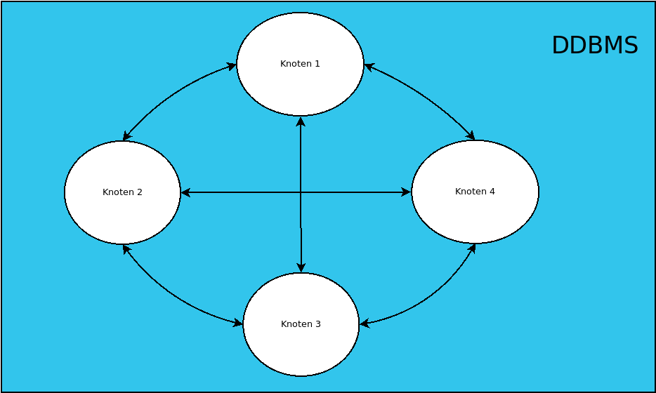

# verteilte Datenbanken

## Merkemale einer verteilten Datenbank
Im folgenden Kontext wird unter einer verteilten Datenbank eine Sammlung von verschiedenen,logisch miteinander verknüpften Datenbanken verstanden, die Knoten eines verteilten Systems sind.
Ein verteiltes Datenbankmanagementsystem (*distributed DBMS*) definieren wir davon ableitend als System,TODOTODO

## Anforderungen
Analog zu den *Codd's 12 rules*[6],Designregeln mit denen definiert wurden, welche Anforderungen ein DBMS erfüllen muss, um als *relational* zu gelten wurden *Date's 12 rules**[7] abgeleitet. Diese 13 Regeln spezifizieren, welche Aufgaben ein DDBMS erfüllen muss um als solches zu gelten.
<dl>
  <dt>lokale Autonomie</dt>
  <dd>Die einzelnen Knoten eines verteilten Systems sollten autonom sein; alle Operationen finden lokal statt und werden lokal verwaltet und nicht von einem zentralen Standort aus</dd>
</dl>
<dl>
  <dt>keine Abhängigkeit von zentralen Standorten</dt>
  <dd>Diese in der ersten Regel schon implizit erwähnte Bedingung besagt, dass es keinen Knoten geben soll, von dem alle anderen abhängen. Operationen wie das Management der Transaktionen, Erkennen von Deadlocks, Optimierung von Anfragen und Einhalten von Datenkonsistenz muss von jedem Knoten erfüllt werden</dd>
</dl>
<dl>
  <dt>kontinuierlicher Betrieb</dt>
  <dd>Der Ausfall eines Knotens darf nie zum Ausfall des gesamten Systems führen. Auch das hinzufügen oder entfernen weiterer Knoten soll ohne Ausfall des Systems möglich sein.</dd>
</dl>
<dl>
  <dt>lokale Unabhängigkeit</dt>
  <dd>Unabhängig davon, wo der User auf die Daten zugreift soll der User die Möglichkeit für diesen Zugriff haben und auch alle Daten vorfinden.</dd>
</dl>
<dl>
  <dt>Unabhängigkeit der Fragmentierung</dt>
  <dd>Dem User präsentiert sich nur eine logische Datenbank, unabhängig davon ob Daten fragmentiert sind oder nicht.</dd>
</dl>
<dl>
  <dt>Unabhängigkeit der Replikation</dt>
  <dd>Die Replikation der Daten ist für den User nicht sichtbar, außerdem kann er diese nicht manuell anstoßen und muss sie auch nicht manuel managen</dd>
</dl>
<dl>
  <dt>verteilte Anfragenverarbeitung</dt>
  <dd>Das System besitzt die Fähigkeit, Anfragen zu bearbeiten, die sich auf Daten beziehen, die auf verschiedenen Knoten liegen.</dd>
</dl>
<dl>
  <dt>verteilte Transaktionsverarbeitung</dt>
  <dd>Das System muss bei Transaktionen gewährleisten, dass ACID erfüllt ist. Außerdem muss auch verteilten Transaktionen ein System zur Wiederherstellung bei Fehlern implementiert sein. </dd>
</dl>
<dl>
  <dt>Unabhängigkeit der Hardware</dt>
  <dd>Das DBMS soll nicht nur auf einer bestimmten Hardware lauffähig sein.</dd>
</dl>
<dl>
  <dt>Unabhängigkeit des Betriebssystems</dt>
  <dd>Das DBMS soll auf mehreren Betriebssystemen lauffähig sein.</dd>
</dl>
<dl>
  <dt>Unabhängigkeit des Netzwerks</dt>
  <dd>Die Art des unterliegenden Netzwerks soll die Lauffähigkeit des DDBMS nicht beeinträchtigen</dd>
</dl>
<dl>
  <dt>Unabhängigkeit der Datenbank</dt>
  <dd>Es soll die Möglichkeit geben, das lokale Knoten des DDBMS heterogen sind, also z.B. Produkte verschiedenere Hersteller, deren Interoperabilität z.B. durch einen gemeinsam genutzten Standard möglich wird.</dd>
</dl>

Die Anforderungen an verteilte Datenbanken macht sichtbar, warum eine Einführung in Erlang notwendig war, und warum
Erlang eine gute Grundlage sein kann.
Die Herausforderungen, auch als **Fallacies of Distributed Computing**[3] bekannt, sind 8 Trugschlüsse, die beim Arbeiten mit nebenläufigen Datenbanken
angenommen werden könnten.

## verteilte Daten
Ein Kernthema der verteilten Datenbanken ist die Speicherung der Daten auf verschiedenen Knoten. Eine grobe Einordnung kann über die beiden Konzepte *Replikation* und *Fragmentierung* erfolgen.
### Replikation

### Fragmentierung
#### vertikale Fragmentierung

#### horizontale Fragmentierung

Wie genau Mnesia diese Probleme löst, wird im nächsten Kapitel genauer erläutert, allerdings wird hier schon auffällig, dass
die unterliegende Programmiersprache bereits einige der Probleme als Kernprobleme anerkennt und Lösungen bereitstellt.

## ACID

[**Weiter**](./04_Mnesia.md)
