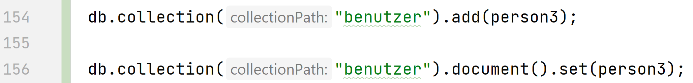

 
 
 

 
 

# Firebase Cloud Firestore

 
 

 
 

**Datenbank-Technologien**

 
 

Georges A. K. Bonga

Matrikel: 20223343

 
 

Betreuer: Prof. Dr.-Ing. Nils Jensen EUR ING

 
 

Brandenburg an der Havel, 25. Dezember 2021

 
 

# 1. Einleitung

Heutzutage muss fast jede Applikation Daten speichern oder auf Daten zugreifen, die irgendwo gespeichert sind. Für die Speicherung der Daten waren SQL-Datenbanken lange Zeit die Standard Lösung. Mit der Zeit haben sich immer mehr Alternative entwickelt, zum Beispiel, NoSQL Datenbanken. In dieser Arbeit wird die NoSQL Datenbank Cloud Firestore vorgestellt.

## 1.1 NoSQL Datenbanken?

In der Vergangenheit waren SQL-Datenbanken der Standard. In SQL-Datenbanken werde Elemente in Tabelle gespeichert, die ein bestimmtes Schema haben. Es ist genau definiert welche Spalten jede Zeile haben muss und welche Datentypen in den Zellen gespeichert werden. Aus diesem Grund kann man in der Regel nur einen einzigen Objekttyp in einer Tabelle Speichern und bei jeder Änderung des Datenmodells, müssen alle alten Daten angepasst werden.
In einer NoSQL Datenbank, gibt es keine Einschränkung was die Datentypen angeht, die in dir Datenbank gespeichert werden können. Es gibt auch keine festen Schemata, wie in SQL-Datenbanken. In einer NoSQL-Datenbank gibt es verschiedene Möglichkeiten Daten zu speichern. Man kann Daten als Key-Value Paare, als eine verschachtelte Baum-Struktur, als JSON-Objekte oder was anderes speichern. Daten, die in der SQL-Welt in unterschiedlichen Tabellen gespeichert wären, können alle zusammen in NoSQL Datenbanken gespeichert werden. In einer NoSQL Datenbank müssen nicht alle Einträge die gleichen Felder haben oder die gleiche Länge. Das gibt Entwicklern eine große Flexibilität, weil bei Änderungen nicht gleich alle alten Einträge angepasst werden müssen.

## 1.2 Firebase Cloud Firestore?

# 2. Cloud Firestore-Datenmodell und Datentypen

Dies ist ein Typoblindtext. An ihm kann man sehen, ob alle Buchstaben da sind und wie sie aussehen. Sehr bekannt ist dieser: The quick brown fox jumps over the lazy old dog. Oft werden in Typoblindtexte auch fremdsprachige Satzteile eingebaut, um die Wirkung in anderen Sprachen zu testen.

# 3. Zugriff und Sicherheit Regeln

Text

# 4. Cloud Firestore Abfragen

