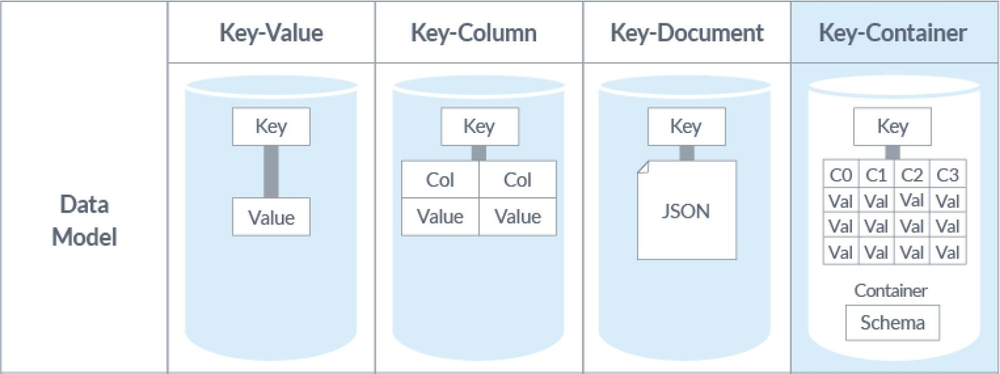
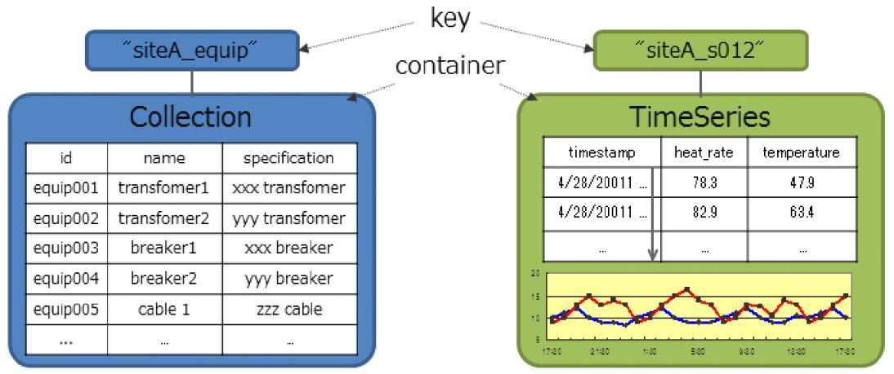
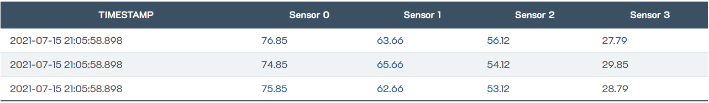
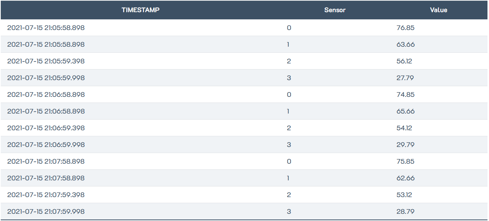
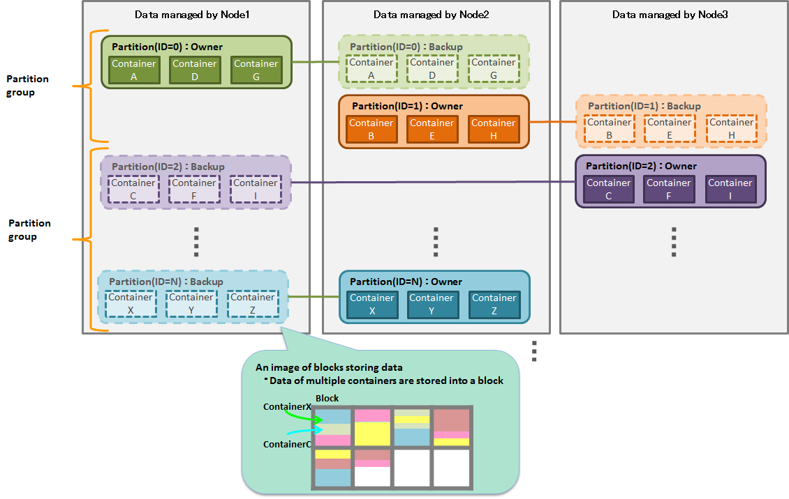
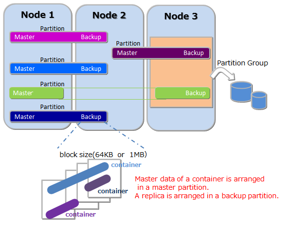

# 3.2 GridDB

GridDB ist eine verteilte hochskalierbare NoSQL-Zeitreihendatenbank. Sie weist eine sehr hohe Performance auf und ist für *IoT* (kurz für: *Internet of Things*) sowie Big Data optimiert [3.2.1]. GridDB wurde von Toshiba Corporation entwickelt. Der erste kommerzielle Release war 2013, 2016 wurde der Quellcode öffentlich zur Verfügung gestellt. [3.2.2]

Momentan gibt es drei Ausprägungen einer GridDB: 
- GridDB *Standard Edition*
- GridDB *Advanced Edition*
- GridDB *Vector Edition*
Die *Advanced Edition* ist um die Fähigkeit der SQL-Verarbeitung erweitert. Die *Vector Edition* bietet zusätzlich zur *Advanced Edition* die Verarbeitung von hochdimensionalen Vektordaten, die für die Bilderfassung oder für das *Maschinelle Lernen* (engl.: *Machine Learning*) in der Big-Data-Analyse verwendet wird. [3.2.3]

## Datenmodell

### Key-Value-Store

GridDB integriert eine der vier NoSQL-Technologien: den Key-Value-Store. Dabei handelt es sich um eine Datenbank mit eindeutigen Schlüsseln und zugeordneten Werten. Da die Key-Value-Stores mit ihren Schlüssel-Werte-Paaren einfache Strukturen haben und sie den Arbeitsspeicher von Rechnern nutzen (In-Memory), können ihre Datensätze ressourcenschonend sehr schnell geschrieben und gelesen werden. Sie können als volatiler Zwischenspeicher zur Optimierung von Applikationen und zur Reduzierung der Zugriffszeiten eingesetzt werden. Key-Value-Datenbanken können einfach sklaliert werden und eignen sich aus diesem Grund für das Cloud-Computing [3.2.4]. [3.2.5][3.2.6]

Key-Value-Stores gelten als schemalose Datenbanken. Der Schlüsselraum kann zwar mittels Sonderzeichen wie Doppelpunkten oder Schrägstrichen rudimentär strukturiert werden. Ansonsten unterstützen Key-Value-Datenbanken keinerlei Strukturen, Referenzen oder Verschachtelungen. Datenobjekte können jederzeit in beliebigen Formaten gespeichert werden, ohne die Notwendigkeit eines vorab festgelegten Formats. Dies erhöht die Flexibilität von Key-Value-Datenbanken, beschleunigt die Abfragen und erleichtert die Partitionierung.

Eine Key-Value-Datenbank weist folgende Eigenschaften auf:
- Es gibt Datenobjekte, die zur Identifikation eingesetzt werden: die Schlüssel.
- Jedem Schlüssel wird ein Datenobjekt zugewiesen, das dessen Wert beschreibt.
- Unter Angabe des Schlüssels können die zugewiesenen Werte abgefragt werden.  

Die hohe Schreib- und Lesegeschwindigkeit kann einerseits dadurch erreicht werden, dass auf die Prüfung der *referentiellen Integrität* verzichtet wird, wonach in RDBMSen die Beziehungen zwischen Datenobjekten kontrolliert werden. Andererseits kann die Performance noch weiter gesteigert werden, indem die Schlüssel-Werte-Paare im Hauptspeicher der Datenbank zwischengespeichert werden. Key-Value-Stores sind In-Memory-Datenbanken. Sie verwenden Technologien, die Werte im Hauptspeicher puffern können, während diese permanent mit den persistenten Langzeit-Daten im Hintergrundspeicher überprüft werden.  
Durch das simple Datenmodell der Key-Value-Stores ist die Partitionierung sehr einfach. Einzelne Computer eines Clusters, die *Shards*, übernehmen einen Teil des Schlüsselraums. Dadurch kann die Datenbank auf mehrere Maschinen verteilt werden. Die Verteilung der Schlüssel erfolgt nach dem Prinzip des *Consistent Hashing* (engl. für: *Konsistente Hashfunktion*). Danach wird eine Speicheradresse oder ein Hashwert aus einem Satz von Schlüsseln berechnet, um einen neuen entsprechenden Datensatz zu speichern. Gemäß dessen werden in Big-Data-Anwendungen Schlüssel-Werte-Paare verschiedenen Knoten in einem Computernetzwerk zugeordnet. Ausgehend von den Schlüsseln werden deren Werte in den zugehörigen Knoten gespeichert. Mittels *Consistent Hashing* wird die Adressberechnung sowohl für die Knotenadressen als auch für die Speicheradressen der Datenobjekte verwendet (Key-Value). [3.2.7]

### Key-Container

Bei der GridDB wird die typische NoSQL-Technologie des Key-Value-Stores erweitert. Die unten stehende Abbildung zeigt unterschiedliche Datenmodelle im direkten Vergleich. Auf die in der Abbildung erwähnten Datenmodelle Key-Column und Key-Document wird hier nicht näher eingegangen. *Key-Value* wurde als Ausgangsbasis von GridDB bereits oben beschrieben. Das Datenmodell *Key-Container* ist eine Erweiterung des Key-Value-Stores und ist das von GridDB eingesetzte Datenmodell. [3.2.8]

  
***Abbildung 3.2.1:** Datenmodelle im Vergleich: Key-Value, Key-Column, Key-Document und Key-Container* [3.2.8] 

GridDB verwaltet Daten auf der Basis von *Blöcken*, *Containern* (*Tabellen*), *Reihen*, *Partitionen* und *Partitionsgruppen*. Ein *Block* ist eine Dateneinheit für die Verarbeitung persistenter Daten auf einem Festplattenspeicher. Es ist die kleinste physische Einheit der Datenverwaltung in einer GridDB. Mehrteilige Containerdaten werden in einem Block angeordnet. Die Blockgröße kann entweder 64 KB oder 1 MB betragen.  
Ein *Container* ist eine Datenstruktur, die als Oberfläche für den Nutzer dient. Er besteht aus mehreren Blöcken. Ein Block wird *Container* genannt, wenn auf Basis von *NoQL* gearbeitet wird, und *Tabelle*, wenn auf Basis von *NewSQL* gearbeitet wird. *NewSQL* bezieht sich auf Datenbankmanagementsysteme, die die Vorteile von klassischen RDBMSen und NoSQL verbinden möchte. Es gibt zwei Datentypen: *Collection* (*Tabelle*) und *Time Series Container* (*Time Series Tabelle*).  
Eine *Row* (engl. für *Reihe*, auch *Zeile*) bezieht sich auf eine Datenzeile, die in einem Container eingetragen wird. Abhängig von der Eintragung und der Zeiteinteilung, werden die Daten in den passenden Blocks innerhalb von Partitionen gespeichert. In der Regel gibt es Spalten mit mehreren Datentypen pro Zeile.  
Eine *Partition* ist eine logische Datenverwaltungseinheit, die eine oder mehrere Container beinhaltet. Zwischen Clustern dient sie zur Verwaltung der Datenbewegungen, zur Regelung der Lastverteilung zwischen den Knoten sowie zur Mehrfachhaltung von Daten im Falle einer Störung. Eine *Partitionsgruppe* besteht aus mehreren Partitionen. [3.2.3]

Bei dem Datenmodell des *Key Containers* werden Daten in Form einer *Collection* (engl. für: Kollektion, Sammlung) abgebildet und durch einen *Key* (engl. für: *Schlüssel*) referenziert. Dieses Prinzip kann in etwa dem von relationalen Datenbanken gleichgesetzt werden. Der *Key* entspricht dabei dem Tabellennamen und die *Collection* den Tabellendaten, die in einem *Container* zusammengefasst sind (vgl. unten stehende Abbildung). Auf diese Art können die Daten in einem Schema strukturiert werden, ähnlich wie in einer relationalen Datenbank. [3.2.9]

  
***Abbildung 3.2.2:** Datenmodell mit Key-Container* [3.2.9]

In der GridDB werden sowohl *Collections* als auch *Time Series Container* unterstützt. Während für *Collections* beliebige Werte als *Keys* eingesetzt werden, verwenden *Time Series Container* einen *Zeit-Wert*. Auf diese Weise ist die Speicherung und der Zugang zu Meta-Informationen von Zeitreihen leichter zu handhaben, da der Wechsel zwischen verschiedenen APIs und Verbindungen entfällt. [3.2.9]  
Darüber hinaus können neben speziellen API-Aufrufen auch Abfragen über den Schlüssel durchgeführt werden, Zeitintervalle begrenzt werden oder Daten aus einem festgelegten zurückliegenden Zeitraum automatisch gelöscht werden. [3.2.8]

GridDB gilt als eine der schnellsten NoSQL-Datenbanken. Das liegt unter anderem daran, dass GridDB ebenso wie Key-Value-Datenbanken das In-Memory-Prinzip nutzt. Das alleinige Halten der Daten im flüchtigen Speicher reicht allerdings nicht aus. Wenn große Datenmengen verarbeitet werden sollen, sollte ein DBMS ebenso in der Lage sein, diese persistent auf Festplatten zu speichern. Um die Festplattenzugriffe so weit wie möglich zu reduzieren, werden Daten lokal begrenzt. Zu diesem Zweck platziert GridDB zusammenhängende Daten im selben Datenblock. Mittels *Hint*-Informationen (hint, engl. für: *Hinweis*) über die Daten stellt GridDB entsprechende Datenblöcke zusammen. Auf diese Weise werden fehlschlagende Speicherzugriffe reduziert und die Leistung verbessert. [3.2.8]

  
***Abbildung 3.2.3:** Combined use of in-memory/disk* [3.2.3]

### Wide Tables und Narrow Tables

Für die Organisation der Daten im Speicher bestehen verschiedene Möglichkeiten, diese zu strukturieren. GridDB unterstützt sowohl *Wide Tables* (engl. für: breite Tabellen) also auch *Narrow Tables* ((engl. für: schmale Tabellen). *Wide Tables* umfassen alle Variablen in einzelnen Spalten, wobei jede Spalte eine eindeutige Variable hat. Das bedeutet, dass beispielsweise eine Sensordaten-Tabelle mit einem Zeitstempel als Zeilenschlüssel alle dazugehörenden Informationen in einer Zeile hält. Dies zeigt beispielhaft die folgende Tabelle. Eine Zeile enthält hier die Messwerte von drei Sensoren in einer Zeile. [3.2.10]

  
***Abbildung 3.2.4:** GridDB: Wide Table* [3.2.10]

In einer *Narrow Table* enthält eine Tabellenspalte den Zeitstempel. In den anderen beiden Spalten ist ein Wert einem Variablennamen zugeordnet. In der folgenden Tabelle sind beispielhaft Sensordaten in einer Narrow Table abgebildet, mit Zeitstempel, Sensor-ID und Sensormesswert als Tabellenspalten. [3.2.10]

  
***Abbildung 3.2.5:** GridDB: Narrow Table* [3.2.10]

*Narrow Tables* sind aufgrund ihrer Struktur sehr flexibel. Es ist sehr einfach, zusätzliche Metriken hinzuzufügen und nachzuverfolgen. Wenn zum Beispiel ein neuer Sensor hinzugefügt werden soll, wird lediglich eine neue Zeile mit der neuen Sensor-ID erfasst. Bei *Wide Tables* müsste für den gleichen Anwendungsfall entweder eine neue Spalte in der Tabelle ergänzt werden oder ein neues Schema erstellt und die Daten migriert werden. Das Schreiben von Daten in *Narrow Tables* ist zwar sehr einfach, das Lesen der Daten erfordert dagegen größeren Aufwand. Meistens sind sogenannte *Composite Row Keys* (engl. für: zusammengesetzte Reihenschlüssel) erforderlich, um eindeutige Datensätze zu gewährleisten. Abfragen sind oft nur über mehrere Tabellen hinweg sinnvoll. Diese sind nur in Verbindung mit *JOINs* möglich, was wiederum mit Leistungseinbußen verbunden ist. *JOINs* sind allerdings nicht in TQL möglich, genauso wenig wie in anderen NoSQL-Query-Sprachen. [3.2.10]

## Partitionierungsmechanismen

### Architektur
GridDB hat eine hybride Cluster-Architektur, die die *Peer-to-Peer-* und *Leader/Follower*-Topologien (auch: *Master/Slave*) kombiniert. Alle Knoten eines Clusters sind identisch. Ein Knoten wird entsprechend eines Algorithmus zum Master (Leader) gewählt. Der *Master-Knoten* und *Follower-Knoten* tauschen *Heartbeat*-Nachrichten (engl. für: Herzschlag) aus, um damit gegenseitig ihre Betriebsbereitschaft zu signalisieren. 
Knoten können für die Partitionen die Rolle des *Owners* (engl. für: Besitzer) oder des *Followers* (engl. für: Folger) übernehmen. Wenn ein Knoten die Rolle des *Owners* einer Partitionstabelle übernimmt, wird diese an den *Follower* weitergegeben und kopiert. Dieser übernimmt das *Backup* (engl. für: Datensicherung). Der Owner einer Partition hat Lese- und Schreibrechte, während das Backup lediglich lesende Operationen zulässt. [3.2.11]  

  
***Abbildung 3.2.6:** GridDB-Architektur: Partitionen und Partitionsgruppen, Owner und Backup* [3.2.12]

### Partitionierung

Eine GridDB-Partition ist ein logischer Bereich, der ganze Container speichert und für den Nutzer nicht direkt sichtbar ist. Ein Hash-Algorithmus, der den Container-Schlüssel als Startwert benutzt, entscheidet darüber, welcher Partition ein Container zugewiesen wird. Eine Zuordnungstabelle eines Knotens zu jeder Partition wird *Partitionstabelle* genannt. Der Master-Knoten verteilt diese Partitionstabelle an die Follower-Knoten oder Client-Bibliotheken. Indem die Partitionstabelle referenziert wird, werden der Owner-Knoten und der Backup-Knoten bekanntgegeben. Da in einer GridDB komplette Container in den Partitionen abgespeichert werden, sind die Zugriffe innerhalb eines Containers immer schnell, da eine knotenübergreifende Kommunikation und Koordination nicht erfordlich ist. [3.2.2]

Fällt der Master-Knoten aus, erhalten die Follower-Knoten kein Heartbeat-Signal. Unter den Follower-Knoten wird mittels eines Algorithmus ein neuer Master-Knoten gewählt. Da alle Follower-Knoten eine Kopie der *Partitions-Tabelle* (s.a untenstehend *Partitionierung*) besitzen, kann der Cluster innerhalb weniger Sekunden die normalen Operationen fortsetzen. [3.2.11]  
Auf diese Weise wird das Risiko, das ein alleiniger Master ohne Replikation mit sich bringen würde (*single-point of failure*, kurz: *SPOF*), reduziert. [3.2.2]

Um die Bearbeitungsgeschwindigkeit von Anwendungen zu erhöhen, die mit mehreren Knoten eines Clusters verbunden sind, ist es wichtig, die Daten bestmöglich für die Verarbeitung im Speicher vorzubereiten. Dies erfolgt in einer GridDB mittels *Sharding* [3.2.1]. Zu diesem Zweck werden bei großen Tabellen mit einer großen Zeilenanzahl die Zeilen in internen Containern, den *Data-Partitions* (engl. für: Datenpartitionen) gespeichert und auf verschiedene Knoten verteilt. Die Zuordnung jeder Zeile zu den *Data-Partitions* wird mit den *Partitionsschlüsseln* bestimmt, die sich aus der Zeit der Tabellenerstellung ergibt. Die unten stehende Abbildung zeigt die Partitionierung in einer GridDB. [3.2.3]

  
***Abbildung 3.2.7:** GridDB: Partitionierung* [3.2.3]

## Replikationsmechanismen

Die Replikationsstufen können für den gesamten Cluster festgelegt werden. Jede Partition hat einen Knoten, der die Rolle des Owners hat, außerdem ausreichend Backup-Knoten, um die konfigurierte Replikationsstufe zu erreichen, und jegliche *Catch-Up-Knoten* (catch up, engl. für: aufholen, gleichziehen), die erforderlich sind. *Catch-Up-Knoten* werden immer dann benötigt und eingesetzt, wenn es Schwierigkeiten mit den Backup-Knoten gibt oder wenn nicht genügend Backup-Knoten vorhanden sind, um die Replikationsstufe zu erfüllen. In diesen Fällen sendet der Master-Knoten große Speicherblöcke seiner Partitionsdaten an den Catch-Up-Knoten und überträgt dann Aktualisierungsprotokolle, bis der Catch-Up-Knoten mit dem Partitionsowner synchronisiert ist und zu einem Backup-Knoten hochgestuft wird. [3.2.2]

Der Master-Knoten überwacht alle Knoten im GridDB-Cluster. Wenn ein Knoten nicht auf die Heartbeat-Nachricht des Master-Knotens antwortet, kennzeichnet dieser den Knoten als betriebsunfähig und weist die Partitionen anderen Kopien zu. Wenn bei einem Ausfall die Replikationsstufe nicht erreicht wurde, wird einem anderen Knoten die Rolle des Catch-Up-Knotens zugewiesen und in diese Partition werden die Datenblöcke übertragen, bis die Synchronisation erreicht ist. [3.2.2]

  
***Abbildung 3.2.8:** GridDB: Replikation* [3.2.12]

## Unterstützte Programmiersprachen
GridDB wurde in C++ geschrieben und implementiert. Es werden darüber hinaus die Programmiersprachen C, Java, Python, Go, JavaScript (Node.js) und Ruby unterstützt. [3.2.2][3.2.9][3.2.13]

Es stehen Python-, Ruby-, Node.js, PHP- und Go-Clients unter GitHub zur Verfügung [13]. Die *GridDB-APIs* (*Application Programming Interface*, engl. für: Programmierschnittstelle) sind Java- und C-basiert. Abfragen können über *TQL* (*Toshiba Query Language*) erfolgen. TQL ist die Abfragesprache von GridDB und ist an SQL angelehnt. [3.2.14]

## APIs und andere Zugriffskonzepte

Abfragen an eine GridDB können entweder über die APIs oder über TQL erfolgen. GridDB unterstützt dabei Standard-Aggregationsfunktionen wie *MIN*, *MAX*, *AVERAGE* und darüber hinaus auf Zeitreihendatenbanken spezialisierte Funktionen wie *TIME-AVG* (time weighted average, engl. für: zeitgewichteter Durchschnitt). [3.2.2]

Wenn neue Operationen auf einem Container mit einem zuvor festgelegten Auslöser durchgeführt werden, können dazu *JMS*- (*Java Messaging Service*) oder REST-Benachrichtigungen (Representational State Transfer) versendet werden. [3.2.14]

GridDB unterstützt mittels *JDBC*-Treiber (*Java Database Connectivity*) *SQL* (*Structured Query Language*). [3.2.3]

## Einsatzbereiche

GridDB kann für verschiedene Anwendungsbereiche eingesetzt werden. Generell eignen sie sich für den Einsatz in Verbindung mit cyber-physischen Systemen (engl.: cyber-physical system, kurz: *CPS*) und mit Monitoring-Systemen. Einige Beispiele werden im Folgenden aufgelistet.

- **Factory IoT**: Globale Produktionsumgebungen mit *Industrie-4.0*-Konzepten und damit einhergehenden Innovationen erfordern höhere Produktivität und Qualität. Ganze Wertschöpfungsketten müssen optimiert werden. Um diesen Innovationen gerecht zu werden, bietet GridDB IoT-basierte Produktionslösungen als IKT-Lösungen (kurz für: Informations- und Kommunikationstechnik) an. [3.2.15]
- **Energy**: Ein Beispiel bezieht sich auf die Messung des Energieverbrauchs mit sogenannten Smart Metern, die in stromabnehmenden Haushalten installiert werden. Sie sind über das Internet mit den GridDB-Clustern verbunden. Dort wird der von den Smart Metern erfasste Energieverbrauch gespeichert. Diese Daten werden zwecks automatischer Erstellung der Rechnungen an einen weiteren Cluster übergeben. Ein anderes Beispiel ist ein cloud-basiertes Energiemanagementsystem für Gebäude (engl.: *building energy management system*, kurz: BEMS). Dabei handelt es sich um eine ausgeklügelte Methode, um den Energiebedarf eines Gebäudes zu überwachen und zu steuern. Zu diesem Zweck kann eine Vielzahl von Gebäudefunktionen wie zum Beispiel Heizung, Lüftung, Klimaanlage, Licht und Sicherheit überprüft und reguliert werden. [3.2.16]
- **Smart Community**: Smarte Kommunen oder auch Smart Cities verfolgen mit ihren Entwicklungsansätzen das Ziel, eine Kommune oder eine Stadt effizienter, umweltfreundlicher und lebenswerter zu gestalten. GridDBs können in vielen Bereichen einer Smart City eingesetzt werden. Diese werden beispielsweise für Smart Grids eingesetzt, mit dessen Hilfe Stromnetze überwacht werden können, um die Balance aus erzeugter und verbrauchter elektrischer Leistung zu gewährleisten. Dies ist insbesondere hinsichtlich der Zunahme von erneuerbaren Energien wichtig, die durch die Abhängigkeit von ihren natürlichen Energiequellen (Sonne, Wind) nicht kontinuierlich zur Verfügung stehen. Dies wiederum kann Leistungsschwankungen im Stromnetz verursachen. Darüber hinaus kann zum Beispiel die Verkehrsdichte sensorgesteuert gemessen werden und über ein entsprechend vernetztes Verkehrsleitsystem gesteuert werden. Ähnliche Szenarien sind hinsichtlich der Schadstoffregulierung im öffentlichen Raum denkbar.
- **Automotive Industry**: Ein Beispiel für die Automobilindustrie ist der Einsatz einer GridDB für Fahrzeugmanagementsysteme. Ein Fahrzeug hat verschiedene integrierte Sensoren, mit denen Daten - wie zum Beispiel die ständige Erfassung der aktuellen Position - gesammelt und an einen Computer im Fahrzeug gesendet werden. Dieser wiederum analysiert diese Daten und leitet sie per LTE an einen Cloudserver weiter. Im Cloudserver laufen Daten von mehreren Fahrzeugen zusammen und werden dort weiterführend analysiert. Dies kann für die Steuerung des Verkehrsaufkommens verwendet werden. Diese Funktionen erfordern eine hohe Verfügbarkeit des Systems und eine hohe Geschwindigkeit. [3.2.17]

## Vorteile, Besonderheiten und Nachteile 

### Vorteile

- **Hohe Performance**: Die Ein- und Ausgabe von Daten kann in Datenbankmanagementsystemen zu Leistungseinbußen führen. GridDB verfolgt deshalb den Ansatz, dass Daten, auf die häufig zugegriffen wird, zunächst im Hauptspeicher gehalten werden und die übrigen Daten im Festplattenspeicher (SSD und HDD) gespeichert werden. GridDB ordnet die Daten entsprechend der Zugriffsmuster einer Anwendung einem Block zu und kann so je nach Zugriffsfrequenz und -intensität den Hauptspeicher zuweisen. Durch die Verteilung von großen Datenmengen auf mehrere Knoten (Partitionierung) sind parallele Prozesse mit geringem Ressourcenaufwand möglich. [3.2.12]
- **Hohe Skalierbarkeit**: GridDB skaliert sowohl vertikal durch erhöhte Kapazitäten in bestehender Hardware als auch horizontal durch das Hinzufügen von Servern in einem verteilten System. Die Anzahl der Server kann auf bis zu 1000 Einheiten erhöht werden. Dabei werden die Vorteile einer klassischen relationalen Datenbank wie Konsistenz auf Containerlevel mit den Vorteilen einer NoSQL-Datenbank wie Schnelligkeit kombiniert. [3.2.12]
- **Hohe Verfügbarkeit**: Durch die hybride Cluster-Architektur, die Kombination der unterschiedlichen Netzwerktopologien Leader/Follower und Peer-to-Peer, die Partitionierungs- und Replikationsmechnanismen wird ein *Single Point of Failure* vermieden und eine hohe Verfügbarkeit sichergestellt.
- **ACID auf Containerlevel**: Das Transaktionskonzept in GridDB richtet sich nach dem *ACID*-Prinzip auf dem Container-Level. ACID ist ein Akronym und steht für *Atomicity* (engl. für: Atomarität), *Consistency* (engl. für: Konsistenz), *Isolation* und *Durability* (engl. für: Dauerhaftigkeit). [3.2.18]
- **IoT-optimiert**: GridDB wurde mit seiner Architektur speziell für IoT-Szenarien entwickelt und optimiert. [3.2.12]
- **Open Source**: GridDB ist eine Open-Source-Datenbank mit einer guten Dokumentation und einer Open-Source-Community. 

### Besonderheiten

GridDB hebt sich durch die hybride Cluster-Architektur und das Key-Container-Datenmodell von anderen Datenbanken ab.

### Nachteile
Die Festlegung auf ein Schema kann die Flexibilität im Umgang mit der Datenbank einschränken. Die proprietäre Query-Sprache TQL muss von Anwendern neu erlernt werden.
