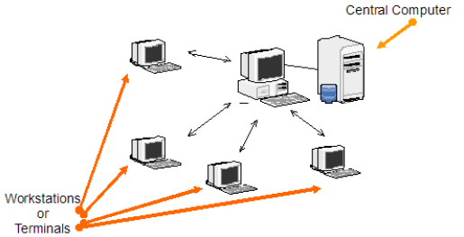
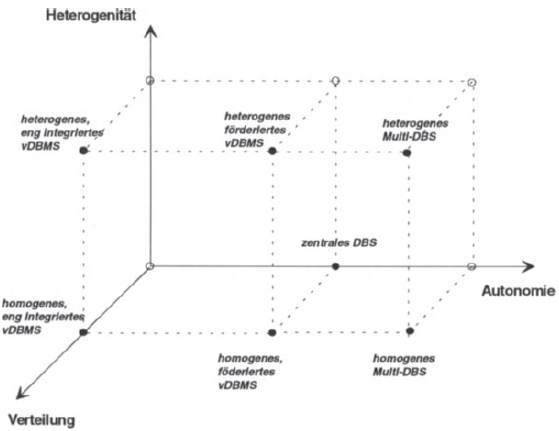
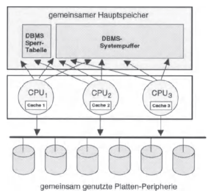
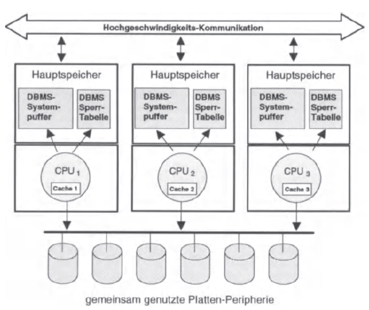
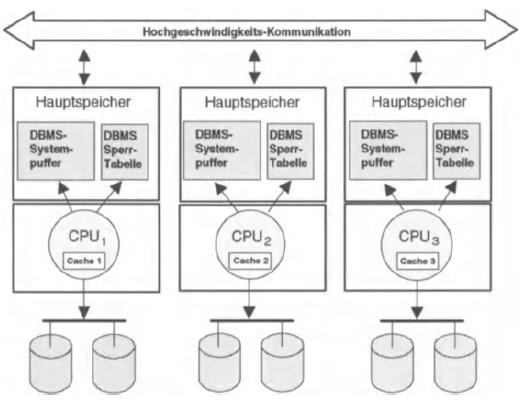
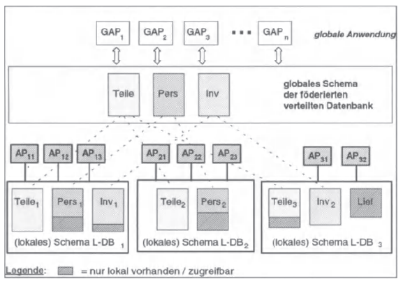
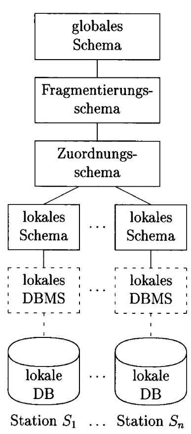
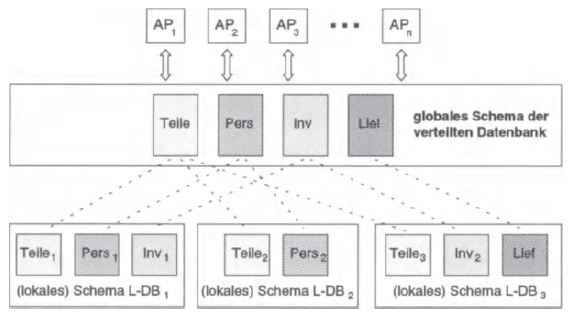

## 2. Grundlagen
Im Nachfolgenden werden die Grundlagen von verteilten Datenbanken skizziert. Dabei wird zunächst die Abgrenzung zu unverteilten Datenbanksystemen aufgezeigt und später der Aufbau von verteilten Datenbanksystemen erläutert.

### 2.1 Abgrenzung zu unverteilten bzw. zentralen Datenbanken
Im Gegensatz zu unverteilten bzw. zentralen Datenbanksystemen (vgl. Abb. 1) implementieren verteilte Datenbanksysteme keine klassische Client-Server-Architektur, da mehrere Clients mit mehreren Servern kommunizieren. 
Bei unverteilten bzw. zentraler  Datenbanken gibt es in der Regel einen einzigen Hauptknoten, der seine eigenen Daten hält, bei den verteilten Datenbanken sind diese auf viele teilnehmende Knoten verteilt.

|  |
|:--:| 
| *Abb. 1: Client-Server-Architektur (vgl. [14])* |

### 2.2 Aufbau
Bei dem Aufbau eines VDBMS steht die Entscheidung der konkreten Realisierung an erster Stelle. Hierbei müssen die verschiedenen Schwerpunkte Heterogenität, Verteilung und Autonomie beachtet werden, die verschiedene Bereiche vom globalen Transaktionskonzept bis zur Verteilungstransparenz abdecken. Durch die Definition dieser Schwerpunkte ergibt sich die Kategorisierung bzw. Klassifizierung der Ausprägung des VDBMS (vgl. [13, S. 10]).

Im Rahmen dieser Abhandlung wird eine kleinere Teilmenge der möglichen Realisierungsalternativen (vgl. Abb. 2) dargestellt und kurz vorgestellt (vgl. [7, S. 27]).

|  |
|:--:| 
| *Abb. 2: Realisierungsalternativen von DBMS (vgl. [13, S. 20])* |

#### Homogene, eng integrierte VDBMSe
Homogene, eng integrierte VDBMSe sind nach außen nicht als ein Verbund von mehreren Knoten zu erkennen, sondern stellen sich durch ein globales Schema als ein einziges System dar. Systeme dieser Art werden auch als Hochleistungsdatenbanksysteme, fehlertolerante Systeme oder zur Dezentralisierung von zentralen DBMS eingesetzt.

Eine spezielle Form dieser eng integrierten VDBMSe ist das Mehrrechner-DBMS bzw. Hochleistungs-DBMS. Hier werden verschiedene Varianten unterschieden: “Shared everything” mit einem gemeinsamen Hauptspeicher und gemeinsam genutzten Festplattenspeicher, “shared disk” mit nur gemeinsam genutzten Festplattenspeicher oder “shared nothing” ohne gemeinsam genutzte Ressourcen.

Systeme der Kategorie shared everything gleichen einem zentralisierten DBMS, da sie den gleichen Aufbau (vgl. Abb. 3) haben und gleich Mechanismen nutzen, um beispielsweise Deadlocks erkennen und lösen zu können. Der einzige Unterschied liegt in den Caches der einzelnen CPUs. Durch den Einsatz von mehreren CPUs kann zum Beispiel eine Änderung der Sperrtabelle durch CPU 2 bemerkt werden, die CPU 1 gerade durchgeführt hat. Dieses Problem nennt man auch das Cache-Kohärenzproblem. Behoben wird dieses, indem Cache-Inhalte konsistent gehalten werden. (vgl. [13, S. 14]).

|  |
|:--:| 
| *Abb. 3: Shard-Everything-Architektur (vgl. [13, S. 13])* |

Shared-Disks-Systeme sind komplette Rechner (vgl. Abb. 4) mit einem dedizierten eigenen Hauptspeicher, die einen gemeinsamen Zugriff auf einen Festplattenspeicher nutzen. Es gibt hierbei keine physische Datenaufteilung, da ein zentraler Speicher für die komplette Datenbank genutzt wird. Probleme, die hierbei entstehen sind Puffervalidierungen, Logging, Recovery und Lastverteilung. Im Allgemeinen gibt es nur ein geringes Interesse an der Umsetzung dieser Variante (vgl. [7, S. 36]).

|  |
|:--:| 
| *Abb. 4: Shared-Disks-Variante (vgl. [13, S. 13])* |

Die shared-nothing-Variante (vgl. Abb. 5) der Mehrrechner-DBMS ist ein VDBMS im Wortsinne. Die Datenbank wird hierbei auf mehreren eigenständigen Rechnern aufgeteilt und das Systemkonzept ist auf eine Hochleistungs-Transaktionsverarbeitung und auf Fehlertoleranz ausgelegt. Ein Beispiel hierfür ist Teradata (vgl. [13, S. 15]).

|  |
|:--:| 
| *Abb. 5: Shared-nothing-Variante (vgl. [13, S. 14])* |

#### Föderiertes VDBMS
Bei dieser Form der Implementierung werden bestehende meist heterogene, zentrale Datenbanksysteme zu einem Verbund zusammengefasst. Analog zu den Bundesländern der Bundesrepublik Deutschland liegen einzelne Verantwortlichkeiten weiterhin bei den zentralen Datenbanksystemen, weshalb es hier geteilte Zuständigkeiten innerhalb des Verbunds gibt. Die einzelnen Systeme bringen daher auch nicht ihren gesamten Datenbankbestand in das verteilte DBMS ein, was die Unterscheidung in “lokale” und “globale” Daten nach sich zieht. Diese Unterscheidung bezieht sich auf die Sichtbarkeit der Daten aus Perspektive der jeweiligen Benutzerinnen. Globale Anwendungen nutzen das verteilte Datenbanksystem während kleine lokale Anwendungen ausschließlich die lokalen Daten eines Knotens nutzen. An dieser Stelle sind Schema-Transformationen nötig, da sich ähnliche Informationen zwischen global und lokal strukturell unterscheiden können (vgl. Abb. 6).

|  |
|:--:| 
| *Abb. 6: Schema-Integration bei föderierten verteilten DBMSen  (vgl. [13, S. 16])* |

#### Zentrales DBS
Die Eigenschaften eines zentralen DBBS sind ein hohes Maß an Autonomie, aber weder Heterogenität noch Verteilung. In dieser Form werden die Daten an einer zentralen Stelle gespeichert. Dieser Aufbau gefährdet die Ausfallsicherheit und Skalierbarkeit stark. Es muss allerdings kein Augenmerk auf Fragmentierung, Allokation und Replikation gelegt werden. 

#### Schemata
Der Aufbau von verteilten Systemen ist in verschiedene Bereiche eingeteilt: dem globalen Schema, dem Fragmentierungsschema, dem Zuordnungsschema und dem lokalen Schema. (vgl. Abb. 7)

|  |
|:--:| 
| *Abb. 7: Aufbau der Schemata nach Kemper und Eikler (vgl. [9, S. 463])* |

##### Globales Schema
Das globale Schema vereinigt redundanzfrei, widerspruchsfrei und sowohl von Synonymen als auch von Homonymen bereinigt verschiedene überlappende Sichten auf Daten (vgl. [9, S. 54]).

|  |
|:--:| 
| *Abb. 8: Position des globalen Schemas innerhalb eines VDBMS (vgl. [13, S. 10])* |

In der Grafik (vgl. Abb. 8) wird der Zusammenhang zwischen dem globalen Schema und den lokalen Schemata der einzelnen Knoten gezeigt.

##### Fragmentierungsschema
Das Fragmentierungsschema bestimmt die Aufteilung der Daten in Fragmente. In diesem Schritt werden Relationen, d. h. logisch zusammenhängende Informationsmengen, in Fragmente zerteilt. Wichtig dabei ist, dass sie disjunkt sind. Für diesen Schritt ist fundamentales Wissen über die Anwendungen erforderlich, die die Datenbank am Ende nutzen. Die Fragmente bestehen aus Daten mit ähnlichen Zugriffsmustern. (vgl. [9, S. 463])

##### Zuordnungsschema
Innerhalb des Zuordnungsschemas wird die Allokation durchgeführt. Damit ist gemeint, dass die Zuordnung der Fragmente zu einzelnen Stationen bzw. Knoten, stattfindet. Innerhalb dieses Schemas ist auch definiert, ob eine Replikation zum Einsatz kommt. (vgl. [9, S. 463])

##### Lokales Schema
Als letztes Schema bietet das lokale Schema die lokale Sicht auf die Daten in der lokalen Datenbank, die von einem Datenbank-Management-System (DBMS) verwaltet werden. Zusätzlich zur Verwaltung beantwortet das DBMS auch die eingehenden Anfragen auf den Datenbestand. (vgl. [7, S. 38])

### 2.3 Ziele
In [6, S. 651] beschreibt Date die zwölf Ziele eines verteilten Datenbanksystems. Auf diese geht der nachfolgende Abschnitt ein.

#### Lokale Autonomie
Kein Standort sollte von einem anderen Standort abhängig sein, was impliziert, dass jeder Standard alle möglichen Operationen selbst unter Kontrolle hat. In der Praxis ist dies nur bedingt erreichbar, weshalb die lokale Autonomie so gut wie möglich erreicht werden soll.

#### Unabhängigkeit von einem zentralen Standort
Die Abhängigkeit von einem zentralen Standort kann zu unterschiedlichen Problemen führen: Zum einen könnte die Verbindung zu diesem einen Engpass darstellen und zum anderen wäre die Ausfallsicherheit gefährdet, wenn das Zentralsystem ausfiele.

#### Kontinuierlicher Betrieb
Der kontinuierliche Betrieb eines verteilten Datenbanksystems wird über dessen Zuverlässigkeit und Verfügbarkeit sichergestellt. Es soll nach Date deshalb nie nötig sein, das System wegen einer Erweiterung oder des Ausfalls eines Systemteils herunterfahren zu müssen.

#### Ortstransparenz
Aus Sicht einer Benutzerin soll es keine Rolle spielen, wo die Daten physikalische gespeichert sind. Auch eine Datenmigration von einem Standort zu einem anderen oder von einem System zu einem anderen soll verborgen bleiben.

#### Fragmentierungstransparenz
Relationen können in Fragmente aufgeteilt werden, jedoch soll dies für eine Benutzerin transparent geschehen. Es soll keine Rolle spielen, in wie viele Teile oder an welchen Orten diese Fragmente gespeichert werden.

#### Replikationstransparenz
Ein Datenbanksystem, das Daten repliziert, soll sich für eine Benutzerin als ein logisches System darstellen, das im Hintergrund Daten repliziert oder wieder löscht ohne den Programmablauf zu stören.

#### Verteilte Verarbeitung von Anfragen
Auf eine einzige Anfrage soll eine einzige Antwort folgen, die die Ergebnisse aller am verteilten Datenbanksystem beteiligten Knoten enthält. Diese Anfrage soll zusätzlich optimiert werden, damit sie zügig beantwortet werden kann.

#### Verteilte Verwaltung von Transaktionen
Die beiden Aspekte Wiederherstellung und Nebenläufigkeit müssen beachtet werden. Bei der Wiederherstellung gilt es Transaktionssicherheit und damit Datenkonsistenz sicherzustellen. Bei Nebenläufigkeit müssen geeignete Locking-Mechanismen bereitgestellt, die die Konsistenz der Daten und die Verhinderung von Deadlocks implementieren.

#### Unabhängigkeit von der Hardware
Die Hardware, auf der das Datenbanksystem betrieben wird, darf keine Rolle spielen – es soll weiterhin ebenfalls ein heterogener Verbund von Hardware unterstützt werden.

#### Unabhängigkeit vom Betriebssystem
Zusätzlich zur Unabhängigkeit von der Hardware soll der Betrieb des Datenbanksystems gleichermaßen unabhängig vom Betriebssystem erfolgen können. Auch hier soll ein heterogener Verbund von verschiedenen Betriebssystemen möglich sein.

#### Unabhängigkeit vom Netzwerk
Ein Datenbanksystem soll eine große Anzahl von Netzwerken und deren Kommunikationsprotokollen unterstützen.

#### Unabhängigkeit vom DBMS
Unterschiedliche Datenbanksysteme sollen in einer heterogenen Umgebung eingesetzt werden, was bedeutet, dass diese von unterschiedlichen Herstellern sein könnten, solange sie nur eine kompatible Schnittstelle wie den offiziellen SQL-Standard teilen.

Nächstes Kapitel: [Funktionsweise](03-funktionsweise.md)