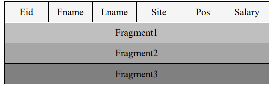

## 3. Funktionsweise
Dieses Kapitel beschreibt die Funktionsweise von verteilten Datenbanksystemen. Es werden die dafür notwendigen Grundlagen Fragmentierung, Replikation und Allokation vorgestellt, die für den Betrieb eines solchen Systems notwendig sind. Die entstehenden Zielkonflikte Konsistenz, Verfügbarkeit und Partitionstoleranz werden mittels des CAP-Theorems erläutert. Schließlich wird der moderne Gebrauch in einer IaaS-Umgebung aufgezeigt und die Vor- und Nachteile eines VDBMS erläutert.

### 3.1 Fragmentierung
Bei dem Prozess der Fragmentierung wird eine Datenbank in einzelne Stücke zerteilt, die Fragmente genannt werden. Durch die Fragmentierung wird die Leistung durch Steigerung der Effizienz verbessert. Bei relationalen DBMS sind die Relationen sonst die kleinste Aufteilung, wodurch die Fragmentierung entfiele. Der Vorteil davon wäre, dass diese Form der Aufteilung das Allokationsproblem vermindert. Zudem werden Operationen, die sich ausschließlich auf eine Relation beziehen ausschließlich auf einem Knoten durchgeführt, was wiederum die Kosten für die Kommunikation senkt. Es gibt allerdings Gründe, die gegen die Datenverteilung auf Relationsebene und für die Aufteilung in Fragmente sprechen. Dies sind ein Load-Balancing, eine Nutzung von Lokalität, eine Reduzierung des Verarbeitungsumfangs und eine Unterstützung von Parallelverarbeitung. Es wird zwischen horizontaler, vertikaler oder gemischter Fragmentierung unterschieden. Ein Nachteil der Fragmentierung ist die hohe Berechnungskomplexität der damit verbundenen Algorithmen. Diese gehen teilweise von einer begrenzten Anzahl an Netzstandorten aus und sind daher in ihrem praktischen Nutzen limitiert (vgl. [7, S. 61; 8]).

Die Funktionsweise von Fragmentierung kann der Abbildung (vgl. Abb. 9) entnommen werden. Eine Relation R wird dabei in mehrere Fragmente R_1, R_2 und R_3 geteilt und über eine Allokation mehreren Stationen, d. h. Datenbankknoten, zugeordnet. Die Fragmente werden dabei nicht zwingend nur einer, sondern mehreren Stationen zugeordnet. Im Beispiel ist das Fragment R_1 nicht nur auf der Station S_1, sondern auch auf der Station S_2 abgelegt, was einer Allokation mit Replikation entspricht.

|  |
|:--:| 
| *Abb. 9: Fragmentierung und Allokation (vgl. [9, S. 465])* |

#### Prinzipien der Fragmentierung
Es gibt eine Reihe von Regeln, um die Korrektheit sicherzustellen, was bedeutet, dass keine semantischen Änderungen bei der Fragmentierung stattfinden. Diese basieren auf den drei Prinzipien Vollständigkeit, Rekonstruktion und Disjunktheit.
Wird eine Tabelle in Fragmente zerlegt, existiert jedes Element aus der Tabelle auch in einem oder in mehreren der entstandenen Fragmente, womit die Vollständigkeit erfüllt ist. Dies stellt auch sicher, dass Daten in einem globalen Schema ohne Verlust einzelnen Fragmenten zugeordnet sind und gleicht der verlustfreien Normalisierung von Datenbanken. Die Rekonstruierbarkeit besagt, dass wenn eine Relation in ihre Fragmente zerlegt wird, es möglich sein soll den relationalen Operator zu bestimmen. Die Rekonstruierbarkeit der Relation stellt sicher, dass Beschränkungen innerhalb der Daten in Form von Abhängigkeiten erhalten bleiben. Zuletzt bestimmt die Disjunktheit, dass bei einer in Fragmente zerteilten Relation ein Datenelement in einem Fragment, aber nicht gleichzeitig in einem anderen Fragment existiert. Im Falle einer horizontalen Zerlegung sind die Fragmente damit disjunkt, im Falle einer vertikalen Zerlegung werden die Attribute des Primärschlüssels üblicherweise wiederholt. Somit gilt die Disjunktheit hier nur für die Attribute von Nichtprimärschlüsseln (vgl. [9, S. 465; 10, S. 79]). 

#### Horizontale Fragmentierung
Bei der horizontalen Fragmentierung wird eine zeilenweise Aufteilung der Relationen vorgenommen, d. h. in Tupel. Als Kriterium für die Zerlegung wird ein Attribut als Zerlegungsprädikat festgelegt, anhand dessen die Fragmente in neue Relationen aufgeteilt werden (vgl. [5; Abb. 10]).

|  |
|:--:| 
| *Abb. 10: Horizontale Fragmentierung (vgl. [5])* |

Dabei müssen folgende Regeln beachtet werden: Jedes Tupel der globalen Relation wird exakt einem horizontalem Fragment zugeordnet, alle Fragmente sind disjunkt, was impliziert, dass keine Schnittmengen entstehen dürfen und bei der Fragmentierung dürfen keine Datensätze verloren gehen (vgl. [7, Seite 63]).
Die Vorteile liegen darin, dass die eingehenden Anfragen auf eine Teilmenge der Fragmente begrenzbar ist und bei großen Tabellen eine optimale Parallelisierung stattfinden kann (vgl. [7], S. 60ff).

In der Abb. 11 wurde das Attribut Filiale als Zerlegungsprädikat gewählt. Die vorhandene Relation KUNDE wird anhand dessen in drei neue Relationen KUNDE_1, KUNDE_2 und KUNDE_3 zerlegt: KUNDE_1 hält dabei alle Tupel, die der Filiale L, KUNDE_2 alle, die der Filiale F und KUNDE_3 alle, die der Filiale KL zugeordnet werden können. Bei der Fragmentierung entstehen keine Schnittmengen und KNR kann als Primärschlüssel auch in den fragmentierten Relationen weiterverwendet werden.

|  |
|:--:| 
| *Abb. 11: Beispiel einer horizontalen Fragmentierung (vgl. [7, S. 63])* |

Eine Sonderform ist die abgeleitete horizontale Fragmentierung (vgl. Abb. 12).

|  |
|:--:| 
| *Abb. 12: Beispiel einer abgeleiteten horizontalen Fragmentierung (vgl. [7, S. 64])* |

Hierbei wird die Zerlegung nicht auf Basis eines Attributs durchgeführt, sondern der horizontalen Fragmentierung einer weiteren Relation angepasst, von der die erste Relation über eine Beziehung aus ihrem Primärschlüssel und ihren Fremdschlüsseln abhängt (vgl. [7, S. 64]). Hier im Beispiel wird die Relation KONTO in drei Fragmente KONTO_1, KONTO_2 und KONTO_3 geteilt, jedoch unter Einbeziehung der globalen Relation KONTO mit den Fragmenten KUNDE_1, KUNDE_2 und KUNDE_3. In KONTO_2 ist daher zu sehen, dass die drei Tupel im Attribut KNR zwei verschiedene Kundennummern K1 und K2 halten.

#### Vertikale Fragmentierung
Eine vertikale Fragmentierung liegt vor, wenn eine Relation in disjunkte Gruppen von Spalten bzw. Attributen mit Ausnahme des Primärschlüssels geteilt ist. Da die Prinzipien der Vollständigkeit und der Rekonstruierbarkeit erfüllt sein müssen, muss jedes Attribut in mindestens einem Fragment enthalten sein. Über eine Join-Operation können die Fragmente wieder zusammengeführt werden, wozu jedes Fragment einen oder mehrere Primärschlüsselattribute beinhalten muss. Dies hat zur Folge, dass das dritte Prinzip der Disjunktheit eingeschränkt werden muss und nur für Attribute gilt, die nicht der Menge an Primärschlüsseln angehören (vgl. [7, S. 66; Abb. 13]).

|  |
|:--:| 
| *Abb. 13: Beispiel einer vertikalen Fragmentierung (vgl. [5])* |

Eine solche Fragmentierung kann dann eingesetzt werden, wenn verschiedene Standorte über verschiedene Funktionen mit den Attributen arbeiten. Dies hat den Vorteil, dass Relationen in kleinere Relationen aufgeteilt und so zuvor genannte Funktionen ein einziges Fragment bearbeiten (vgl. [5]).

Der Abb. 14 ist zu entnehmen, dass die globale Relation KUNDE anhand der Attribute KNR, NAME und Filiale in die Relation KUNDE_1 und anhand der Attribute KNR, GEBDAT in die Relation KUNDE_2 geteilt wird. Der Primärschlüssel KNR wird demnach als neuer Primärschlüssel für beide entstandenen Relationen übernommen. Über eine JOIN-Operation auf den Primärschlüsseln von KUNDE_1 und KUNDE_2 könnte das ursprüngliche Tupel wiederhergestellt werden.

|  |
|:--:| 
| *Abb. 14: Beispiel einer vertikalen Fragmentierung (vgl. [7, Seite 67])* |

#### Gemischte Fragmentierung
Die Kombination aus horizontaler und vertikaler Fragmentierung wird gemischte Fragmentierung genannt (vgl. Abb. 15).

|  |
|:--:| 
| *Abb. 15: Gemischte Fragmentierung (vgl. [5])* |

Bei dieser komplexesten Form der Fragmentierung wird eine bestehende Relation abhängig von den Anforderungen in beliebige Fragmente aufgeteilt, wobei jedes dieser Fragmente an einem anderen Standort abgespeichert werden kann. Diese Fragmentierung basiert auf relationaler Algebra und ist deshalb so komplex, weil sie einen höheren Administrationsaufwand in Form von horizontalen und vertikalen Fragmentierungen von Datenbankanwendungen mit sich bringt (vgl. [5]). 

Am Besten lässt sich die gemische Fragmentierung durch einen sogenannten Fragmentierungsbaum darstellen, bei dem die globale Relation die Wurzel bildet und die Blätter dieses Baumes den einzelnen durch die Teilung erzeugten Fragmenten entsprechen. Die Knoten auf dem Weg von der Wurzel zu den Blättern stellen die Zwischenergebnisse zwischen den einzelnen Schritten der Fragmentierung dar (vgl. [7, S. 69]).

Das exakte Vorgehen ist der Abb. 16 zu entnehmen: Zunächst findet eine vertikale Fragmentierung der globalen Relation KUNDE statt, bei der anhand der Attribute KNR, NAME und Filiale die Relation KUNDE_1 und anhand von KNR, GEBDAT die Relation KUNDE_2 entsteht. Die neue Relation KUNDE_1 wird nun horizontal anhand des Zerlegungsprädikats Filiale geteilt, wobei die Relationen KUNDE_11 mit Einträgen, die der Filiale L zugeordnet sind, KUNDE_12 mit Einträgen der Filiale F und KUNDE_13 mit Einträgen der Filiale KL enstehen.

|  |
|:--:| 
| *Abb. 16: Beispiel einer gemischten Fragmentierung (vgl. [7, S. 68])* |

### 3.2 Replikation
Unter Replikation versteht man die physikalische oder logische Speicherung von Daten oder Kopien der Datenbank an mehr als einem Standort. Gründe dafür sind Effizienz, Ausfallsicherheit,Verfügbarkeit und Autonomie. Die Effizienz ergibt sich dadurch, dass Zugriffe an einem anderen Standort aus der Perspektive dieses Standorts lokal stattfinden können, statt remote über das Internet. Da die replizierten Daten eine Kopie darstellen, wird darüber die Ausfallsicherheit dargestellt. Bei der Verfolgung dieser drei Ziele entstehen eine Vielzahl von Replikaten auf einer großen Anzahl von Datenbankknoten und damit ein Zielkonflikt. Denn um alle Daten synchron zu halten und damit die Konsistenz aufrecht zu erhalten, wären wenige Replikate von Vorteil, da diese schneller synchronisierbar wären (vgl. [4, S. 5]). Für die Wartung der Replikate ist alleine das VDBMS zuständig. Die Existenz von Replikaten, bleibt für Nutzer komplett verborgen” (vgl. [7, S. 62])

In ihrem Buch “On the Move to Meaningful Internet Systems” (vgl. [3, S. 36]), beschreiben Seybold et al. verschiedene Replikationsmodi, wobei der erste Modus “keine Replikation” ist. Wird keine Replikation genutzt und fällt dein Datenbankknoten aus, so werden alle darauf gespeicherten Daten unzugänglich. Bei einer gleichförmigen Verteilung der Datenbankabfragen würde für die Dauer des Ausfalls die insgesamte Erreichbarkeit des Systems um den Anteil des ausgefallenen Knotens sinken.
Bei einer Source-Replica-Replikation (Master-Slave-Replikation) falle der Ausfall eines Knotens zunächst weniger ins Gewicht, da die Daten innerhalb des Systems verfügbar bleiben. Eine zeitliche Komponente spiele dennoch eine Rolle, da sowohl die Suche nach dem Fehler als auch die nach einem neuen Source-System Zeit kostet und auch hier bei einer gleichförmigen Verteilung der Anfragen für eine kurze Zeit die insgesamte Erreichbarkeit um den Anteil des Knotens sinke.
In einer Umgebung mit Multi-Source-Replikation (Multi-Master-Replikation) beeinflusse der Ausfall eines einzigen Datenbankknotens nicht die insgesamte Erreichbarkeit, da Replikate auf anderen noch laufenden Knoten gespeichert seien und von dort ausgeliefert werden könnten. Ein Ausfall von Antworten sei für die Anfragen zu erwarten, die bereits mit einem bestimmten Knoten im Moment vor seinem Ausfall in Verbindung standen.
Manche Datenbanksysteme machen in diesem Zusammenhang auch von funktionalen Knoten Gebrauch, die als Eintrittspunkte fungieren und die Zuordnung von Daten und einem Datenbankknoten speichern. Im Falle des Ausfalls eines solchen Knotens könne die insgesamte Erreichbarkeit des Systems gefährdet sein.

### 3.3 Allokation
Die Allokation beschreibt die physische Zuweisung von Datenfragmenten auf einem Computersystem. Darum wird sie auch “Zuordnungsschema” genannt. Damit ist bekannt, wo das Fragment oder dessen Replikat gespeichert ist. Dabei sind zwei Punkte von wesentlicher Bedeutung: Effizienz und Datensicherheit. Die Effizienz wird durch die Minimierung von Kosten für Zugriffen über das Internet und der Vermeidung von Problemen auf dem Transportweg der Daten. Die Datensicherheit wird durch eine Filterung von Datenbankknoten im Bezug auf deren Zuverlässigkeit und durch das redundante Ablegen von Datenfragmenten erreicht (vgl. [4, S. 5]).

Die Allokation von Datenfragmenten ist daher ein intensiv untersuchtes Optimierungsproblem, das sich mit diversen Heuristiken, der Rucksackproblem-Lösung, Branch-and-Bound-Techniken und Netzwerkflussalgorithmen lösen ließe. Dieses Gesamtproblem setzt sich aus dem Datei-Zuordnungsproblem (File Allocation Problem) und dem Datenbank-Zuordnungsproblem (Database Allocation Problem) zusammen.  Die Ziele sind die Minimierung der Kosten, die durch die Abfrage und die Aktualisierung von Daten definiert sind, die Minimierung der Antwortzeiten und die Maximierung des Durchsatzes über die verteilte Systeme. Eine global gültige Lösung kann nicht pauschal genannt werden, da zur Lösungsfindung einige Bereiche beleuchtet werden müssen (vgl. [10, S. 114ff]).
Bei diesen Bereichen handelt es sich um den Aufbau der Datenbanken (Tabellen und Relationen), Anwendungen (die die Datenbank nutzen sollen), Knoten (auf die sich das VDBMS verteilt) und das Netzwerk, spezifisch die Verbindung der Knoten, zu denen Informationen eingeholt werden müssen.

#### Allokation ohne Replikation
Diese Form von Allokation wird auch redundanzfreie Allokation oder partitionierte Datenbank genannt (vgl. [7, S. 62]). Die fehlende Replikation impliziert, dass jedes Fragment nur ein einziges Mal existiert und damit auch genau einem Knoten zugeordnet ist. Die Beziehung zwischen Knoten und Fragmenten ist daher eine N:1-Beziehung (vgl. Abb. 9; [9, S. 464]).

#### Allokation mit Replikation
Unter einer Allokation mit Replikation wird eine replizierte Datenbank verstanden (vgl. [7, S. 62]). Hierbei werden die Fragmente auf verschiedene Knoten dupliziert bzw. repliziert, wodurch sich zwischen Knoten und Fragmenten eine N:M-Beziehung ergibt (vgl. Abb. 9; [9, S. 464]). In diesem Fall kann zusätzlich noch zwischen voller und partieller Replikation unterschieden werden. Bei der vollen Replikation werden alle Fragmente einer globalen Relation auf allen Knoten gespeichert, bei der partiellen werden einzelne Fragmente auf einzelne Knoten repliziert (vgl. [7, S. 62]).

### 3.4 Transparenz
Bereits im Kapitel Grundlagen – Ziele wurden drei verschiedene Ziele in Bezug auf die Transparenz vorgestellt. Es werden in verteilten Datenbanksystemen verschiedene Stufen von Transparenz unterschieden und damit auch verschiedene Unabhängigkeitsgrade, die beim Datenzugriff von einem Datenbanksystem vermittelt werden (vgl. [9, S. 473]). Im Nachfolgenden werden die Fragmentierungs-, Allokations- und die Replikationstransparenz näher beleuchtet.

#### Fragmentierungstransparenz
Die Fragmentierungstransparenz bedeutet, dass die vorgestellten Fragmentierungsmodi horizontale, vertikale oder gemischte Fragmentierung sowohl für die Benutzerin als auch für die Anwendungsentwicklerin verborgen bleibt. Diese Fähigkeit der Fragmentierung, der Fragmentierungstransparenz und die Unterstützung der dafür nötigen Operationen zur Veränderung von Relationen müssen einzig vom Datenbanksystem unterstützt werden. Letzteres ist von Bedeutung, da eine Manipulation eines Datensatzes eine Auswirkung auf verschiedene Fragmente an unterschiedlichen Standorten haben kann (vgl. [7, S. 69; 9, S. 473]).

#### Allokationstransparenz
Bei der Allokations- bzw. Ortstransparenz greifen Anwendungen und Datenbankabfragen auf einen logischen View einer Datenbank zu, der physikalisch über verschiedene Standorte verteilt ist. Die Datenbankbabfragen greifen dabei lesend und schreibend auf verteilte Objekte zu, ohne den eigentlichen physikalischen Speicherort dieser Objekte zu kennen. Auch eine Änderung dieses Speicherorts durch eine Veränderung oder Erweiterung des Datenbanksysteme hat keine Auswirkung auf den logischen View und erfordert deshalb auch keine Veränderung in einer Anwendung, die über den View auf diese Daten zugreift. Die Voraussetzung hierfür ist, dass an jedem Standort ein lokales Datenbanksystem und ein “data dictionary/directory”, in dem die Schemainformationen, vorgehalten wird (vgl. [11]).

#### Replikationstransparenz
Die Replikation von Relationen bzw. Fragmenten soll im Rahmen der Replikationstransparenz ebenfalls für eine Benutzerin oder Entwicklerin verborgen bleiben. Somit können Anfragen an das Datenbanksystem gerichtet und ohne Wissen über die Existenz eines oder mehrerer Replikate von diesem beantwortet werden. Dies soll auch dann gelten, wenn ein Knoten ausfällt und das System auf dem Replikat arbeiten muss. Eine Anforderung hierfür ist, dass jegliche Änderung eines Datenelements im Hintergrund an alle Replikate weitergeleitet wird, weshalb diese Form von Transparenz im Zusammenhang mit der Gleichzeitigkeits- und Fehlertransparenz steht. (vgl. [7, S. 9; 10, S. 8]).

### 3.5 CAP-Theorem
Das CAP-Theorem (vgl. Abb. 17) beschreibt das Konzept, dass ein verteiltes Datenbanksystem nur zwei der drei Eigenschaften Konsistenz (engl. consistency), Verfügbarkeit (engl. availability) und Partitionstoleranz (engl. Partition tolerance) erfüllen kann (vgl. [2]).

|  |
|:--:| 
| *Abb. 17: CAP-Theorem (vgl. [2])* |

#### Konsistenz
Wenn alle Knoten zur selben Zeit die gleichen Daten sehen, ist eine Konsistenz gegeben. Die Konsistenz im Sinne des CAP-Theorems bezieht sich auf eine sequentielle Konsistenz, einer sehr starken Form der Konsistenz. Ein System ist konsistent, wenn eine Transaktion mit dem System in einem konsistenten Zustand beginnt und mit dem System in einem konsistenten Zustand endet. Im Fehlerfall wird die gesamte Transaktion zurückgesetzt (vgl. [Abb. 18; 2]).

|  |
|:--:| 
| *Abb. 18: Konsistenz (vgl. [2])* |

#### Verfügbarkeit
Jede Anfrage an ein Datenbanksystem muss beantwortet werden, unabhängig davon, ob sie eine Lese- oder Schreiboperation enthält und unabhängig von der Verfügbarkeit einzelner Knoten innerhalb des verteilten Datenbanksystems. Die Antwort erfolgt auch im Fehlerfall, damit die Operation beendet werden kann. Es ist weiterhin unerheblich, welcher Datenbankeintrag in einem beliebigen Knoten zuerst angelegt wurde. Die Anfrage kann auch bei inkonsistenten Daten erfolgen (vgl. [Abb. 19; 2]).

|  |
|:--:| 
| *Abb. 19: Verfügbarkeit (vgl. [2])* |

#### Partitionstoleranz
Die Partitionstoleranz beschreibt das Prinzip, dass ein System kontinuierlich weiterlaufen muss, auch wenn Nachrichten zwischen den einzelnen Knoten verzögert transportiert werden. Der Vorteil liegt darin, dass selbst viele Netzwerkausfälle nicht dazu führen, dass das System als Gesamtes ausfällt. Die Daten sind dabei über verschiedene Kombinationen von Knoten verteilt, um einzelne Netzwerkausfälle zu kompensieren. Aufgrund dessen ist die Partitionstoleranz in modernen Systemen keine Option, sondern zwingend notwendig. Die Abwägung findet in der Praxis daher ausschließlich zwischen Partitionstoleranz und Konsistenz oder Partitionstoleranz und Verfügbarkeit statt und nicht zwischen Konsistenz und Verfügbarkeit (vgl. [Abb. 20; 2]).

|  |
|:--:| 
| *Abb. 20: Partitionstoleranz (vgl. [2])* |

### 3.6 DDBMS on IaaS
Die bevorzugte Variante zum Aufbau eines verteilten Datenbanksysteme ist Distributed Database Management System (DDBMS) on Infrastructure as a Service (IaaS). Unter IaaS versteht man das Angebot eines entsprechenden Dienstleisters, die komplette Infrastruktur zum Betrieb eines Systems in einer standardisierten und meist hochautomatisierten Form in einem oder mehreren entfernten Rechenzentren anzubieten. Der Vorteil ist hierbei, dass eine deutlich größere Flexibilität bei der Nutzung verschiedener Hardware-Ressourcen wie Speicher und Netzwerkanbindung besteht und diese dem Bedarf entsprechend skaliert werden kann. Die einzelnen Datenbank-Nodes laufen in dieser Betriebsart in eigenen virtuellen Maschinen (VM). Der Betrieb bei einem IaaS-Anbieter erleichtert die Vernetzung verschiedener geographischer Standorte, da IaaS auch in verschiedenen Verfügbarkeitszonen aufgebaut werden kann. Durch die Trennung dieser Zonen sind Ausfälle aus globaler Sicht sehr selten bzw. nie zu erwarten (vgl. [3, S. 34f; Abb. 21]).

|  |
|:--:| 
| *Abb. 21: 8 VMs, die auf verschiedene Verfügbarkeitszonen zugreifen (vgl. [3, S. 35])* |

### 3.7 Vor- und Nachteile
In [12] beschreibt Thakur eine Reihe von Vor- und Nachteilen eines verteilten Datenbanksystems. Aus seiner Sicht bestehen die Vorteile darin, dass es die Struktur einer Organisation besser reflektieren könne, da eine solche aus verschiedenen Filialen an verschiedenen Standorten bestehen könnte und an jedem Standort jeder Zugriff auf den Inhalt der Datenbank möglich sein solle. Die verbesserte Verteilung und lokale Autonomie sei eng damit verbunden, da marktspezifische Daten beispielsweise in einem Teil des Systems gehalten werden könnten, das geographisch nah am oder im betreffenden Markt liegt. Weitere Vorteile seien die verbesserte Verfügbarkeit, Zuverlässigkeit und Leistung: Der Ausfall eines einzelnen lokalen Systems habe keine Auswirkung auf die Verfügbarkeit des gesamten Systems, weil es derart konzipiert wurde, einen solchen Ausfall aufzufangen. Dadurch, dass die lokalen Systeme einen im Vergleich zum gesamten Datenbankinhalt kleineren Datenbestand bearbeiten, ergebe sich eine höhere Leistung bei bestimmten Operationen. Ein Verbund aus kleineren Rechnern sei zudem wirtschaftlicher zu betreiben als ein einziger großer Rechner, zudem könne das vorhandene Netzwerk einfacher und modularer um kleinere Rechner und damit um Rechenzeit und Speicher erweitert werden. Durch die verteilte Architektur ergeben sich auch Einsparpotentiale bei der Datenübertragung, da lokale Anfragen auch lokale verarbeitet werden können anstatt sie über das Internet zu einer zentralen Datenbank zu verschicken.

Nachteile sieht Thakur in der Komplexität im Datenbankdesign, das die Datenfragmentierung, die Allokation der Fragmente und die Datenreplikation adressieren müssen und in fehlenden Standards und fehlender Erfahrung mit verteilten Systemen. Ein anderes Problem sei die Komplexität, die zum Erreichen von Leistung, Zuverlässigkeit und Verfügbarkeit notwendig sei. Die für den verteilten Betrieb unumgängliche Replikation von Daten sei ebenfalls komplexer im Vergleich zu einem einfachen zentralisierten Datenbanksystem, bei dem diese nicht notwendig ist. Werde die Replikation nicht korrekt behandelt, so verschlechtere sich das System im Bezug auf die Parameter Leistung, Zuverlässigkeit und Verfügbarkeit. Zwar beschreibt Thakur den Betrieb eines verteilten Datenbanksystems insgesamt wirtschaftlicher, die Pflege- und Betriebskosten aber höher, da mehrere Rechner an verschiedenen Standorten Mehrkosten erforderten und die Hardware von mehr Personal gewartet werden müsse. Dieses Personal müsse auch in höherem Maße für die Sicherheit der Systeme und der darauf gespeicherten Daten sorgen. Die Einzelsysteme müssten untereinander deutlich mehr kommunizieren, um die Integrität der Daten aufrechtzuerhalten und Inkonsistenzen zu vermeiden.

Nächstes Kapitel: [Zusammenfassung und Ausblick](04-zusammenfassung.md)