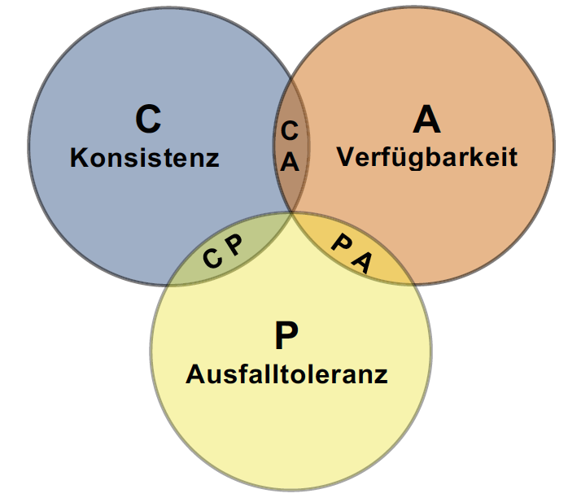
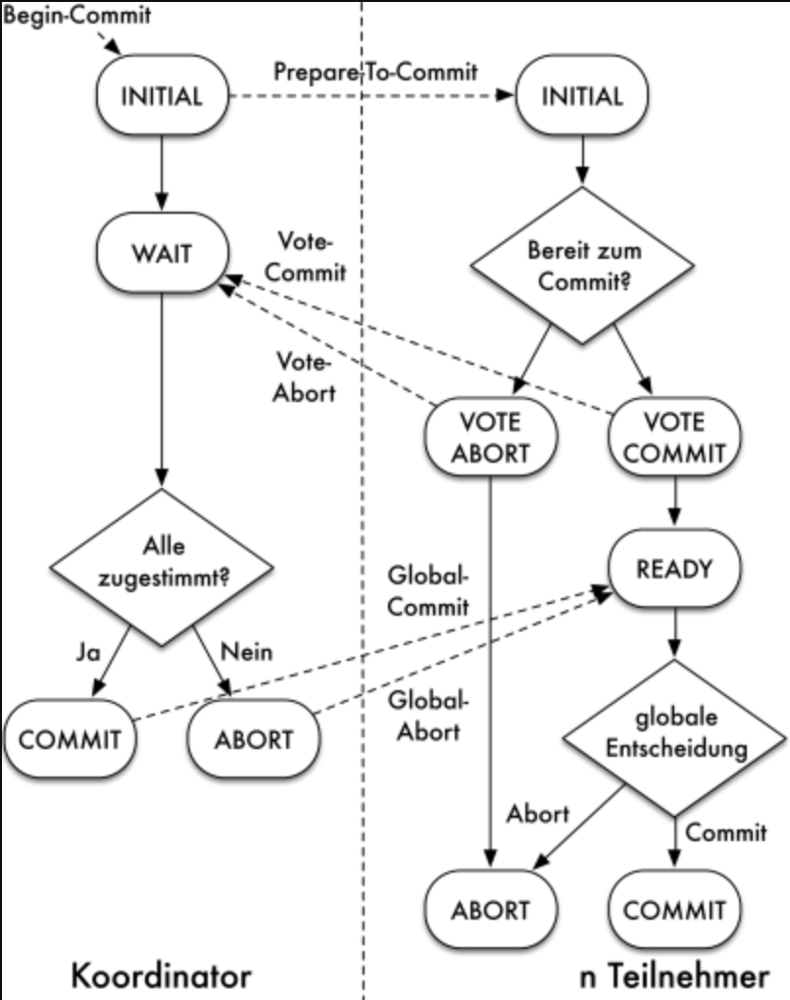

# Verteilte Datenbanken

Gemäß [1] wird man hauptsächlich mit zwei Fragen konfrontiert, wenn Daten auf mehrere Rechner verteilt werden oder in die Cloud gelegt werden sollen.

1.	 Worin liegt der Vorteil der getrennten Datenhaltung gegenüber der zentralen Speicherung?
2.	 Wie funktioniert die Verwaltung verteilter Datenbanken bzw. inwieweit muss der Datenbankbenutzer ein Umstieg auf verteilte Systeme umdenken? [1]

## Zwölf Regeln für verteilte Datenbank Systeme (DBS)

Die zwölf „Regeln“ für Verteilte DBS nach CJ Date [2] stellen die Anforderungen an verteilte Datenbanksysteme dar. Diese Regeln sind in Tabelle x zusammengefasst:

Nummer | Regel
------ | ------
1	| Lokale Autonomie
2	|Keine Abhängigkeiten von zentralen Systemfunktionen
3	|Hohe Verfügbarkeit
4	|Ortstransparenz
5	|Fragmentierungstransparenz
6	|Replikationstransparenz
7	|Verteilte Anfrageverarbeitung
8	|Verteilte Transaktionsverwaltung
9	|Hardware-Unabhängigkeit
10	|Betriebssystemunabhängigkeit
11	|Netzwerkunabhängigkeit
12	|Datenbanksystemunabhängigkeit

Nachfolgend sind diese Regeln genauer beschrieben.
1.	Lokale Autonomie
Jeder Rechner sollte ein Maximum an Kontrolle über die bei ihm gespeicherten Daten haben. Insbesondere sollte der Zugriff auf diese Daten nicht von anderen Rechnern abhängen.
2.	Keine Abhängigkeit von zentralen Systemfunktionen
Zur Unterstützung einer hohen Knotenautonomie und Verfügbarkeit sollte die Datenbankverarbeitung nicht von zentralen Systemfunktionen abhängen. Solche Komponenten stellen zudem einen potenziellen Leistungsengpass dar.
3.	Hohe Verfügbarkeit
Die Datenbankverarbeitung sollte trotz Fehlern im System (z.B. Rechnerausfall) oder Konfigurationsänderungen (Installation neuer Software oder Hardware) idealerweise nicht unterbrochen werden.
4.	Ortstransparenz
Die physische Lokation von Datenbankobjekten sollte für den Benutzer verborgen bleiben. Der Datenzugriff sollte wie auf lokale Objekte möglich sein.
5.	Fragmentierungstransparenz
Eine Relation der Datenbank sollte verteilt an mehreren Knoten gespeichert werden können. Die dabei zugrundeliegende Zerlegung (Fragmentierung) der Relation sollte für den Datenbankbenutzer transparent bleiben.
6.	Replikationstransparenz
Die replizierte Speicherung von Teilen der Datenbank sollte für den Benutzer unsichtbar bleiben; die Wartung der Redundanz obliegt ausschließlich der DB-Software.
7.	Verteilte Anfrageverarbeitung
Innerhalb einer DB-Operation sollte auf Daten mehrerer Rechner zugegriffen werden können. Zur effizienten Bearbeitung sind durch das Verteilte DBS geeignete Techniken bereitzustellen (Query-Optimierung).
8.	Verteilte Transaktionsverwaltung
Die Transaktionseigenschaften sind auch bei verteilter Bearbeitung einzuhalten, wozu entsprechende Recovery- und Synchronisationstechniken bereitzustellen sind (verteiltes Commit-Protokoll, Behandlung globaler Deadlocks, u.a.).
9.	Hardware-Unabhängigkeit
Die DB-Verarbeitung sollte auf verschiedenen Hardware-Plattformen möglich sein. Sämtliche Hardware-Eigenschaften sind für den DB-Benutzer zu verbergen.
10.	Betriebssystemunabhängigkeit
Die DB-Benutzung sollte unabhängig von den eingesetzten Betriebssystemen sein.
11.	Netzwerkunabhängigkeit
Die verwendeten Kommunikationsprotokolle und -netzwerke sollten ohne Einfluss auf die DB-Verarbeitung bleiben.
12.	Datenbanksystemunabhängigkeit
Es sollte möglich sein, unterschiedliche (heterogene) Datenbanksysteme an den verschiedenen Rechnern einzusetzen, solange sie eine einheitliche Benutzerschnittstelle (z.B. eine gemeinsame SQL-Version) anbieten.
Zusätzlich wird auch Leistungstransparenz gefordert. Die Kommunikationsverzögerungen sollen möglichst keine merkliche Verschlechterung der Bearbeitung verursachen. Eine Verbesserung durch die Parallelität der verteilten Bearbeitung wird erwartet. Wie [3] beschreibt, ist es nicht möglich alle zwölf Regeln gleichzeitig zu erfüllen. Manche Regeln widersprechen sich gegenseitig. Obwohl die „Regeln“ bereits 30 Jahre alt sind, werden Betriebssystemunabhängigkeit und Hardware-Unabhängigkeit nur teilweise umgesetzt. So wird Microsoft SQL-Server erst seit Ende 2017 auf Linux Betriebssystemen unterstützt. Offensichtlich entsprechen diese Regeln nicht den Wünschen der Hersteller. Andere Regeln (z.B. Nummer 9 und 11) werden inzwischen als selbstverständlich angesehen.
Schlussendlich müssen Kompromisse geschlossen werden, um das bestmögliche aus den Regeln zu verwenden. In dem nachfolgenden Abschnitt wird auf Verfügbarkeit, sicheren Transaktionsbetrieb und die Verteilung der Daten genauer eingegangen.

## CAP Theorem

Im Jahr 2000 stellte E. Brewer das CAP Theorem auf. Die Begriffe Consistency, Availability, Tolerance of Network Partitions bilden die Abkürzung CAP. Dieses Theorem besagt, dass Konsistenz (Consistency), Verfügbarkeit (Availability) und Ausfalltoleranz (Tolerance of Network Partitions) in verteilten Datenbanken nicht gleichzeitig erfüllt werden können. Wie bereits bei den zwölf Regeln nach CJ Date deutlich wurde, können nicht alle Regeln erfüllt werden. Das CAP Theorem sagt sogar aus, dass nur zwei von den drei genannten Eigenschaften (Consistency, Availablity, Tolerance of Network Partitions) vollständig realisiert werden können.

_Consistency_: Zur gleichen Zeit müssen alle mehrfach gehaltenen gültigen Daten übereinstimmen. Damit die Daten gleichzeitig aktualisiert werden können, wird Atomarität aus dem ACID-Modell benötigt. Die Konsistenz ist in einem Transaktionsbetrieb eine zwingende Vorrausetzung. In der achten Regel von CJ Date (siehe Kapitel Zwölf Regeln von Date) festgelegt. [1]

_Availability:_ Es können hier die Regeln von Date Nummer 3 und Nummer 7 verwendet werden. Ein Ausfall einzelner Rechner darf nicht zum Ausfall des gesamten Systems führen. Eine Anfrage an einen Rechnerknoten muss immer zu einem Ergebnis führen. Neben der Erreichbarkeit ist auch eine kurze Antwortzeit von Bedeutung. Verfügbarkeit ist im Transaktionsbetrieb besonders wichtig. [1]

_Tolerance of Network Partitions:_ Es können Daten in Netzen verloren gehen oder verspätet zugestellt werden. Laut [1] soll das Gesamtsystem tolerant mit diesen Problemen umgehen. Ein System sollte bei Konsistenzverletzungen nicht ausfallen oder komplett zurückgesetzt werden müssen.

Da nur zwei von drei genannten Eigenschaften vollständig realisiert werden können, sind in Abbildung die Schnittmengen der drei Eigenschaften dargestellt.

### CA-Systeme
Bei relationalen Datenbanksystemen findet häufig das CA-System Anwendung. Bei dem CA-System werden nur Konsistenz und Verfügbarkeit verwendet. Schon seit mehr als 20 Jahren wird zum Beispiel das Zwei-Phasen-Commit-Protokoll in verteilten Datenbanken mit großem Erfolg eingesetzt.[1] Auf PA und CP-Systeme wird in dieser Auswertung nicht weiter eingegangen, da sich ausschließlich mit Relationalen Datenbanken befasst wird. 

## Zwei-Phasen-Commit-Protokoll
Laut [1] ist es in hochverfügbaren verteilten Systemen schwer die zeitnahe Konsistenz zu garantieren. Seit vielen Jahren wird in relationalen Datenbanken das zwei-Phasen-Commit-Protokoll verwendet. Mit Hilfe von diesem Protokoll kann die Konsistenz eines Systems auch über mehrere Rechner hinweg sichergestellt werden. In einer relationalen Datenbank entspricht das Zwei-Phasen-Commit Protokoll einem CA-System (siehe Abschnitt CA-System). Es kann somit hohe Verfügbarkeit und zeitnahe Konsistenz garantiert werden. Häufig findet dieses Protokoll in betriebswirtschaftlichen Anwendungen sein Einsatzgebiet (Ein- und Verkauf, Produktion oder in Buchungs- und Abrechnungssystemen). XOpen/DTD ist als Standard für Zwei Phasen-Commit-Protokoll verwendet. Beim Zwei-Phasen-Commit Protokoll werden zwei Phasen ausgeführt. Die Wahlphase und die Entscheidungsphase. In der folgenden Abbildung ist das Commit Protokoll laut [4] grafisch dargestellt.

Wie in der Abbildung zu sehen, fragt der Koordinator in der Wahlphase, die Teilnehmer, ob diese ein Commit durchführen können. Als nächsten Schritt teilen die Teilnehmer dem Koordinator ihre Entscheidung mit. In der zweiten Phase, der Entscheidungsphase, entscheidet der Koordinator, indem er die erhaltenen Ergebnisse der Teilnehmer auswertet. Die Knoten (Teilnehmer), die mit „Ja“ geantwortet haben, warten auf eine Entscheidung. Wie [4] beschreibt, benötigt das Basisprotokoll pro weiteren Teilnehmer vier Nachrichten, die vom Koordinator verschickt werden, sodass eine über n Knoten verteilte globale Transaktion insgesamt im Erfolgsfall 4(𝑛−1) Nachrichten benötigt.

## Teilung von Datenmengen
Die ersten Ansätze zur Teilung der Datenmengen und Aufwände bringen horizontale (zeilenweise) und vertikale (spaltenweise) Verteilung. Während in der horizontalen Verteilung die Gesamtmenge über mehrere identisch strukturierte Tabellen nach gewissen Merkmalen (z.B. nach Anfangsbuchstaben der Nachnamen, Geburtsmonat, Geburtstag) verteilt wird, werden in vertikaler Verteilung die Daten segmentiert. So können Teile der zusammenhängenden Information ausgelagert werden. Seit Beginn der 1980er Jahre war es Thema mehrerer wissenschaftlichen Arbeiten über die verschiedenen Modelle zur Festlegung der Selektionsprädikate [3].

Beide Verteilungen weisen auch negative Eigenschaften auf. Die vertikale Verteilung erfordert weitere Aufteilung der Relationen, welche mit zusätzlichem Aufwand verbunden ist. Bei der horizontalen Verteilung werden die Ressourcen nicht gleichmäßig belegt. Damit ist ein einigermaßen gleichmäßiges Loadbalancing nur schwer möglich. Die Operationen auf die Gesamtmenge der Relation muss deswegen sorgsamer überdacht werden. Auch Kombination der Fragmentierungen, beide Verteilungen, ist möglich. Durch die integrierte Logik des verteilten DBMS kann die Aufteilung automatisiert werden und für die Abfragen vollständig transparent gehalten werden.

Die Datenbanksystemunabhängigkeit ist nur teilweise gegeben, da die Hersteller für die Abfragen öfter SQL-Dialekte verwenden.
Nach wie vor ist die Hauptursache der meisten Ausfälle im Datenbankumfeld die Hardware [5]. In der horizontalen Verteilung  wäre der Hardware-Ausfall noch möglicherweise nicht vollständig geschäftsschädigend, da nur eine Teilmenge betroffen wäre. In der vertikalen Verteilung wäre der Ausfall deutlich gravierender.

