# Vergleich der Systeme

Die aktuelle Marktsituation: Oracle (37% Marktanteil) und Microsoft (29% Marktanteil) dominieren das Angebot der RDMS [4]. Im Abschlussbericht der Verwendung der Datenbankmanagementsysteme (DBMS) in der deutschen Bundesverwaltung wurden 55% Anteile bei Oracle und 24% bei Microsoft identifiziert [5]. Im Weiteren werden die Lösungsansätze zur Hochverfügbarkeit und Skalierung der marktbeherrschenden DBMS von Oracle und Microsoft betrachtet. Die nachfolgende Betrachtung erfolgt gemäß den Regeln für CA-Systeme. Oracle und Microsoft wurden nach ihren Funktionalitäten für Verfügbarkeit und Konsistenz untersucht. Als erstes erfolgt die Analyse mit Oracle und dann die Analyse mit Microsoft SQL Server. Abschließend werden beide Anbieter mit ihren Funktionalitäten gegenübergestellt und verglichen.

## Oracle
„Auch Oracle-Datenbanken bieten Hochverfügbarkeit. Stand-by-Datenbanken sorgen für Ausfallsicherheit auch über mehrere Rechenzentren und große Distanzen. Mit Oracle Real Application Clusters (RAC) lassen sich nicht nur äußerst geringe Ausfallzeiten erreichen, die Technik adressiert auch das Thema Skalierung. Auf RAC und ASM (Automatic Storage Management) aufbauend brachte Oracle eine eigene Appliance heraus: Oracle Exadata. Das Flaggschiff ist horizontal skalierbar und basiert auf intelligenten Storage-Servern, High-Performance InfiniBand-Fabrics und Flash-Technologie.“ [6] Hier ist nur kurz anzumerken, dass auch beliebte MySQL-Datenbank im Rahmen des Zukaufs von Sun Microsystems seit dem Jahr 2010 der Firma Oracle gehört. Diese Datenbanklösung wird jedoch hier nicht untersucht.

Im Oracle Sprachgebrauch wird Datenbank als verwendete Dateien, welche die Information persistent speichern, und Instanz als eine Umgebung durch Prozesse und Speicher, welche Zugriff auf die Informationen ermöglichen, verwendet. Die Dateien in einem Produktivsystem werden in der Regel mit Hardwareredundanz im RAID (Redundant Array of Independent Disks) organisiert. Öfter werden die Speicher zentral als SAN (Storage Area Network) und NAS (Network Attached Storage) organisiert. Die Version 21c ist ein Innovations-Release, welches den Kunden die Möglichkeit bietet, mit neuen und verbesserten Funktionen für Workload-Anwendungsfällen und Anwendungen schneller von Innovationen zu profitieren. Die Version löst die vorherige Innovationsversion 20c ab.

Dagegen ist die Version 19c die aktuelle Long Term Release, die bis zum März 2026 unterstützt wird. Die Version 22c wird die nachfolgende Long Term Version werden. Oracle hat die Versionierung mit der Version 2 im Jahr 1979 begonnen und bis 12 nummeriert. Ab Version 8(i) wurden je zwei Releases rausgegeben. Die Version 12c war die letzte mit zwei Releases [7] . Die Buchstaben hinter der Nummer stehen für i wie Internet, g/G wie Grid Computing [8] und c für Cloud. Ab 2018 werden die Versionen nach Jahren (18c – 22c) nummeriert.

### Data Guard
„Oracle Data Guard ist die effektivste Lösung, die heute verfügbar ist, um das Kernstück eines jeden Unternehmens – seine Daten – zu schützen und sie rund um die Uhr verfügbar zu machen, selbst im Falle von Katastrophen und anderen Unglücken.“ [9]

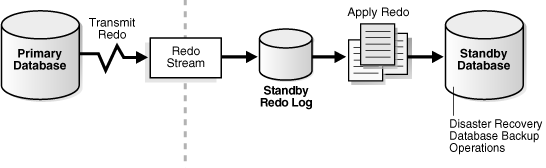
<em> Abbildung 3 - Typische Oracle Data Guard-Konfiguration [9] </em>

Als eine Primärdatenbank wird die produktive Datenbank definiert, welche die meisten Applikationen direkt bedient. In der Regel ist es auch eine Urdatenbank, bevor die Betreiber unter anderem über die Notwendigkeit der Ausfallszenarien nachdenken. Standby-Datenbank ist eine transaktionskonsistente Kopie der Primärdatenbank [10] . Seit der Version 9 funktionierte die Technologie auch umfangreich in der Praxis. Ab Version 10 kam eine signifikante Erweiterung, das Fast-Start-Failover. Damit war die Möglichkeit, ein automatisches (kein Eingreifen des DB-Administrators) und schnelles Failover im Problemfall zu definieren, gegeben. Sehr viele weitere nützliche neue Features erweitern die Möglichkeiten der Standby-Datenbank. Exemplarisch können folgende Änderungen benannt werden. Ab der Version 18 können globale temporäre Tabellen in Active-Data-Guard Konfiguration erzeugt werden (s. Abb. 4). In der Version 19 kam die Replikation von Restore Point von Primärdatenbank zur Standby-Datenbank. In einer Active-Data-Guard Konfiguration (s. Abb. 4) können DML-Operationen auf Standby-Datenbank erfolgen [10]. Damit entspricht es einem Activ-Activ-System.

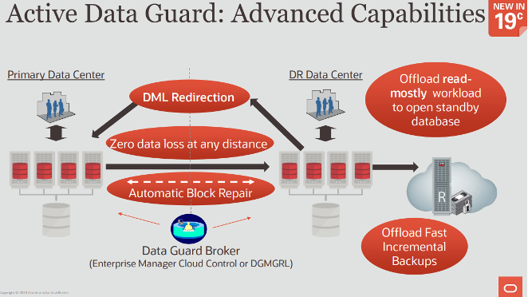
<em> Abbildung 4 - Oracle Active Data Guard [11] </em>

In der Version 21 können bis zu 30 Standby-Datenbanken einer Primärdatenbank definiert werden [9]. Grundsätzlich unterscheidet Oracle 3 Typen der Standby-Datenbanken [9]:
1.	Physische Standby-Datenbank
Diese Datenbank stellt eine physisch-identische Kopie der Primärdatenbank mit Datenbankstrukturen auf der Festplatte, die Block für Block identisch mit der Primärdatenbank sind, bereit. Das Datenbankschema, einschließlich der Indizes, ist identisch. Eine physische Standby-Datenbank wird über Redo Apply mit der Primärdatenbank synchronisiert, dass die von der Primärdatenbank empfangenen Redo-Daten wiederherstellt und die Wiederholung auf die physische Standby-Datenbank anwendet (s. Abb. 5). Ab Oracle Database 11g Release 1 (11.1) kann eine physische Standby-Datenbank Redo-Daten empfangen und anwenden, während sie für schreibgeschützten Zugriff geöffnet ist. Eine physische Standby-Datenbank kann daher gleichzeitig für Datenschutz und Reporting genutzt werden.

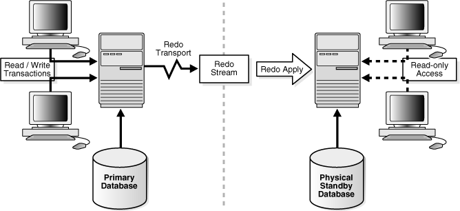
<em> Abbildung 5 - Physische Standby-Datenbank </em>

2.	Logische Standby-Datenbank
Diese Datenbank enthält dieselben logischen Informationen wie die Produktionsdatenbank, obwohl die physische Organisation und Struktur der Daten unterschiedlich sein kann. Die logische Standby-Datenbank wird über SQL Apply mit der Primärdatenbank synchronisiert, dass die Daten im von der Primärdatenbank empfangenen Redo- Daten in SQL-Anweisungen umwandelt und dann die SQL-Anweisungen in der Standby-Datenbank ausführt (s. Abb. 6).

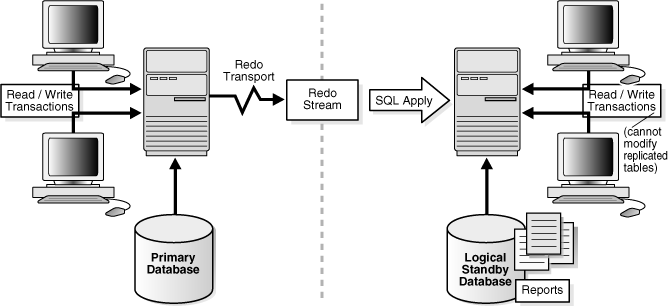
<em> Abbildung 6 - Logische Standby-Datenbank </em>

3.	Snapshot-Standby-Datenbank
Eine Snapshot-Standby-Datenbank ist eine vollständig aktualisierbare Standby-Datenbank. Ähnlich einer physischen oder logischen Standby-Datenbank empfängt und archiviert eine Snapshot-Standby-Datenbank Redo-Daten von einer Primärdatenbank. Im Gegensatz zu einer physischen oder logischen Standby-Datenbank wendet eine Snapshot-Bereitschaftsdatenbank die empfangenen Redo-Daten nicht an. Diese Variante kann für diverse Testszenarien verwendet werden.

Oracle Data Guard bietet drei verschiedene Datenschutzmodi. In manchen Situationen kann es sich ein Unternehmen nicht leisten, Daten zu verlieren, ungeachtet der Umstände. In anderen Situationen kann die Verfügbarkeit der Datenbank im unwahrscheinlichen Fall eines Mehrfachausfalls wichtiger sein als ein potenzieller Datenverlust. Schließlich erfordern einige Anwendungen zu jeder Zeit maximale Datenbankleistung und können daher einen geringen Datenverlust tolerieren, wenn eine Komponente ausfällt.

•	Maximum Availability – dieser Schutzmodus gewährleistet keinen Datenverlust, außer bei bestimmten Doppelfehlern, wie beispielsweise dem Ausfall einer Primärdatenbank nach dem Ausfall der Standby-Datenbank.
•	Maximum Performance (Standarteinstellung) – dieser Schutzmodus bietet etwas weniger Datenschutz als der Modus mit maximaler Verfügbarkeit und hat nur minimale Auswirkungen auf die Leistung der primären Datenbank.
•	Maximum Protection – dieser Schutzmodus stellt sicher, dass bei einem Ausfall der Primärdatenbank kein Datenverlust auftritt.

Das Client-Failover umfasst die Fehlerbenachrichtigung, die Bereinigung veralteter Verbindungen und die transparente Wiederverbindung mit der neuen primären Datenbank. Die Möglichkeiten des Data Guards in Verbindung mit dem Client-Failover erlauben die HA-Szenarien sowohl für Datenbank-Server als auch für die verbundenen Clients und Applikationen.

### Real Applikation Cluster (RAC)

RAC adressiert seit der Version 9i im Jahr 2001 zwei Themen: Hochverfügbarkeit und Skalierbarkeit.
Nur auf einem Server laufende Instanz, stellt die SPOF (Single Point of Failure) dar (s. Abb. 7).

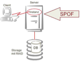
<em> Abbildung 7 - SPOF, auf einem Server laufende Instanz [12]. </em>

RAC bietet, zwei oder mehr Instanzen auf unabhängigen Servern zu der gemeinsamen Datenbank-Speicherinfrastruktur zu verbinden, an. Ab Version 11 kann eine RAC-Installation bis zu 100 Knoten beinhalten. Der Clientseitige Zugriff erfolgt über SCAN (Single Client Access Name) (s. Abb. 8).

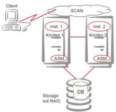
<em> Abbildung 8 - klassischer RAC-Aufbau [12] </em>

In der Version 9i erfolgte die Zuteilung der IP-Adressen der Server noch durch Round-Robin-Verfahren. Damit wird für den Client eine Transparenz der Verbindung bereitgestellt. Die Clients verteilen sich über mehrere Knoten, wobei kein echtes Austarieren noch stattfindet.
Verschiedene Clients verbinden sich über SCAN sales.us.example.com (s. Abb. 8) über zwei verschiedene Knoten sales1 und sales2 zur selben Datenbank [13].

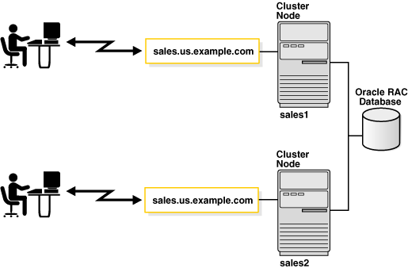
<em> Abbildung 9 - Verbindung zum Oracle-RAC [13] </em>

In den folgenden Versionen fand noch die Verfeinerung des Verfahrens. Oracle CRS (Cluster Ready Services) haben ab Version 10g R2 die Start/Stopp-Funktionalität und damit die Verwaltung des Clusters übernommen. In nächster Version wurden die Dienste zu Oracle Clusterware umbenannt und erweitert [14] .
Bereits in der Version 11g Release 2 wurde SCAN-Funktionalität erheblich erweitert. Die dynamische Listener-Registrierung der Knoten am SCAN-Listener ermöglichte dynamische Anpassung an die Verfügbarkeit der Knoten. „Die SCAN-Listener dienen als eine Art Load-Balancer und leiten die Client-Anfragen auf den lokalen Listener der am wenigsten ausgelasteten Maschine weiter.“ [15] Mit der selben Version wurde auch GNS (Grid Naming Service) eingeführt. Der DNS-Dienst leitet die Anfragen an die GNS IP-Adresse weiter. Jedes Cluster wird als eigene Sub-Domain geführt, so dass GNS die Verteilung der Clients übernimmt.
Die Weiterentwicklungen für RAC (s. Abb. 10):

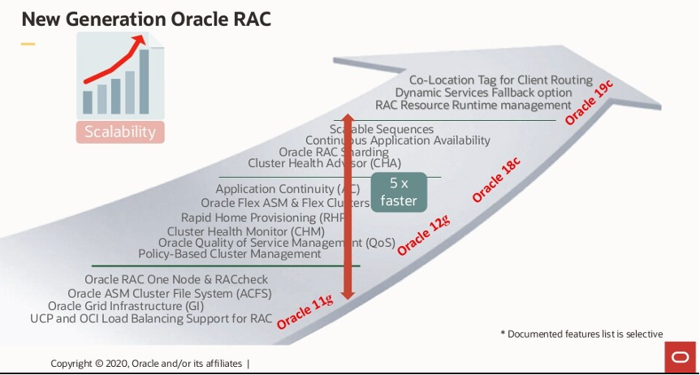
<em> Abbildung 10 - VNext Generation Oracle RAC, Anil Nair, Oracle 2020 </em>

Die Smart Fusion Block Transfer Optimierung wurde in der Version 12c implementiert. Kurzer Überblick darüber ist im weiteren Verlauf vorhanden. In der Version 18c wurden Transparent Applikation Continuity für RAC-Datenbanken, Sharding und Scalable Sequenzen implementiert [10]. In der Version 19c folgeten Co-Location-Tag für das Clientrouting, Option für dynamisches Service Fallback und Erweiterungen im Rosource Manager [10]. In Oracle 21c wurde die RDMA-Unterstützung (Remote Direct Memory Access) für Cache Fusion um die Unterstützung von Lesen von Datenblöcken, Space-Blöcken und Undo-Header-Blöcken erweitert. Ähnlich wie bei der Undo-Block RDMA-Leseoptimierung in 18c ist in der Version 21c führt Undo-Block zu einem schnelleren Lesen von Daten, die in entfernten Instanzen zwischengespeichert sind, und zu einer weiteren Reduzierung der CPU-Last, da LMS (Global Cache Service Process) nicht aufgerufen wird wenn Daten über RDMA gelesen werden [16]. Die Skalierung im RAC wird also durch mehrere Knoten (Cluster Node) erreicht. Die Hochverfügbarkeit wird dadurch nur teilweise erreicht. Im Unterkapitel Hochverfügbarkeit mit RAC wird die Thematik bei weiteren Ausfällen beleuchtet. Ein oder mehrere Knoten können ausfallen (s. Abb. 11), die Anwendung kann aber auf andere Server zugreifen. Bereits ab Version 10 können die Verbindungen mittels TAF (Transparent Application Failover) und FCF (Fast Connection Failover) inaktive Verbindungen auf funktionierende Knoten umleiten. TAF bietet die Möglichkeit, beim Ausfall des korrespondierenden Knoten, während einer SELECT-Abfrage, die Abfrage an letzter Cursor-Position fortzusetzten. FCF ist proaktiv. Beim Ausfall einer Instanz, wird aktiv ein Event an den Client versendet. Da die Fa. Oracle die Fa. WebLogic übernommen hat, ist die FCF bei konfigurierten GridLink-Verbindungen intelligenter. Es wird eine Verbindung zu weniger ausgelasteter Instanz aufgenommen. Diese Methode wird WebLogic Active GridLink genannt.

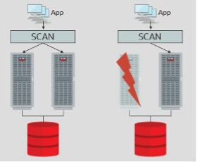
<em> Abbildung 11 - Datenbank-Hochverfügbarkeit mit 2-Knoten-RAC [17] </em>

Mitten in einer Transaktion mit DML-Operatoren (INSERT, UPDATE und DELETE) ist beim Ausfall möglicherweise keine Information, ob der COMMIT erfolgreich war, vorhanden. Um die Problematik zu schlissen, stellt Oracle ab Version 12 die TG-Funktionalität (Transaction Guard) bereit (s. Abb. 12). Der Status der letzten Transaktion ist in der Datenbank gespeichert. Nach der Wiederherstellung der Verbindung, fragt die Anwendung den Zustand der letzten Transaktion anhand einer LTXID (Logical Transaction ID) ab. Nur im Fehlerfall muss die Anwendung die Transaktion wiederholen [17].

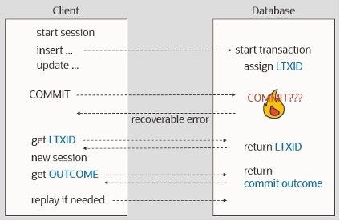
<em> Abbildung 12 - Schematische Darstellung von Transaction Guard [17] </em>

Transaction Guard (s. Abb. 12) erfordert eine zusätzliche Programmierung in der Anwendung, um die letzte Transaktions-ID und deren Status abzufragen und darauf zu reagieren.
Application Continuity verwendet automatisch im Hintergrund TG-Funktionalität, um sicherzustellen, dass eine Transaktion genau einmal ausgeführt wird, um logische Datenkorruption in der Datenbank zu vermeiden. Wird eine Transaktion nach einem Ausfall wieder ausgeführt (Replay), erscheint es für die Anwendung wie eine kurze Verzögerung, ohne eine Fehlermeldung zu geben.
Funktionen, welche im Wiederholungsfall neue Werte, wie z.B. SYSDATE oder NEXTVAL bei Sequenzen, erzeugen, liefern bei einem Replay den Wert des ersten Aufrufs wieder.
Der Einsatz von Connection-Pools ist für Application Continuity jedoch erforderlich. Transparent Application Continuity (ab 18c) funktioniert auch ohne Connection-Pools, auch wenn diese weiterhin empfohlen sind. Application Continuity wird in jeder neuen Datanbankversion weiterentwickelt – auch in der neuen Version 21c [17].

### Hochverfügbarkeit mit RAC
Wie bereits erläutert, können einige SPOF bereits durch RAC-Konfiguration minimiert werden. Doch was passiert, wenn die Stromversorgung am Serverstandort wegfällt? Die Netzanbindung zu den Clients aus Rechenzentrum kann u.a. dadurch nicht mehr erfolgen. Auch ein möglicher Brand kann zum Ausfall führen. In einigen Dokumenten wird auf verschiedene Brandabschnitte hingewiesen, welche ggf. im Brandfall weiterlaufen können. Leider sind die Brandabschnitte in der Praxis doch nicht so weit räumlich voneinander getrennt, so dass im Brandfall auch dort die Stromversorgung aus Sicherheitsgründen ausgeschaltet wird. Auch eine Wartung an den Strom/USV-Anlagen kann zur vollständigen Stromabschaltung führen.
Für diese Fälle hat Oracle MAA (Maximum Availability Architecture) definiert (s. Abb. 13). Die vorher beschriebene Funktionalität des Oracle Data Guard in Verbindung mit einen und mehreren weiteren Standorten bilden die MAA.

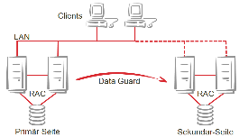
<em> Abbildung 13 - Oracle MAA (Maximum Availability Architecture) [12] </em>

Active Data Guard Far Sync (s. Abb. 14) schützt eine Produktionsdatenbank vor Datenverlusten, indem es eine synchronisierte Standby-Datenbank in beliebiger Entfernung vom primären Standort unterhält, ohne die Datenbankleistung zu beeinträchtigen. Die Kosten und Komplexität sind dabei minimal. Eine Far-Sync-Instanz (bereits ab Version12) empfängt Änderungen synchron von einer primären Datenbank und leitet sie asynchron an eine entfernte Standby-Datenbank weiter, so dass die Umschaltung so schnell wie nötig erfolgen kann. Die Umschaltung an die entfernte Standby-Datenbank kann manuell oder automatisch ohne Datenverlust erfolgen.

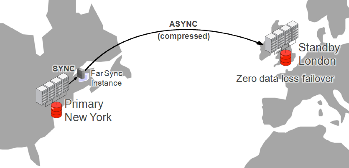
<em> Abbildung 14 - Active Data Guard Far Sync: kein Datenverlust bei beliebiger Entfernung [17]  </em>

Oracle Maximum Availability Architecture (MAA) ist eine Reihe von Best Practices für die integrierte Verwendung von Oracle High Availability (HA) Technologien, die sowohl die Nutzung von Oracle Exadata inkl. der Nutzung von Data Guard und RAC-Technologien vorsieht (s. Abb. 15). Auch eine Skalierung ist möglich [18].

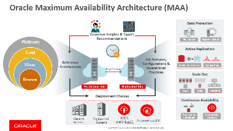
<em> Abbildung 15 - Umfangreiche Oracle MAA (Maximum Availability Architecture) [18]  </em>

### Exadata
Oracle hat seit Oktober 2008 eine eigne On-Premise-Lösung für Unternehmen mit kombinierter Hard- und Software im Angebot. Die Konfiguration war in der Version X2 und X3 starr, momentan kann in der Version X9M-2 bis zu 22 Datenbankservern, bis zu 19 Storage Server oder Kombinationen davon erworben werden [19]. Neben der Basis Konfiguration mit 2 Datenbankservern und 3 Storage Servern und netto Festplattenkapazität von 648 TB bestehen die Möglichkeiten der Erweiterung mit weiteren Servern und Speicher (RAM & ePCI). Mit der entsprechenden Softwarelizensierung ermöglicht Exadata Database Machine (s. Abb. 16) alle Arten von Datenbank-Workloads, einschließlich Online Transaction Processing (OLTP), Data Warehousing und eine Konsolidierung gemischter Workloads. Exadata Database Machine betreibt und schützt die wichtigsten Datenbanken und ist die ideale Grundlage für eine konsolidierte Datenbank-Cloud [19]. Diese Lösung sorgt für sehr gute Abstimmung der Hardware, welche nur mit sehr viel Zeit und Wissen zusammengestellt werden kann. Auch die Effekte der möglichen Inkompatibilität zwischen den einzelnen Herstellern kann damit ausgeschlossen werden.

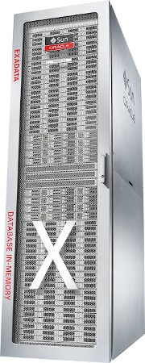
<em> Abbildung 16 - Oracle-Exadata Database Machine X9M-2 [20]   </em>

[weiter](03_SQL.md)

