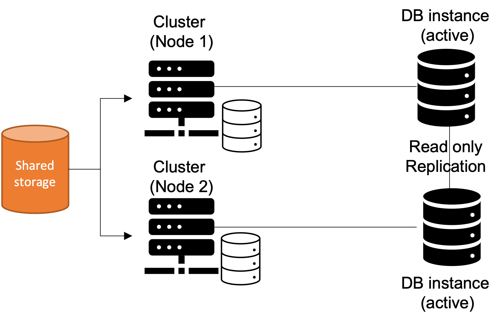
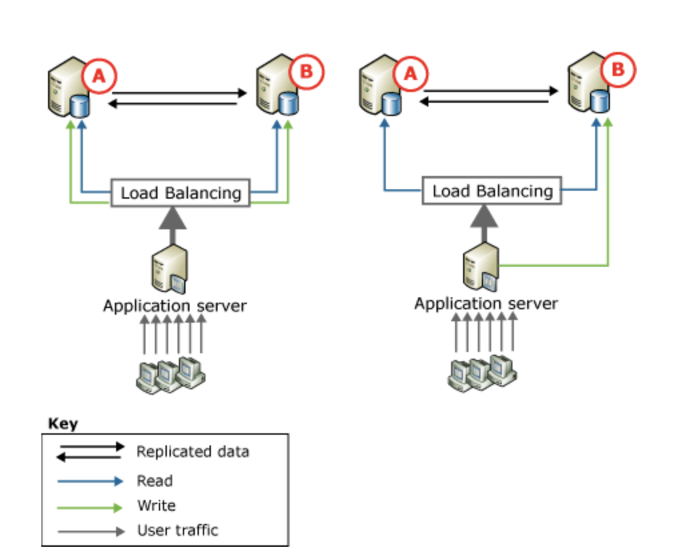

# Microsoft SQL-Server

Microsoft SQL-Server erschien 1989. Microsoft arbeitet mit der Sybase zusammen und entwickelte den SQL-Server für relationale Datenbanken. Mit dem Release von SQL-Server 7.0 im Jahr 1999 löst sich Microsoft von der ursprünglichen Codebasis aus der Kooperation mit Sybase. Mit der SQL-Server Version 2017 wurden auch Linux Betriebssysteme unterstützt. Die derzeit aktuelle Version ist der SQL-Server 2019. In Kürze soll die Version SQL-Server 2022 erscheinen. SQL Server wird kommerziell eingesetzt und verfügt, wie viele Microsoft Produkte, über ein eigenes Lizenzierungsmodell. In Bezug auf verteilte Datenbanken bietet SQL-Server folgende Möglichkeiten:

•	(Hoch-)Verfügbarkeit mit Cluster
•	Active-Passive Cluster
•	AlwaysOn
•	AlwaysOn-AvailabilityGroups
•	Replication [6]

In den nachfolgenden Abschnitten wird auf die einzelnen Möglichkeiten detaillierter eingegangen.

## (Hoch-) Verfügbarkeit mit Cluster
Laut [21] wird unter einem SQL-Cluster eine Sammlung von zwei oder mehr physikalischen Servern, den sogenannten Nodes (engl. Knoten), verstanden. Diese Nodes sind per LAN miteinander verbunden, hosten eine SQL-Server Instanz und haben den gleichen Zugriff auf einen gemeinsamen Speicher. Das Clustern von SQL-Servern bietet hohe Verfügbarkeit. Im Falle eines Ausfalls (zum Beispiel der Server Hardware) von einem Node bzw. SQL-Server übernimmt ein anderer SQL-Server die Aufgaben. Man unterscheidet bei Microsoft zwischen zwei verschiedenen Cluster Konfiguration. Man kann zwischen Active/Active oder Active/Passive Clustern wählen.

### Active/Active
Die schematische Darstellung der Active/Active Cluster Konfiguration ist in der Abbildung dargestellt.

<em> Abbildung 17 - Active/Active Cluster </em>

Aus der Abbildung 17 geht hervor, dass unter der Active/Active Cluster Konfiguration verstanden wird, dass SQL-Server auf beiden Nodes des Zwei-Wege Clusters laufen. Jede Kopie des SQL-Servers arbeitet unabhängig und der Benutzer sieht zwei verschiedene SQL-Server. Sobald ein Server im Cluster-Verband ausfällt, übernimmt ein anderer Server die Aufgaben des ausgefallenen Servers. Somit findet jedoch keine Lastverteilung statt. In einem Active/Active Cluster muss der Server ausreichend dimensioniert sein. Bei nicht ausreichender Dimensionierung kann es bei einem Server Ausfall zu Performance Einbußen kommen.

### Active/Passive
Die Active/Passive Cluster Konfiguration ist in der Abbildung 18 schematisch dargestellt.

<em> Abbildung 18 - Active/Passive Cluster </em>

Unter einer Active/Passiv Konfiguration wird ein SQL-Server Clusterverbund bezeichnet, indem nur eine SQL-Server Instanz auf einem der physikalischen Server innerhalb des Clusters verwendet wird. Der andere SQL-Server (Cluster, Node 2) dient als reiner Backup-Server und wartet darauf, die Aufgaben des primären Knotens, im Fall eines Ausfalls, übernehmen zu können. Da bei dieser Konfigurationsvariante ein Server als Backup fundiert, ist die Performance gut jedoch ist diese Lösung kostspieliger.

Abschließend lässt sich sagen, dass sich SQL-Server Clustering nur für die Hochverfügbarkeit und somit Ausfallsicherheit verwenden lässt. Für Load Balancing ist Clustering nicht geeignet. Hierzu sollte man die verschiedenen Replikationstypen in Betracht ziehen.

### Fail-Over Cluster
Laut [22] handelt es sich beim Windows Server-Failovercluster (WSFC) eine Gruppe unabhängiger Server, die zur Steigerung der Verfügbarkeit von Anwendungen und Diensten zusammenarbeiten. Der SQL Server nutzt WSFC-Dienste und WSFC-Funktionen, um Always On-Verfügbarkeitsgruppen und SQL Server Failoverclusterinstanzen zu unterstützen. In der Abbildung ist die Gesamt-Schematik von dem Windows Server Failover Cluster dargestellt.

<em> Abbildung 19 - Failover Cluster [22] </em>

Wie in der Abbildung dargestellt, muss für eine erfolgreiche SQL-Server AlwaysOn Lösung ein Verständnis und eine Zusammenarbeit von unterschiedlichen Ebenen stattfinden. Laut [23] sind die folgenden Ebenen (engl. Level) nötig:

•	Infrastructure level: Windows Server Failover Clustering (WSFC) bietet Eigenschaften zum health monitoring und zur Failover Koordination
•	SQL-Server instance level: eine SQL Server AlwaysOn Failover Cluster Instance (FCI) ist eine SQL Server-Instanz, die über Serverknoten in einem WSFC-Cluster hinweg installiert ist. Sie kann dort ein Failover durchführen. Die Knoten, die die FCI hosten, sind an einen robusten symmetrischen gemeinsamen Speicher (SAN oder SMB) angeschlossen.
•	Database level: Eine Verfügbarkeitsgruppe (siehe Abschnitt Alway-On Availablilty groups) besteht aus einem primären Replikat und einem bis vier sekundären Replikaten. Jedes Replikat wird von einer Instanz von SQL Server (FCI oder nicht-FCI) auf einem anderen Knoten des WSFC-Clusters gehostet.
•	Client connectivity: Datenbank-Client-Anwendungen können sich direkt mit dem Netzwerknamen einer SQL Server-Instanz oder mit einem virtuellen Netzwerknamen (VNN) verbinden, der über einen availability group listener gebunden ist. Der VNN wird dann Verbindungsanfragen direkt an die SQL-Server Instanz und das Datenbank Replikat weiterleiten.

## Always On
SQL Server Always On ist eine Lösung für Hochverfügbarkeit und Notfallwiederherstellung. Always On-Komponenten stellen eine integrierte, flexible Lösung bereit. Diese Lösung erhöht die Anwendungsverfügbarkeit und vereinfacht die Verwaltung von der Hochverfügbarkeit.

## Always On-Availablilty Groups
Mit SQL-Server 2012 wurden Always On Availability Groups (engl. Verfügbarkeitsgruppen) eingeführt. Hierbei handelt es sich um eine Lösung für hohe Verfügbarkeit und Notfallwiederherstellung, als alternative zur Datenbankspieglung. Laut [24] unterstützt eine Verfügbarkeitsgruppe eine Failoverumgebung (siehe Cluster) für einen diskreten Satz von Benutzerdatenbanken, sogenannte Verfügbarkeitsdatenbanken), die zusammen ein Failover ausführen. Hierbei unterstützt diese Gruppe einen Satz primärer Datenbanken mit Lese-Schreibzugriff. Eine Verfügbarkeitsgruppe führt auf der Ebene eines Verfügbarkeitsreplikats (siehe Kapitel Replication) ein Failover aus. Ein Failover wird nicht durch Datenbankprobleme verursacht.

## Replication
Laut [5] handelt es sich bei der Replikation um eine Reihe von Technologien zum Kopieren und Verteilen von Daten und Datenbankobjekten aus einer Datenbank in eine andere. Anschließend findet eine Synchronisation zwischen den Datenbanken statt, um die Konsistenz der Daten sicherzustellen. SQL-Server bietet sechs Replikationstypen (Transaktionsreplikation, Merge Replikation, Momentaufnahmen Replikation, Peer-zu-Peer, Bidirektional und aktualisierbare Abonnements) an. Mit der Replication wird somit die zweite Regel für CA-Systeme „Konsistenz“ beachtet. In der nachfolgenden Abbildung ist das Replikationsveröffentlichungsmodell nach Microsoft dargestellt.

<em> Abbildung 19 - Replikationsveröffentlichungsmodell [25]  </em>

Unter deinem Article versteht man ein Objekt, welches repliziert werden kann. Ein Article kann eine Datenbanktabelle, ein View, eine Store Procedure oder eine benutzerdefinierte Funktionen sein. Wie in der Abbildung dargestellt, versteht man unter einer Publikation eine Sammlung verschiedener Artikel, die bei dem Publisher existieren. Unter einem Publisher versteht man die SQL-Server Instanz, die Publikationen mit diversen Articles enthält, die an die sogenannten Subscriber verteilt werden sollen. Ein Subscriber erhält von einem oder mehreren Publishern Article. Eine zentrale Verteilstelle nimmt dabei der Replication Agents ein. Der sogenannte Distributor sammelt alle neuen Article von den Publishern und verteilt diese an die Subscriber.

### Replikationstypen
In dem folgenden Abschnitt werden die verschiedenen Replikationstypen genauer beschrieben. Wie erwähnt bietet SQL-Server sechs verschiedene Replikationstypen zur Auswahl an. 
1.	Transaktionsreplikation: Änderungen auf dem Publisher werden an Subscriber übermittelt, sobald sie auftreten. Datenänderungen werden somit direkt in derselben Reihenfolge und mit denselben Transaktionsgrenzen angewendet, wie bei dem Publisher. [8]
2.	Merge Replikation: Auf beiden Seiten (Publisher und Subscriber) können Daten geändert werden. Die Änderungen werden mit Hilfe von Triggern nachverfolgt. Sobald eine Verbindung mit dem Netzwerk vorhanden ist, nimmt der Subscriber eine Synchronisation mit dem Publisher aus und tauscht alle Zeilen aus, die sich seit der letzten Synchronisierung sowohl beim Publisher als auch beim Subscriber geändert haben. 
3.	Momentaufnahmen Replikation: Zu einem bestimmten Zeitpunkt wird eine Momentaufnahme vom Publisher auf die Subscriber verteilt. Bei dieser Synchronisierung wird die gesamte Momentaufnahme an die Subscriber gesendet, ohne die Aktualisierung der Daten zu überwachen.
4.	Peer-zu-Peer: Aufbauend auf der Transaktionsreplikation werden transaktionskonsistente Änderungen zwischen mehreren Serverinstanzen weitergegeben. 
5.	Bidirektional: Zwei Server können Änderungen austauschen. Jeder Server veröffentlicht seine Daten und abonniert dann eine Veröffentlichung mit dem gleichen Daten eines anderen Servers. Bei der bidirektionale Transaktionsreplikation handelt es sich um eine spezielle Transaktionsreplikationstopologie. [25]
6.	aktualisierbare Abonnements: Sobald Daten auf einem Subscriber für ein aktualisierbares Abonnement aktualisiert werden, werden diese Daten zuerst an den Publisher weitergegeben und erst dann an andere Subscriber. [25]

Nachfolgend werden zwei von diesen Typen in ihrer Funktion genauer betrachtet. Zum einen die Transaktionsreplikation und darauf aufbauend die Peer-zu-Peer Replikation, die laut Microsoft auch zum Load Balancing eingesetzt werden können. Zunächst wird die Funktion der Transaktionsreplikation genauer betrachtet. In der nachfolgenden Abbildung sind die wichtigsten Komponenten der Transaktionsreplikation dargestellt.

<em> Abbildung 20- Komponenten der Transaktionsreplikation [25] </em>

Die Implementierung wird von drei Agenten (Momentaufnahme-Agent, Protokolllese-Agent und Verteilungs-Agent) des SQL-Servers durchgeführt. Der Momentaufnahme-Agent bereitet eine Momentaufnahme vor. Diese beinhaltet das Schema und die Daten der veröffentlichten Tabellen und Datenbankobjekten. Der Agent speichert die Dateien im Momentaufnahmeordner und zeichnet Synchronisierungsaufträge in der Verteilungsdatenbank auf dem Verteiler auf. [25] Wie in der Abbildung dargestellt, überwacht der Protokolllese-Agent das Transaktionsprotokoll jeder für die Transaktionsreplikation konfigurierten Datenbank.

Der Agent kopiert hierzu die für die Replikation markierten Transaktionen aus dem Transaktionsprotokoll in die Verteilungsdatenbank.Die Verteilungsdatenbank fungiert somit als zuverlässige Warteschlange zum Speichern und Weiterleiten. Der Verteilungs-Agent kopiert die Anfangsmomentaufnahmedateien aus dem Momentaufnahmeordner und die in den Tabellen der Verteilungsdatenbank gespeicherten Transaktionen auf Abonnenten.[25] Die beim Publisher vorgenommenen inkrementellen Änderungen laufen nach dem Zeitplan des Verteilungs-Agenten ab. Dieser kann fortlaufenden oder in geplanten Intervallen ausgeführt werden. Da Datenänderungen nur auf dem Publisher vorgenommen werden, werden Updatekonflikte somit vermieden. Alle Subscriber erhalten somit dieselben Werte wie der Publisher. Microsoft [25] weist darauf hin, dass bei einem Verzögerten Update über eine Warteschlange Konflikte auftreten können.

Als zweiten Typ wird die Peer-zu-Peer Replikation genauer betrachtet. Laut [26] bietet die Peer-zu-Peer Replikation eine skalierbare Lösung mit hoher Verfügbarkeit. Kopien der Daten werden auf mehreren Serverinstanzen (Nodes) verwaltet. Peer-zu-Peer-Replikation bietet Datenredundanz, die die Verfügbarkeit der Daten erhöhen. In der nachfolgenden Abbildung 21 ist die Peer-zu-Peer Topologie mit zwei teilnehmenden Datenbanken dargestellt.

<em> Abbildung 21 - Peer-zu-Peer Topologie [26]</em>

## Fazit
Wie in Kapitel CA-Systeme beschrieben, sind Hochverfügbarkeit und Konsistenz die beiden Hauptmerkmale für diese Art der verteilten Datenbanken. Microsoft SQL Server bietet eine Vielzahl von Lösungen um Hochverfügbarkeit von Datenbanken zu gewährleisten. Hierbei liegt das Hauptaugenmerk auf der Hochverfügbarkeit und Ausfallsicherheit von SQL-Server Instanzen in verschiedenen Modi. Im Zusammenspiel mit weiteren Microsoft Produkten (wie dem Microsoft Server) wird der Einsatz von SQL-Server effektiv. In Bezug auf verteilte Datenbanken bietet der Microsoft Replikationsmodelle unter anderem mit verteilten Transaktionen an.

[weiter](04_Zusammenfassung.md)

