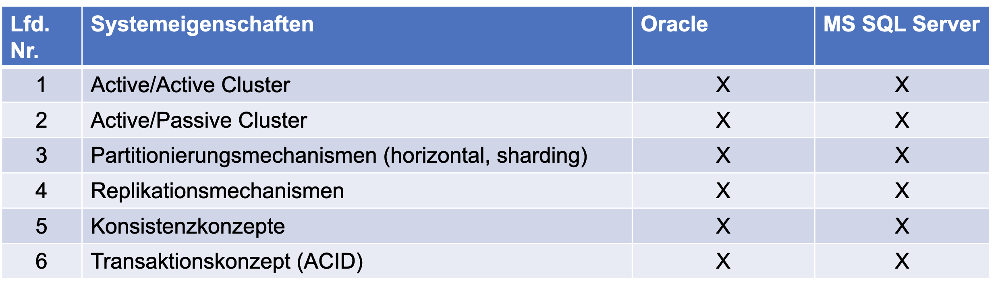

# Zusammenfassung

In der Tabelle 2 ist eine  Gegenüberstellung mit den wichtigsten Oberbegriffen zwischen Oracle und Microsoft SQL-Server dargestellt.

<em> Tabelle 2 - Vergleich der Systeme  </em>

Wie in der Tabelle 2 zu sehen, bieten beide Anbieter die Funktionalitäten für CA-Systeme an. Die Unterschiede liegen im Detail. Oracle ist das komplexeres System und bietet im Bereich Load Balancing und Hochverfügbarkeit mehr inklusive Möglichkeiten als MS SQL-Server.  Beide Lösungen bieten Konvertierungstools, um einen Wechsel zu ermöglichen.
Teilweise müssen teurere Enterprise - Versionen lizenziert werden, um alle Skalierungs- und Hochverfügbarkeits-Funktionen zu verwenden [27]. Abschließend lässt sich sagen, dass im betrieblichen Umfeld die Datenbankauswahl durch die Software-Lieferanten öfters eindeutig vorbestimmt wird, so dass möglicherweise beide Lösungen eingesetzt werden.Insgesamt können trotz vieler funktionaler Unterschiede beide Lösungen in etwa gleichwertig eingesetzt werden. Objektiv betrachtet, kann kein Sieger hier ausgezeichnet werden.

