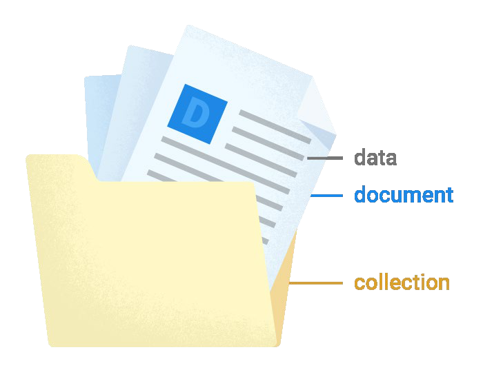

# 2. Cloud Firestore-Datenmodell und Datentypen

Cloud Firestore ist eine dokumentorientierte NoSQL-Datenbank. Das bedeutet, dass Daten in einer Cloud Firestore Datenbank in Dokumente gespeichert werden. Diese Dokumente werden in Sammlungen (collections) organisiert

Abbildung 1: Cloud Firestore Datenmodell

 

Für eine Cloud Firestore Datenbank, gelten folgende Regeln:

•	Dokumente können Untersammlungen (subcollections) enthalten oder verschachtelte Objekte.\
•	Sammlungen können nur Dokumente enthalten \
•	und Dokumenten können nicht größer als 1 MB sein.\
•	Ein Dokument kann kein Dokument enthalten.\
•	Es kann maximum 40.000 Indexe in einem Dokument geben\
•	Zwei Dokumente in einer Sammlung / Kollektion können nicht den gleichen Namen haben.\

Die Größe der Dokumente ist begrenzt, weil Cloud Firestore für die Speicherung großer Sammlungen von vielen kleinen Dokumente optimiert ist.
Kollektionen müssen nicht explizit erstellt oder gelöscht werden. Bei einer Zuweisung wird die Kollektion automatisch erstellt, wenn sie noch nicht existiert. Wenn alle Dokumente gelöscht werden, existiert die Sammlung auch nicht mehr.   
In einem Dokument, unterstützt Cloud Firestore verschieden Datentypen. In einem Dokument kann man Boolean, Zahlen, Strings, Binären Blob, geo Punkte, und Zeitstempel speichern.
Für eine Chat-Applikation könnte man zum Beispiel die Benutzerdaten in einem Dokument speichern. Alle Benutzer könnten dann in einer Sammlung gespeichert werden. So ein Dokument könnte die folgende Struktur haben:

 Schneider 
&nbsp;&nbsp;&nbsp;&nbsp;&nbsp;&nbsp;&nbsp;&nbsp;&nbsp;&nbsp;&nbsp;&nbsp;&nbsp;&nbsp;&nbsp;&nbsp;&nbsp;&nbsp;firstaname  
&nbsp;&nbsp;&nbsp;&nbsp;&nbsp;&nbsp;&nbsp;&nbsp;&nbsp;&nbsp;&nbsp;&nbsp;&nbsp;&nbsp;&nbsp;&nbsp;&nbsp;&nbsp;Lastname
<pre>test

