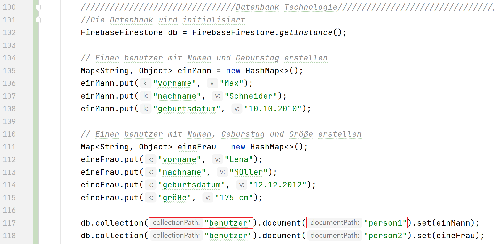
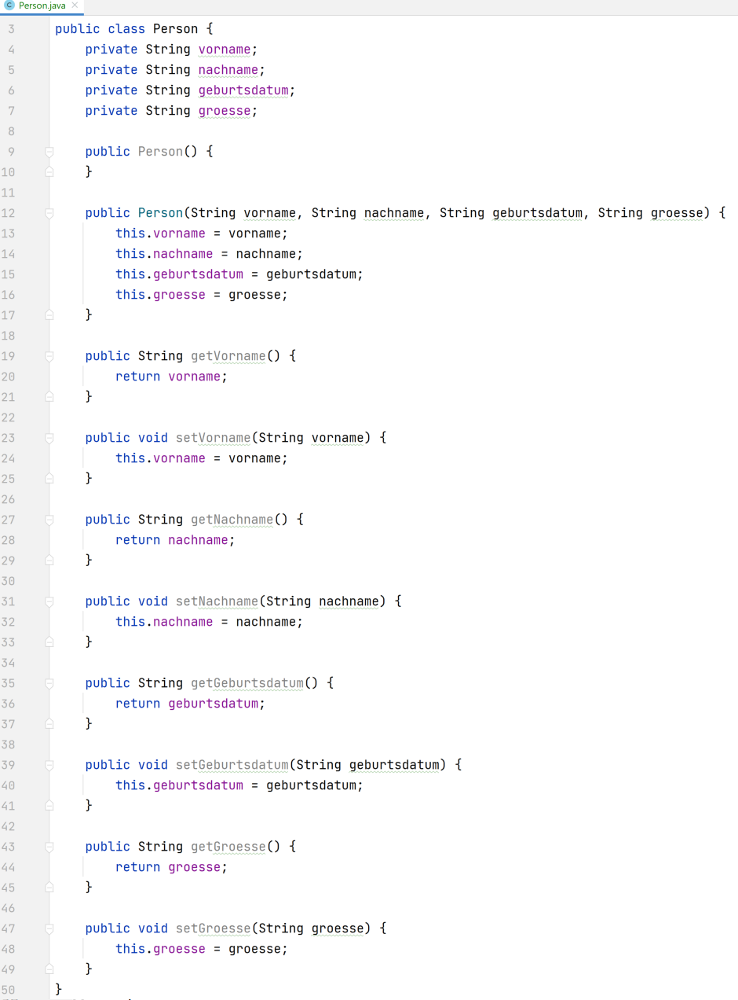
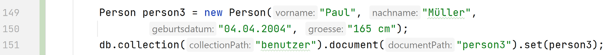
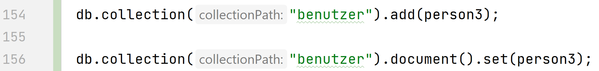
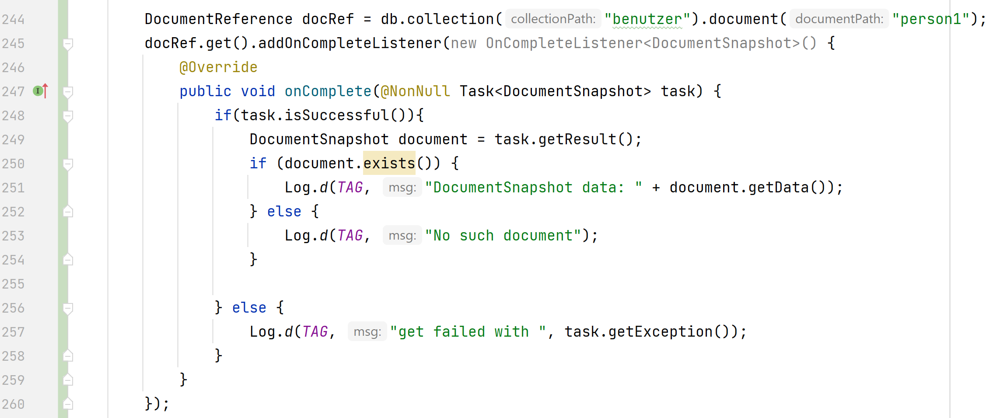
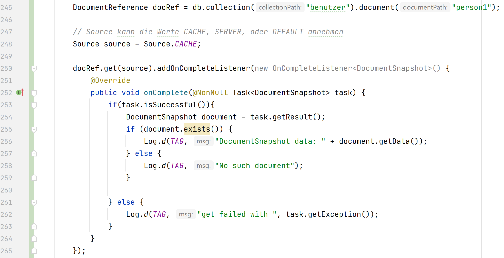
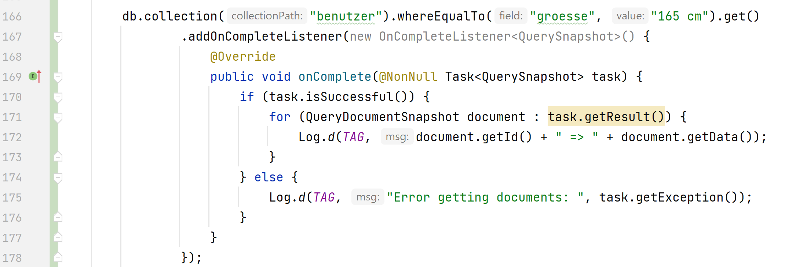
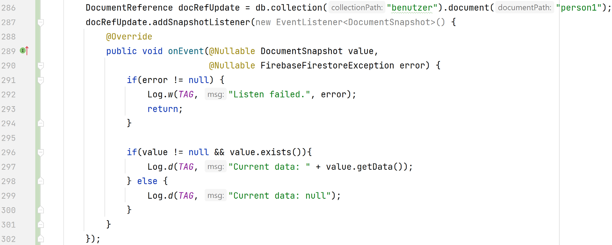

# 4. Cloud Firestore Abfragen

Bevor man Abfragen verwendet, muss zuerst eine Datenbank erstellt werden. Das geht sehr einfach in der Firebase Konsole. Danach muss man die Entwicklungsumgebung einrichten.
 

## 4.1	Entwicklungsumgebung

Damit eine Anwendung mit Cloud Firestore arbeiten kann, muss Firebase, während der Entwickelung, dem Projekt hinzugefügt werden. Dann müssen Bibliotheken hinzugefügt werden, die die Anwendung für Cloud Firestore braucht. Firebase unterstützt mehrere Programmiersprachen und Plattformen wie iOS, Android Java, Node.js. oder Go.
Für eine Android Anwendung, wenn Firebase dem Projekt hinzugefügt wurde, müssen folgende Zeilen in der Gradle-Datei auf der Module Ebene hinzugefügt werden.

Abbildung 8: Cloud Firestore einem Android Projekt hinzufügen (Ohne BoM)

 
 

Wenn man mehrere Firebase Bibliotheken verwendet, muss man für jede Bibliothek manuell eine Version eingeben. Um die Versionen nicht einzeln manuell zu schreiben, kann man BoM (Bill of Materials) verwenden (siehe Abbildung 9).

Abbildung 9: Cloud Firestore einem Android Projekt hinzufügen (Mit BoM)

 
 

BoM erlaubt es für alle Firebase Bibliotheken nur eine einzige Version zu schreiben.
In dem Code, bevor Abfragen verwendet werden können, muss Cloud Firestore initialisiert werden. Das geschieht mit der folgenden Zeile:

 

Abbildung 10: Initialisierung von Cloud Firestore in Java Android

 
 

## 4.2	Abfragen

Cloud Firestore erlaubt es, in vielen Sprachen, mit der Datenbank mit Hilfe von Abfragen zu interagieren. Cloud Firestore Abfragen sind expressiv, effizient und flexibel.

 
Obwohl Cloud Firestore eine verschachtelte Struktur hat, sind die Cloud Firestore Abfragen so genannte „Shallow Queries“. Das bedeutet, dass diese Abfragen erlauben es, Daten zu lesen, ohne die ganze Sammlung oder die darunter liegenden Element auch lesen zu müssen.

 

Cloud Firestore Abfragen sind gleich schnell egal wie viele Elemente in der Datenbank gespeichert sind. Um diese Leitung zu erreichen, werden alle Daten in der Datenbank indexiert.  
Die Ergebnisse von Abfragen können sortiert oder gefiltert werden. Wenn eine Abfrage zu viele Ergebnisse liefert, kann man diese Ergebnisse paginieren. Bei Änderungen in der Datenbank, müssen nicht alle neu geladen werden. Mit den Realtime Listeners von Cloud Firestore werden nur die geänderten Daten neu geladen. Cloud Firestore unterstützt auch den offline Modus. Das bedeutet, dass geladene Daten immer noch in den Anwendungen verfügbar sind, wenn es keine Internetverbindung gibt. 

In Cloud Firestore Datenbanken gibt es einfache Abfragen und es gibt auch Transaktionen, die verwendet werden können, um Daten zu lesen und zu schreiben.
In der verschachtelten Struktur der Daten in Cloud Firestore Datenbanken, jedes Element muss einen eindeutigen Namen haben. 

 
 

### 4.2.1	Daten schreiben

Die Schreiboperationen, die in einer Cloud Firestore Datenbank möglich sind, sind: set, add und update.

 

**„set":** 
Mit dem Befehl „set“, kann man in einer Cloud Firestore Datenbank ein Dokument erstellen oder überschreiben. Wenn die Sammlung, in der das Dokument geschrieben wird, noch nicht existiert, wird die Sammlung erstellt. Wenn das Dokument noch nicht existiert, wird es erstellt, sonst wird es überschrieben.
Das folgende Code-Beispiel zeigt wie man eine Sammlung „benutzer“ erstellen kann und dort Dokumente erstellen, die Benutzerdaten enthalten.

Abbildung 11: Java Android Beispiel Code

  
Manche IDEs erleichtern die Arbeit und zeigen Sammlungen, Dokumenten, Keys, und Values an. In dem aktuellen Beispiel wurde Android Studio benutzt. Diese Hilfe ist besonders wichtig, wenn man eine tief verschachtelte Struktur.

Abbildung 12: Verschachtelte Struktur eines set-Befehls in Android Studio

  

In der Firestore Konsole, hat man die Möglichkeit die gespeicherten Daten zu visualisieren. Die Abbildung 13 zeigt die Daten in der Firebase Konsole, die mit dem Code der Abbildung 11 gespeichert wurden.

Abbildung 13: Visualisierung der Daten in der Firebase Konsole

  

Mit dem set-Befehl werden standardmäßig die Daten erstellt oder überschrieben, aber mit diesem Befehl und die Option „SetOptions.merge()“ ist es auch möglich Daten zusammenzuführen oder zu ergänzen.
In dem Beispiel der Abbildung 11, hatten die Daten des Mannes kein Feld „Größe“. Das kann mit dem folgenden Code ergänzt werden, ohne die anderen Felder aktualisieren zu müssen

Abbildung 14: set-Befehl mit SetOptions.merge()

  

„SetOptions.merge()“ kann auch verwendet werden, wenn man nicht weiß, ob ein Dokument existiert, und man die Daten nicht überschreiben will.
Die Abbildung 15 zeigt die Daten des Mannes (Abbildung 11), vor und nach der Ausführung des Codes der Abbildung 14. Auf der Abbildung 15 kann man sehen, dass die Größe der Person 1 hinzugefügt wurde, ohne die anderen Daten zu ändern.

Abbildung 15: Daten vor und nach dem set-Befehl mit SetOptions.merge()

 
 

Das set-Befehl kann auch mit Fehlerbehandlung geschrieben werden, wie auf der Abbildung 16.

Abbildung 16: set-Befehl mit Fehlerbehandlung

Oft arbeitet man mit Klassen und es ist dann einfacher das set-Befehl statt mit Map oder Dictionary, direkt mit Klassen zu verwenden. Damit das Möglich wird, müssen die Klassen einen Constructor ohne Argumente und, getter und setter für alle Attribute haben. Für das Beispiel der Abbildung 11, könnte man folgende Klasse haben:

Abbildung 17: Beispiel-Klasse "Person"

  

Um die Daten einer Person zu speichern wie in dem Beispiel der Abbildung 11, würde man nur den folgenden Code brauchen:

Abbildung 18: Verwendung vom set-Befehl mit einer Klasse

  

**add:** 
Mit dem set-Befehl muss man in der Regel einen Dokumentennamen vergeben. Manchmal will man aber, dass Cloud Firestore die Dokumentennamen automatisch generiert. In solchen Fällen benutzt man das add-Befehl.
Wenn man das set-Befehl verwendet ohne Dokumentennamen zu vergeben, hat man genau die gleiche Funktion wie das add-Befehl. Die zwei Zeilen auf der Abbildung 19 sind äquivalent.

Abbildung 19: add-Befehl mit dem äquivalenten set-Befehl

  

**update:**  
Das Update-Befehl wird verwendet, um bestimmte Felder eines Dokumentes ohne das gesamte Dokument zu aktualisieren. Für Felder, die sicher existieren, ist ein set-Befehl mit SetOptions.merge() äquivalent.
Wenn man zahlen verwendet, kann man auch die Funktion „increment“ verwenden, um den Wert zu ändern.

### 4.2.2	Daten lesen

Wenn man Daten in einer Datenbank speichert, will man sie irgendwann auch wieder lesen. Cloud Firestore bietet zwei Möglichkeiten an, Daten zu lesen. Man kann eine Funktion aufrufen, um Daten zu lesen oder man kann ein „Listener“ verwenden, um bei jeder Änderung, Daten zu lesen.
Wenn man eine Funktion verwendet, um Daten zu lesen, hat man die Möglichkeit ein einziges Dokument zu lesen oder auch mehrere Dokumente zu lesen. Wenn man mehrere Dokumente lesen will, verwendet man Schlüsselwörter wie „where()“ in der Abfrage, um nur Dokumente zu lesen, die eine bestimmte Bedingung erfüllen. Die Abbildung 20 zeigt ein Beispiel Code, der verwendet werden kann, um die „person1“ zu lesen, die wir in 4.2.1 gespeichert haben.

Abbildung 20: Ein Dokument lesen

  

Cloud Firebase unterstützt den Offline-Modus. Um diese Funktionalität zu ermöglichen, werden Daten im Cache gespeichert, aber standardmäßig werden die Daten immer direkt von der Datenbank gelesen, außer wenn man wirklich offline ist. Um auch mit einer verfügbaren Internetverbindung Daten vom dem Cache Speicher zu lesen, kann man die „source-option“ von get() verwenden. Die Abbildung 21 zeigt eine modifizierte Version des Beispiels der Abbildung 20. In dieser Version werden Daten aus dem Cache-Speicher gelesen.

Abbildung 21: Ein Dokument aus dem Cache lesen
  

Um jetzt alle Personen mit der Größe „165 cm“ zu lesen, die wir gespeichert haben, können wir „whereEqualTo("groesse", "165 cm") verwenden.

Abbildung 22: Mehrere Dokumente lesen

  

Um alle Dokumente einer Kollektion zu lesen, kann man die where()-Bedingung weglassen. In dem Beispiel der Abbildung 22, würde man nur whereEqualTo("groesse", "165 cm") weglassen. Der Rest würde gleichbleiben.  

Um bei jeder Änderung ein Dokument zu lesen, muss man einen „Listerner“ verwenden. Wenn wir „person1“ bei jeder Änderung lesen wollen, kann der Code der Abbildung 23 verwendet werden.

Abbildung 23: Dokument bei jeder Änderung lesen
  

Cloud Firestore hat viele weiteren Möglichkeiten Lese-operationen zu kombinieren, zu filtern, die nicht alle hier vorgestellt werden können. Es gibt auch die Möglichkeit die Anzahl der Ergebnisse zu begrenzen oder die Möglichkeit die Ergebnisse zu paginieren.

### 4.2.3	Transaktionen und Batched Writes

Transaktionen und Batched Writes sind Cloud Firestore „Funktionen“, die es ermöglichen mehrere Operationen atomisch auszuführen. Das bedeutet, entweder werden alle Operationen ausgeführt oder gar keine Operation wird ausgeführt.   
•	**Transaktionen** sind Sätze von Lese- und Schreiboperationen in einem oder mehreren Dokumenten.\
•	**Batched Writes** sind Sätze von und Schreiboperationen in einem oder mehreren Dokumenten
  
Transaktionen und Batched Writes können in Cloud Firestore in maximum 500 Dokumente schreiben.

 

**Transaktionen:**  
Transaktionen bestehen in der Regel aus get-Operationen gefolgt von set-, update- oder delete-Operationen.
In Cloud Firestore gibt es Regeln, die bei der Verwendung von Transaktionen beachtet werden müssen.  
•	Wenn eine Transaktion Dokumente liest, und mindestens eins von diesen Dokumenten während der Transaktion geändert wird, wird die Transaktion noch einmal ausgeführt.\
•	Leseoperationen sollten vor Schreiboperationen kommen.\
•	Transaktionen sollten den Zustand einer Anwendung direkt ändern.\
•	Transaktionen funktionieren nicht, wenn die Anwendung offline ist.\

  
**Batched Writes:**  
Batched Writes sind fast wie Transaktionen aber unterstützen keine Lese-Operationen. Sie sind atomische Operationen wie Transaktionen aber sie haben ein paar Vorteile im Vergleich zu Transaktionen.  
Batched Writes werden nicht von Lese-Operationen beeinflusst. Das bedeutet, dass Batched Writes nicht wiederholt werden müssen, wenn Dokumente geändert werden, die gerade von einer anderen Operation gelesen werden.

